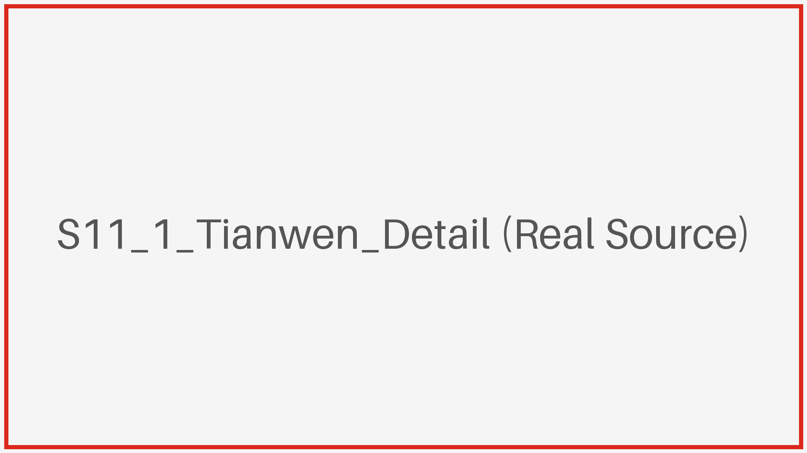
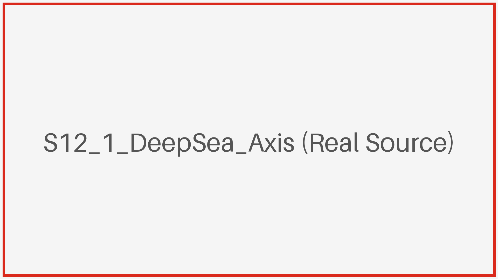
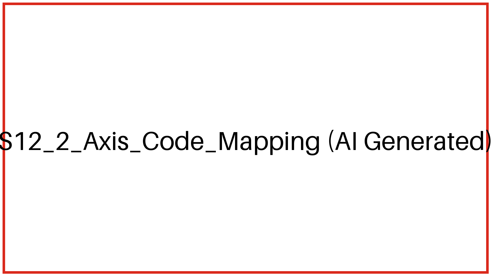
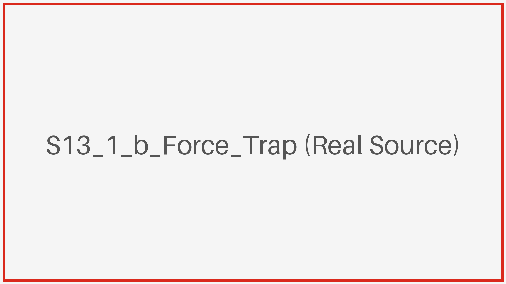
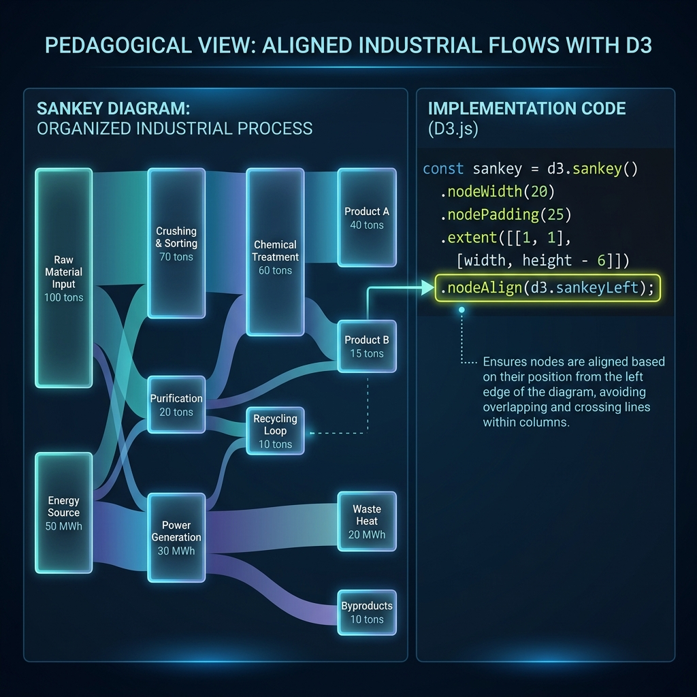

## M04 大师逆向工程：大国重器篇

<!-- BUDGET: 7000 chars | STATUS: done -->

> [VISUAL]
> *   **Slide**: `S10_Great_Nation_Tech`
> *   **Layout**: `Center`
> *   **Scene**: 太空探索、深海潜水器、精密芯片与农业科技元素的科技风拼贴，展现大国重器的宏大叙事。
> *   **Text**: "大国重器：多维逆向拆解"
> *   **List**: "理论映射 / 逻辑映射 / 技术溯源"
> *   **Asset**: 

上一模块我们看到了可视化如何传递人文关怀，而本模块我们要将视线转向“硬核科技”与“大国重器”。

> [LIFE CONNECT]
> 让我们先做一个小测试。当你在新闻上看到“长征火箭发射遥测轨迹”或者“潜水器下潜深度的多维参数表”时，你的目光能停留多久？3 秒？还是 5 秒？
> 对很多艺术设计专业的同学来说，那些密密麻麻的航空航天数据、芯片制程的拓扑参数，就像是外星代码。虽然看起来很震撼，但内心往往毫无波澜，因为**它们离我们的日常生活太远了**。

> [VISUAL]
> *   **Slide**: `S10_1_Hardcore_Data_Challenge`
> *   **Layout**: `Center`
> *   **Scene**: 冰冷的深蓝色悬浮数据阵列与试图触碰它的带有暖色光晕的人影剪影形成强烈对比。
> *   **Text**: "工程数据的困境：认知超载与情感脱节"
> *   **Asset**: 
> *   **Source**: `AI_Gen`

这就是硬核科技题材在可视化时面临的最大挑战：工程数据多维异构且极度**“缺乏情感共鸣”**。面对毫无温度的技术壁垒，设计师不仅要避免**“认知负荷过高”**，更要徒手凿出一个让普通观众产生共情的突破口。接下来，我们将融合 Tamara 的数据抽象、郝亚维的逻辑映射与底层技术溯源，对这四个巅峰案例进行硬核拆解，看设计如何把冰冷的参数转化为我们肉身能感知到的重量、秩序与温度。

### 1.1 跨越时空的壮举：深空探测《天问一号》

> [VISUAL]
> *   **Slide**: `S11_Tianwen`
> *   **Layout**: `Split`
> *   **Scene**: 充满科技感的线稿风格，展示天问一号的轨道器与着陆过程。
> *   **Text**: "《天问一号》：向星空致敬"
> *   **Asset**: `../public/textbook/9c48081a4166636423aa352e5e506b18724ebfc97524b240cef2aa90e4123b1e.jpg`
> *   **Source**: `Textbook`

首先是中国“天问一号”探索火星全过程的可视化。面对从地球到火星长达数亿公里的浩瀚距离以及复杂的飞行器姿态数据，设计师没有选择堆砌生涩的航天参数。

> [TECH NOTE]
> 设计师进行了极致的**数据抽象**：剥离三维空间，将复杂的时序轨迹映射在二维图纸上。
> 按照 Tamara 的视觉编码原则，他调用了人类视觉最敏感的通道——**对齐的空间位置 (Aligned Spatial Position)**（即将所有数据点放在同一条起跑线上比长短，就像排队量身高一样一目了然），将宏大的物理距离浓缩为同一参考轴上的长度刻度。

这就呼应了郝亚维老师强调的**“视觉噪音剔除与导向”**。没有写实的星空背景，只有纯净的线稿与色块；视线被牢牢钉在“地火转移轨道”这根中心主轴上，平稳地从宏观轨迹牵引至发射、着陆等微观组件，消解了深空探测的认知壁垒。

> [VISUAL]
> *   **Slide**: `S11_1_Tianwen_Detail`
> *   **Layout**: `Center`
> *   **Scene**: 原素材局部特写：地火转移轨道的精细线稿与坐标刻度放大。
> *   **Text**: "局部放大：克制的过滤与导向"
> *   **Asset**: 
> *   **Source**: `External`

#### 技术溯源 (W01-W06)
在前端实现层面，这种复杂的轨迹还原直接对应我们在 **W04** 训练的 **ECharts 动态折线与 SVG 路径插值**技术。

为了巩固“剥离三维空间维度、二维平铺对齐”的降维抽象概念，我们来看一个实战情境。

> [ACTIVITY]
> *   **Type**: `Quiz`
> *   **Duration**: `2min`
> *   **Desc**: 降维抽象与空间位置编码的应用
> *   **Q**: 某航天科普馆要求你设计一张图，向小学生展示“嫦娥六号从地球飞向月球并返回的时间线”。航天局提供了一套包含经纬度、轨道高度和倾角的三维复杂坐标。若借鉴《天问一号》的设计策略，为了避免小学生认知超载，你应该如何处理这些工程数据？
> *   **Options**: A. 直接接入 WebGL/Three.js 引擎，1:1 还原地月系的三维空间轨道模型并动态演示飞行过程 | B. 果断剥离真实的三维物理空间维度，将所有关键动作节点按时间顺序平铺在一条二维的主轴轨道上 | C. 保留完整的高精三维参数，使用多颜色的雷达图详细呈现每个节点的六自由度遥测数据 | D. 忽略复杂的轨迹时序数据，只在屏幕中央放大展示嫦娥六号探测器的高精度三维渲染图
> *   **Answer**: B
> *   **Explain**: 《天问一号》案例的成功在于极致的“数据抽象”（Data Abstraction）：主动剥离普通人难以建立概念的深空三维距离，将浩瀚的空间降维到人类视觉最敏感的“一维长度对齐”。A 和 C 虽然真实，但保留了过多的专业维度，会导致科普受众认知超载；D 则丢失了时序逻辑的可视化，变成了单纯的美术展示。

### 1.2 极限环境的挑战：深海探测《深海的勇者》

> [VISUAL]
> *   **Slide**: `S12_Deep_Sea`
> *   **Layout**: `Split`
> *   **Scene**: 深邃的海洋中，蛟龙号、深海勇士号与奋斗者号按不同深度分布，散点图与潜水器插图结合。
> *   **Text**: "《深海的勇者》：极限深渊的探索"
> *   **List**: "蛟龙号 / 深海勇士 / 奋斗者"
> *   **Asset**: `../public/textbook/17ea7fdb774f1fd0db6d16d3d65d8339cff52f1ce6e5290affa065329b4a9156.jpg`
> *   **Source**: `Textbook`

深空侧重横向的时空跨度，而深海可视化则完全聚焦于垂直深度下切。

> [CASE STUDY] 
> 如果让我们来绘制潜水器下潜深度的对比图，很多人本能的反应是画一张常规的柱状图或条形图：蛟龙号的柱子低一点，奋斗者号的柱子高一点。但这会产生一个灾难性的认知断层——潜水是往下沉的，而常规柱状图是往上长的！这种违背真实世界引力的表现方式，会瞬间破坏大国重器题材的沉浸感。

那么，如何把物理世界的**重力与窒息感**装进二维平面的画布？

> [VISUAL]
> *   **Slide**: `S12_1_DeepSea_Axis`
> *   **Layout**: `Center`
> *   **Scene**: 原素材局部特写：深邃海水色阶过渡与左侧 Y 轴深度的精细对齐。
> *   **Text**: "重力编码：用坐标反转制造物理压迫感"
> *   **Asset**: 
> *   **Source**: `External`

设计师在这里做了一个关键的视觉映射改动：**反转坐标轴 (Axis Reversing)**。
我们在 W02 敲下 D3 `range().reverse()` 这行代码时，你可能觉得这仅仅是个 API 的语法配置。但在《深海的勇者》中，这行代码承载的是一万零九百米海水的物理重量。它打破了数据由下至上递增的常规惯性，将观众的视线向下拖拽进深渊。

> [TECH NOTE]
> 这正是 Tamara 理论中“利用空间位置进行定量编码”（即通过画面中物体的高低、远近来直观表达数值大小）的极致体现，同时也是郝亚维老师强调的**剔除视觉噪音**。
> 这里不需要画栩栩如生的深海巨鱿，只需要用逐渐黑化的色阶递进，配上向下的 Y 轴。反转的不仅是坐标，更是用数据向下的挤压感，逼迫受众体会那份窒息与敬畏。这正是对 M01 提到的**“缺乏情感共鸣”**的技术反击。

> [VISUAL]
> *   **Slide**: `S12_2_Axis_Code_Mapping`
> *   **Layout**: `Code`
> *   **Scene**: 左侧展示深海可视化原图，右侧高亮对应 `range().reverse()` 的 D3 代码片段，建立视觉与代码的映射。
> *   **Text**: "反向映射：用代码改写重力"
> *   **Asset**: 
> *   **Source**: `AI_Gen`

#### 技术溯源 (W01-W06)
这种垂直刻度的映射体系，正是我们在 **W02** 重点讲解的 **D3 线性比例尺 (Linear Scale)** 与 **坐标轴反转配置 (Axis Reversing)** 的经典应用场景。

我们马上来验证一下这个反直觉的映射机制。

> [ACTIVITY]
> *   **Type**: `Quiz`
> *   **Duration**: `2min`
> *   **Desc**: 坐标轴反转的情境应用
> *   **Q**: 某矿业公司开发监控大屏，需展示“地下矿井深度与温度”的关系。若使用常规折线图，随着深度数字增大，线条会不断向上攀升。为了解决这种“往下挖却向上画”的违和感，最符合本节物理映射原则的改法是什么？
> *   **Options**: A. 引入 3D 效果制作逼真的下潜矿洞模型 | B. 剔除坐标轴，只保留不同深度的具体温度数字 | C. 对 Y 轴执行坐标轴反转，让数据点向下延伸还原地心引力的挤压感 | D. 保持 Y 轴不变，将背景色改为向下渐深的岩石纹理
> *   **Answer**: C
> *   **Explain**: 《深海的勇者》案例展示了：当数据涉及真实世界的深度下沉时，反转坐标轴能瞬间打破向上生长的视觉惯性，建立真实的物理压迫感。A 选项违背克制降维原则，B 选项丢失了空间位置映射，D 选项治标不治本（线条依然反直觉向上长）。

### 1.3 微观世界的奇迹：芯片制造《芯片工厂》

> [VISUAL]
> *   **Slide**: `S13_Chip_Factory`
> *   **Layout**: `Full`
> *   **Scene**: 蓝紫色调的深色科技背景，将芯片比作“智能机器人的大脑”，四大工序由发光的阶梯和管道连接。
> *   **Text**: "《芯片工厂》：微观工艺的宏观展现"
> *   **Asset**: `../public/textbook/0bba756133491d83cda38eaf5059a03ced4225455bb7a612cbe823058feb2ed6.jpg`
> *   **Source**: `Textbook`

微观半导体制程极其繁琐，设计中如何避免受众迷失在工艺细节里？

> [VISUAL]
> *   **Slide**: `S13_1_Chip_Nodes`
> *   **Layout**: `Center`
> *   **Scene**: 原素材局部特写：芯片工艺网状关系图中的单组节点连线 (Node-Link) 局部裁切。
> *   **Text**: "局部放大：克制的 3D 拓扑连线"
> *   **Asset**: 
> *   **Source**: `External`

面对从晶圆制造到封装测试这套隐匿于微观层面的复杂流水线（树状/网络结构数据，你可以把它想象成一座拥有无数分岔路口的超级地下迷宫），设计师需要向公众解释清楚其中的时序逻辑。

> [TECH NOTE]
> 设计师通过节点-链接图 (Node-Link Diagram)（就像用一根根发光的透明管道把独立的加工车间按顺序串联起来的拓扑地图）的排布，将庞杂的工艺链清晰地**展平**在二维平面上。
> 芯片制程涉及成百上千个微观加工节点，如果毫无章法地将它们连接，将会演变成一场视觉灾难。设计师在这里的核心策略是：**用算法建立视觉秩序**，用绝不回流的线条隐喻微观工业流水线的绝对严谨。本案中哪怕引入了微 3D 效果，也没有喧宾夺主去建构什么华丽的“赛博朋克工厂”，而仅仅被克制地用作拓扑连线的空间隐喻（让节点看起来像悬浮的发光元器件），守住了数据克制的底线。

> [VISUAL]
> *   **Slide**: `S13_1_b_Force_Trap`
> *   **Layout**: `Center`
> *   **Scene**: 一张极其混乱、连线互相交叉的 Force Layout 失败案例图（毛线球），打上红色的警告标志。
> *   **Text**: "认知灾难：力导向图的失控"
> *   **Asset**: 
> *   **Source**: `External`

> [WARNING]
> 面对几百个微观工艺节点的网络结构，新手设计师极易跌入“力导向图 (Force Layout)”的陷阱。把节点直接丢给基于弹簧引力算法的 D3 Force 模型，最后往往生成一个看起来很炫酷、实际上乱成一团的“毛线球”。这种滥用不仅无法展现严谨的工业制程，更是典型的**“认知负荷过高”**灾难。

记住，芯片生产线不是无序碰撞的分子，它是**一条不允许回流的单向江河**。

> [VISUAL]
> *   **Slide**: `S13_2_Force_Vs_Sankey`
> *   **Layout**: `Comparison`
> *   **Scene**: 左侧是一团乱麻般相互排斥交叉的力导向图（Force Layout），右侧是极其规整、单向流动、绝无交叉的桑基图（Sankey Layout）。
> *   **Text**: "算法即秩序：从混沌互斥到刚性单向"
> *   **Asset**: 
> *   **Source**: `External`

> [TECH NOTE] 
> 这正是我们在 W05 区分算法应用场景的核心价值所在——在这里，绝对不能用 Force Layout 的互斥碰撞，而必须用体现流量与有向时序的 **桑基拓扑 (Sankey Layout) 思想** 进行降维：
> 
> 深色背景压暗了次要的辅助设施，高亮的发光管道则充当了明确的视线轨道。

视线顺着这根高亮轨道，从上游晶圆制造被稳稳引流至下游封装测试。这种消除交叉连线的排布，不仅是为了画面干净，更是通过视觉的“顺畅无阻”，向公众传达大国重器在微观工艺控制上的绝对严谨。这就是将复杂时序逻辑进行感官翻译的巅峰。

> [VISUAL]
> *   **Slide**: `S13_3_Sankey_Code`
> *   **Layout**: `Code`
> *   **Scene**: 展示 D3 Sankey Layout 核心 API `d3.sankey().nodeAlign(d3.sankeyLeft)` 及其生成的纯净连线效果。
> *   **Text**: "代码秩序：桑基算法的强制排布"
> *   **Asset**: 
> *   **Source**: `AI_Gen`

#### 技术溯源 (W01-W06)
构建该结构呼应了我们在 **W05** 探讨的 **桑基拓扑 (Sankey Layout)**。利用算法生成无交叉连线，是处理复杂工业关系流的有效范式。

为了巩固这个概念，我们来看一个实际工作中的场景。

> [ACTIVITY]
> *   **Type**: `Quiz`
> *   **Duration**: `2min`
> *   **Desc**: 复杂时序与流转数据的算法降维应用
> *   **Q**: 某物流平台需要向公众展示“双十一期间，上千万包裹从 5 个总仓经过层层分拨，最终流向全国”的复杂包裹流转图。新人小李直接调用了基于引力算法的力导向图 (Force Layout)，结果密集的连线交叉重叠，成了一团乱麻。如果你是视觉主管，应建议他改用哪种布局算法？
> *   **Options**: A. 调整力导向图的引力系数参数，让节点排布更紧凑 | B. 改用桑基图 (Sankey Layout)，利用无交叉的有向分支宽度展现物流的流量与层级流向 | C. 引入 3D 节点链路图，增加空间维度来分散密集的线条 | D. 保持原有连线，仅增加交互功能，鼠标点击某仓库时才显示相关路线
> *   **Answer**: B
> *   **Explain**: 选项 B 准确命中了本节展示的核心降维逻辑。当需要表现带有明确时间层级、单向流转且存在汇聚分支的数据时，桑基图 (Sankey Layout) 能够强行梳理出无交叉的视觉轨道，完美化解 Force Layout 互斥碰撞导致的认知灾难。A 和 D 治标不治本，C 的 3D 会进一步扭曲空间带来新的认知负荷。

### 1.4 粮食安全的底线：生物育种《海水稻种植》

> [TEACHING MOMENT]
> 讲完太空、深渊和微观芯片，大家感受到的是硬核科技那份令人窒息的物理压迫感和绝对理性的视觉秩序。但当我们面对另一类大国重器——比如“农业育种”时，如果再用深蓝色的发光管线和冷冰冰的数学坐标去展示，合适吗？
> 绝对不合适。因为农业科普的受众不再是极客或工程师，而是普罗大众；它要传递的不是科技的敬畏感，而是“丰收的安全感”。因此，设计师必须具备灵活切换叙事心智的能力。

> [VISUAL]
> *   **Slide**: `S14_Sea_Rice`
> *   **Layout**: `Split`
> *   **Scene**: 拟人化的“米仔”与“米妞”IP 形象，在一片丰收的稻田中进行动态数据播报。
> *   **Text**: "《海水稻种植》：亲民的硬核农业科普"
> *   **Asset**: `../public/textbook/40c28cc53955ea9a4c2d4d67ac3fa21468aed1896096511aa38aacd2779a5d4d.jpg`
> *   **Source**: `Textbook`

面对涉及底层民生的农业科研科普，如果照搬工业极客审美就会跌入数据罗列的陷阱。设计师在这里果断放下了“高冷”的科技架子，这份设计完美诠释了郝亚维老师的理念：**“信息可视化也是生活必需的审美转换”**。

> [TECH NOTE]
> 在 Tamara 理论框架下，为了向公众直观呈现粮食增产的绝对价值，设计师采用了抗扰度极高的二维面积与长度编码（Area and Length Channels）。别被这些学术词汇吓倒，它的本质就是“分量足不足，看面积大小”。就像分蛋糕一样，用肉眼可见的“地块大小”和“稻穗长短”代替了生涩的公顷和吨数，将庞大抽象的盐碱地转化面积与亩产数字，稳稳地**注入**直观的条形区域中。

> [VISUAL]
> *   **Slide**: `S14_1_Area_Length_Encoding`
> *   **Layout**: `Center`
> *   **Scene**: 特写“米仔”旁边通过条形柱状的面积大小与长度来直观展现盐碱地面积和亩产的区域。
> *   **Text**: "二维编码映射：将抽象公顷具象为肉眼分量"
> *   **Asset**: 
> *   **Source**: `Textbook`

而在逻辑映射上，设计坚决剥离了复杂的基因图谱与生化参数。以“盐碱贫瘠向高产丰收的逆转”作为底层因果脉络，引入“米仔”“米妞”等卡通 IP。利用 IP 人物的肢体引导与朝向手势，接管观众的视线锚点，将生硬的科普**转换**为一场平易近人的对谈。

#### 技术溯源 (W01-W06)
这种轻量级表达对应了我们 **W01 与 W03** 掌握的 **SVG 矢量图像数据驱动与基础区域图 (Area Chart) 渲染**技术。

> [ACTIVITY]
> *   **Type**: `QA`
> *   **Duration**: `1min`
> *   **Desc**: 快速心跳校验
> *   **Q**: 刚才拆解的四大重器案例中，哪一个在“视觉导向”上必须依赖坐标轴反转 (Axis Reversing) 来建立物理环境的压迫感？为什么？

我们来检验一下大家对这一设计策略的理解。

> [ACTIVITY]
> *   **Type**: `Quiz`
> *   **Duration**: `2min`
> *   **Desc**: 审美转换破冰检验
> *   **Q**: 某社区向老年居民普及“高血压与含盐量”关系，最初使用的生化指标折线图效果极差。若借鉴《海水稻种植》的“审美转换”策略，工作者最应该如何修改这份可视化设计？
> *   **Options**: A. 将生化指标转换为动态 3D 柱状图，增加高科技感以吸引注意力 | B. 剥离生涩的医学参数，将盐摄入量转化为“几勺盐”具象图案辅以警示色 | C. 增加详细的医学文本说明，解释每个生化指标的具体病理学意义 | D. 利用坐标轴反转将折线图倒转，体现血压升高的危险压迫感
> *   **Answer**: B
> *   **Explain**: 选项 B 准确对应了“信息可视化也是生活必需的审美转换”以及“剥离生涩参数、建立直观认知”的破圈策略，将专业医疗数据转化为公众生活化的视觉语言。选项 A 滥用伪 3D 徒增认知负担；选项 C 进一步堆砌术语；选项 D 的坐标轴反转在面向老年人的生活化场景中极易导致反向误解。
