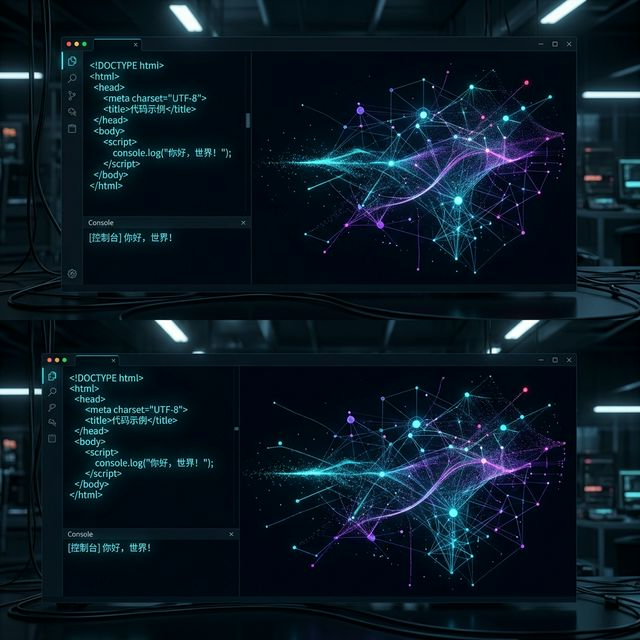
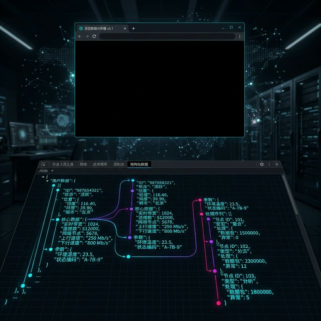
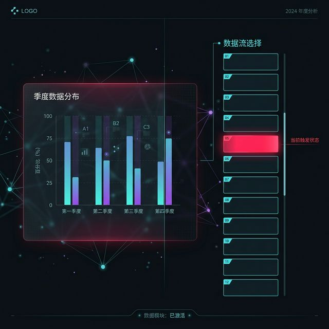
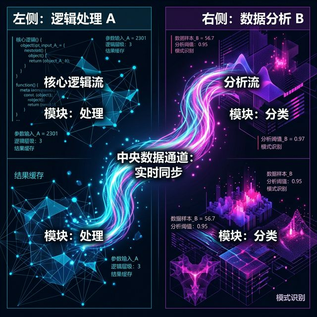
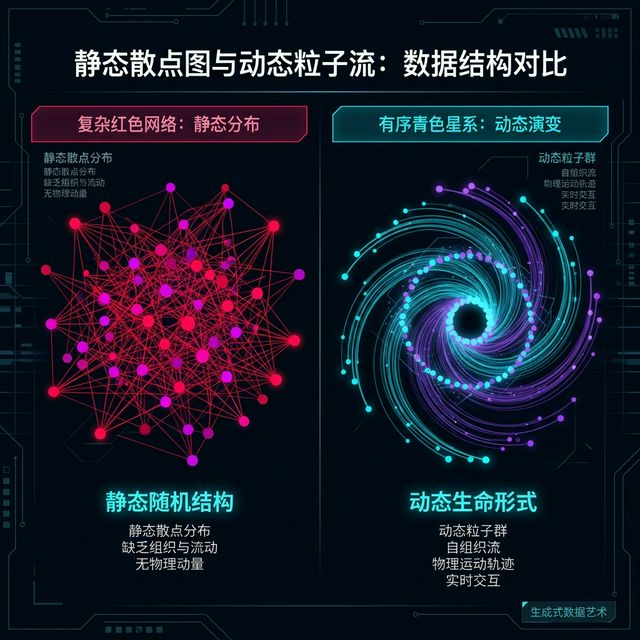
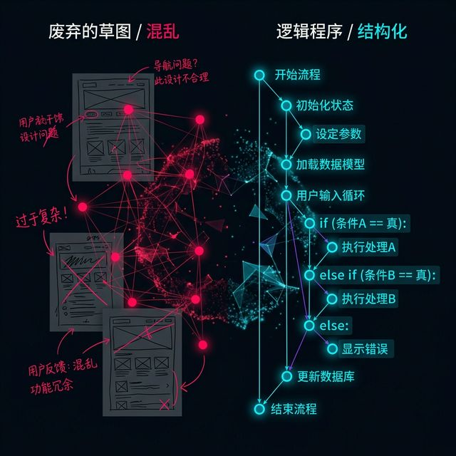
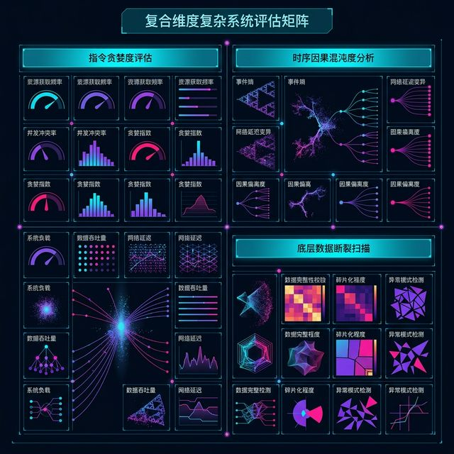

## 模块 4: 架构解体，如何向机器描绘宏大工程 (80 分钟)
<!-- BUDGET: 4500 chars | SLIDES: >=8 | STATUS: done -->

数据就绪。我们现在手里握着被 AI 净化过的黄金 `dataset.json`。现在我们要下发给大模型那张最终的图腾，也就是我们要开始真正生成交互式大作业的代码了。

如果这个时候，你点开一个全新的对话框，直接对大模型丢出这样一段话：“嘿，帮我用刚才清洗的数据，写一个讲述人类火星探测历史和天问一号着陆分析的宇宙级炫酷互动大屏幕滚动网站。必须用最新版的 ECharts 画出 3D 火星，还要有随着鼠标滚轮滚动的动画过渡。”

大模型会用极度热情且自信的语气回答你：“好的，没问题，马上为你生成火星探测互动网站。” 

然后，经过长达两分钟的思考和代码流式输出，它会吐给你一个缝合了三个过期版本的开源库、总计一万多行完全没有注释、存在严重作用域冲突、甚至 HTML 标签都没有闭合的怪胎乱码文件。

### 4.1 自然语言工程建筑学的分层策略：为什么不能一步到位？

你绝对不能对模型下达复合到顶天的指令。大模型的本质是概率预测机器，当指令的约束条件（如使用什么图表、实现什么交互、展示什么数据、达成什么视觉风格）在同一个 Prompt 里交叉叠加时，它的注意力机制会迅速涣散，产生严重的“上下文坍缩”和代码幻觉。

> [VISUAL]
> *   **Slide**: `S05_Prompt_AI_Failure`
> *   **Asset**: 
> *   **Layout**: `Screenshot`
> *   **Scene**: 屏幕截图：左侧是一段长达 1000 字的许愿式 Prompt，右侧是控制台爆出满屏红色的 "Uncaught TypeError" 报错。
> *   **Text**: "一步到位的代价：大模型的认知坍缩"

我们来看屏幕左侧的这段“许愿式”提示词，这是很多初学者最容易犯的错误。他们把大模型当成了神灯里的精灵，试图在一个回合内解决所有问题。右侧满屏的红字告诉我们：这种贪心带来的后果是毁灭性的。

> [CASE STUDY: 去年期末的坍塌事故]
> 在去年的期末项目中，有一组同学试图制作一个关于全球濒危语言多样性流失的可视化大屏。他们第一天晚上就直接要求 AI 一次性写出包含地球仪自转、语言节点动态生成、以及时间轴滚动的全套代码。
> 结果整个周末，他们都在绝望地修复 AI 产生的幻觉代码：引入的 Three.js 库和 ECharts 库产生了全局变量冲突；地球仪在滚动时出现了无法名状的扭曲变形；而且，由于代码全部堆在一个文件里，每一次让 AI 去修改滚动的速度，AI 都会把地球仪的材质贴图莫名其妙地删除。
> 最后他们不得不把这一万行代码全部删掉，回到原点。这就是企图“一步到位”所付出的惨痛代价。

> [VISUAL]
> *   **Slide**: `S06_Strategy_Comparison`
> *   **Asset**: 
> *   **Layout**: `Comparison`
> *   **Scene**: 左侧显示“许愿式工程”：一团乱麻直接导向成品。右侧显示“建筑学工程”：地基 -> 框架 -> 承重墙 -> 软装，分层递进。
> *   **Text**: "许愿式工程 vs 建筑学分层接力"

所以，你现在不再是一个随心所欲写代码的码农，你是一名**总建筑师**。面对宏伟的总揽，你要做的是精准的架构解体：**自然语言工程必须分层接力**。你递给 AI 的图纸（提示词），应当按照极其严格的顺序依次推进。每一步只做一件事，每一步必须得到验证后，才能进入下一步。绝不贪功。

我们把这个过程拆解为经典的“四层接力”。

### 4.2 第一步：数据挂载（地基浇筑）

这是所有项目最容易被忽视，却也是最不可或缺的第一步。当我们拿到数据后，第一件事绝对不是去画图。

> [VISUAL]
> *   **Slide**: `S07_Data_Mounting_Skeleton`
> *   **Asset**: 
> *   **Layout**: `Code`
> *   **Scene**: 一个极简的 HTML 骨架代码，没有任何 CSS 或 JS 库的引入，只有一个 `console.log(data)`。
> *   **Text**: "第一层：干净利落的 HTML 骨架与数据注入"
> *   **List**: "1. 搭建基础 HTML 结构 | 2. 引入清洗好的 JSON | 3. 拦截任何图形绘制动作"

在这个阶段，你是要向 AI 确立项目的基本物理边界。你需要输入类似这样的 Prompt：
“我们现在开始一个全新的可视化项目。请先帮我写一个非常干净的纯 HTML 页面框架。把刚刚我传给你的 json 变量在这个页面环境里声明，并通过 Fetch 或直接引入的方式挂载到页面上。然后，仅仅做一个动作：在控制台（Console）输出这条数据的前三项。强调：**绝对不要画任何图表，不要引入任何 ECharts 库，不要加任何 CSS，保持页面全黑。**”

> [TEACHING MOMENT: 不画图就是最大的进步]
> 这里我要特别提醒大家，当你看到浏览器里是一片空白，而按 F12 打开控制台，里面静静地躺着结构完好的 Array(100) 的 JSON 数据时——请给自己鼓掌。
> 这不是停滞不前，这是巨大的胜利。这证明了数据已经成功从你的硬盘，活生生地贯通到了浏览器的内存池中。没有这干净的一步，后面所有的图表都是在沙地上建塔。

> [VISUAL]
> *   **Slide**: `S08_Console_Validation`
> *   **Asset**: 
> *   **Layout**: `Screenshot`
> *   **Scene**: 漆黑的浏览器网页，下方的开发者工具中清晰地展开了一个 JSON 对象树结构。
> *   **Text**: "见证生命体的诞生：控制台里的黄金数据"

为什么要严厉制止 AI 在这一步画图？因为如果在引入数据的同时，AI 还自作主张地写了画柱状图的代码。一旦页面报错，我们作为人类就陷入了“死锁”：你根本不知道是数据 JSON 的路径读错了，还是 ECharts 画图的配置项写错了。
而通过这一层的严格限制，我们就彻底消除了“数据未就绪”加上“前端幻觉”的双重变量叠加。

### 4.3 第二步：孤立组件库（承重墙测试）

地基打好了，数据在内存里平稳流淌。现在我们要引入兵器库。

> [VISUAL]
> *   **Slide**: `S09_Isolated_Component`
> *   **Asset**: 
> *   **Layout**: `Image`
> *   **Scene**: 屏幕正中央孤独地悬浮着一个精美的散点图组件，没有标题，没有多余的装饰，背景是纯色。
> *   **Text**: "第二层：引入武器库与孤立挂载"
> *   **List**: "1. 声明 CDN 或库文件 | 2. 在指定唯一的 div 中挂载 | 3. 验证静态渲染结果"

你会带着已经运行成功的极其干净的代码，丢给大模型继续下达指令：“很好，地基很稳固。现在，在这个环境中，请帮我通过官方最新的 CDN 链接引入 ECharts 5.0。然后，利用刚刚内存里的全局数据，帮我只写一个孤零零的散点图块面。把它实打实地固定在屏幕正中间。确认它能跑起来而且尺寸自适应长得过得去。此时，先不要写任何滚动监听，也不要写任何花哨的特效。”

> [STORY TIME: 建筑学的砌砖哲学]
> 古罗马的建筑师在建造斗兽场巨大的拱门之前，绝不会一上来就把所有的石头直接往拱顶上堆。他们会在地上先找两端巨石，进行“干砌”测试。看看这些石块的弧度和表面摩擦力是否足够支撑。
> 我们的第二层也是同样的道理：我们在测试这块名为 ECharts 的数字砖头，能不能承载得起我们清洗出来的数据。如果在这个最简单、最孤立的环境下，散点图的坐标轴都画不出来，那你怎么敢指望把它放进拥有 8 个页面的滚动特效中去？

> [VISUAL]
> *   **Slide**: `S10_ECharts_Tree`
> *   **Asset**: 
> *   **Layout**: `Diagram`
> *   **Scene**: 展示 ECharts Option 的巨大 JSON 配置树，高亮标出 `series` 和 `dataset` 两个核心节点。
> *   **Text**: "透视引擎盖下的配置宇宙"

在这一步验证成功的标志是：你在屏幕正中间看到了你预想的几何形状。如果颜色不对、轴线太粗，没关系，先放着。最重要的是：大树的主干 `option.series` 已经成功与你的实体数据咬合在了一起。视图层的初步验证宣告成功。

### 4.4 第三步：外壳与卷轴（交互脚手架）

当第二层的静态组件成功渲染后，我们要在这个建筑外围搭建最核心的交互脚手架——滚动叙事 (Scrollytelling)。

> [VISUAL]
> *   **Slide**: `S11_Scrolly_Scaffolding`
> *   **Asset**: 
> *   **Layout**: `Screenshot`
> *   **Scene**: 左侧是刚刚的静态图表（被半透明遮罩临时盖住），右侧是一长串黑底白字的空盒子（占位符），随着滚动，触发的盒子高亮显示红色。
> *   **Text**: "第三层：纯粹的交互引擎测试，屏除视觉干扰"
> *   **List**: "1. 引入 GSAP ScrollTrigger | 2. 建立盲盒占位符阵列 | 3. 输出纯文本触发日志"

此时你需要异常冷酷地对 AI 说：“完美，刚才的静态图表代码完全正确。现在，请把这个图表的 div 容器先用 CSS 彻底藏起来，或者让它呆在屏幕远端。我们的重心转移到屏幕右侧。请引入 GSAP 和 ScrollTrigger 库。帮我写满 8 条含有特定高度（比如 `100vh`）和特定类名（例如叫 `.step`）的文字占位符盲盒。只要我往下滚，触碰到每一个占位符的中线，控制台就立刻精确打印出当前触发元素的 index 序号。最后，绝对不要在此刻做任何图表动画。”

> [PHILOSOPHY: 渐进式披露的认知留白]
> 著名的工业设计大师迪特·拉姆斯有一个设计原则是“少却更好”。
> 为什么在测试滚动交互时，我们要把辛辛苦苦做好的图表藏起来？因为人类的大脑在面临多感官刺激时是极其脆弱的。如果图表在疯狂闪烁，滚动条在移动，报错在疯狂弹出，你根本无法追踪 Bug 的真正源头。
> 这种把业务视图逻辑（画图）和动作控制逻辑（滚动）彻底物理剥离的哲学，叫做“解耦”。我们在利用大模型编程时，本质上是在用自然语言践行极其严谨的、最古典的解耦软件工程。

> [VISUAL]
> *   **Slide**: `S12_Trigger_Console`
> *   **Asset**: 
> *   **Layout**: `Diagram`
> *   **Scene**: 一张简单的状态机流程图：从“网页滚动事件” -> “ScrollTrigger 交叉侦测” -> “打印触发序号 0, 1, 2...”。
> *   **Text**: "交互引擎点火：只关注扳机是否扣响"

只要你在控制台看到：`"Step 0 triggered"`, `"Step 1 triggered"`... 依次冷酷而准时出现。这说明你的魔法引擎触发器已经组装完毕，并且运转良好。高耸的脚手架已经稳稳地搭在了外墙上。

### 4.5 第四步：打通大动脉（终局整合）

最后，这是所有苦难和克制之后的甘甜时刻。数据的水管已经铺好，图表的骨架完好无损。我们要把数据的大脑和呈现的肌肉，接通同一条神经大动脉。

> [VISUAL]
> *   **Slide**: `S13_Grand_Integration`
> *   **Asset**: 
> *   **Layout**: `Split`
> *   **Scene**: 左侧显示滚动交互的触发器代码，右侧显示 ECharts 的按帧刷新代码。中间有一条发光的动脉将两者相连接。
> *   **Text**: "第四层：连通大动脉，数据与视图的共舞"
> *   **List**: "1. 取消图表隐藏 | 2. 绑定触发序号至数据过滤切片 | 3. 平滑更新视图底层状态"

你这时候对大模型发出的终极指令将犹如统领全军冲锋的号角：“现在，最后的一击。把第二层的图表取消隐藏完全显示出来。当刚才第三步我们搭建的 8 个 step 依次向下触发的时候，**请拦截原本打印控制台的动作**，改为调用 `myChart.setOption`。将数据里的不同年份序列索引（0-7）作为条件参数传入。让那张孤零零的静态散点图，能够随着我的滚轮滑动，无缝读取底层 JSON，实现数据的动态替换、物理平滑位移和颜色渐变。”

> [CASE STUDY: 对标顶级图谱，用极简架构驱动宏大叙事]
> 我们回头想想第一周给大家展示过的顶级国际新闻获奖大作《碎片陨落》，又或者是郝亚维教授书中《芯片工厂》的标杆案例。那些拥有着惊人顺滑度的宇宙级项目，剥开它们华丽到极致的外衣，底层的核心动脉运转机制，本质上就是我们刚才硬生生走出来的这四步。
> 它们绝对没有一上来就做 3D 高级渲染。它们是冷酷地先把极繁的数据切片抽离（第一步）；然后把每个特定剖面的二维地图物理图素独立绘制（第二步）；接着刻板地写好精准的滚轮触发器钩子函数（第三步）；最后，仅仅是在滚轮触碰特定像素高时，把算好的新参数粗暴地塞给试图组件（第四步）。
> 以最古典的单向流简单架构，通过大模型的分步组装，最终支撑起了极其繁复庞大的史诗级视觉叙事。这就是化繁为简的工程奇迹。
> 这种"数据层→组件层→外壳层→集成层"的分层策略，也是郝亚维教材第六章中 11 组社会焦点案例普遍采用的"调研先行→多媒介融合→科普化表达"方法论在 AI 时代的技术升级——从 Processing 和 3Dmax 的手工管线，进化为自然语言驱动的全栈生成管线。

> [VISUAL]
> *   **Slide**: `S14_SetOption_Magic`
> *   **Asset**: 
> *   **Layout**: `Comparison`
> *   **Scene**: 对比图：原静态散点图 vs 传入连续时间戳数据后，带有物理拖影特效演化、犹如生命体般的散点星系大图。
> *   **Text**: "从死寂静物到呼吸生命体的蜕变"

在这最后一步，大模型只需要写几行更新状态数组的代码。因为所有的重负荷底层环境都已经被你手动严格就绪。幻觉的生存空间被你极度无情地压缩了。一个拥有完美自适应、丝滑无缝滚动的沉浸式可视化大屏，就此硬核诞生。

### 4.6 如果大厦将倾：MRE 排错法回链

但现实往往充斥着意外。哪怕你像钟表一样严格遵守了四步走，有时在第四步整合大动脉时，图表依然会突然爆出 100 个严重错误或者干脆消失不见。

> [VISUAL]
> *   **Slide**: `S15_MRE_Rescue`
> *   **Asset**: 
> *   **Layout**: `Diagram`
> *   **Scene**: 漏斗过滤图：从“整体系统报错”层层物理剥离，最终定位到只剩 10 行代码的“隔离最小复现环境 (MRE)”。
> *   **Text**: "面对全面灾难的终极武器：深度降维排错"

> [LIFE CONNECT: 汽车机修的绝对隔离原则]
> 想想修车老师傅是怎么排查越野汽车在高速上无故突然彻底熄火的。他绝对不可能把整辆两吨重的汽车丢回给 4S 店或者是总装厂的客服说：“它坏了，帮我一键重造一辆汽车。”
> 优秀的机修工会立刻做物理隔离排查测试：拔下火花塞单独接电测试有没有电火花——这是点火系统问题；检查油箱油泵的燃油压力——这是供油问题。他一定是在最小的孤立回路上寻找崩溃的元凶死结。

这也就是我在第四周给大家反复灌输的极其重要的“MRE 最小案例截断法”。大模型是用来加速你搭建这些模块的粗重手工艺效率的，但请记住，它**严重缺乏对物理世界整体业务结构的心智与神明领悟**。你在上面任何一层出了乱子，都需要动用 MRE 截断法则，把刚才那个有强烈嫌疑的独立步骤（比如第三步的 ScrollTrigger 的 `pin` 属性）单独拿出来，用 10 行最精简的代码在一个空白网页里独立运行验证。

如果你不会手工隔离降维截断查错，只想双手一摊让大模型“重新生成一次整座楼房”，你最终只会滑向一种极度无意义的、随机刷盲盒碰运气的精神崩溃泥沼中。掌握排错的物理隔离心法，这才是未来全栈可视化工程师，面对 AI 降维打击时，永远不可替代的核心壁垒。

### 4.7 准备交响曲：重新定义“低保真”

有了极其扎实的四层接力工程拆解，我们终于可以心安理得地开始在业务层“做梦”了。但是，在信息可视化这门讲究数据与艺术共振的前沿课程里，针对这学期终极项目的互评与验证机制，需要大家完成一次彻底的理念革新。

> [VISUAL]
> *   **Slide**: `S16_New_Low_Fidelity`
> *   **Asset**: 
> *   **Layout**: `Comparison`
> *   **Scene**: 左侧是传统画在餐巾纸上的 UI 界面粗糙线框图（被画上巨大的红叉）；右侧是一份写满深究逻辑控制步骤、按时间轴缩进排列的“提示词编排剧本 (Prompt Storyboard)”。
> *   **Text**: "做大模型算法时代的导演：什么是真正的低保真？"

在过去十几年的传统产品交互设计工业教案中，真正的“低保真原型 (Low-Fidelity Prototype)”通常是用碳素铅笔画在 A4 打印纸上的各种粗糙 UI 大小框框。大家把这些简陋的草图用磁铁贴在白板上，然后互相指点评价说：“也许这个确定按钮的位置不够居中”。

但在大语言模型代码生成赋能的全栈开发新纪元，这种极其表浅、仅仅停留在视觉皮层的静态草稿毫无实战意义。因为对于布局和颜色，大模型在一秒钟内就可以疯狂生成一万种极其精美的组合。

今天，属于你们这些新晋创造者的真正“低保真原型”，绝对不是画图。而是你们在动手敲写代码前，白纸黑字写下的这一条又一条严丝合缝、充满时间秩序的**“自然语言命令执行栈”**。

> [PHILOSOPHY: 严密的蓝图是为了保护自由的想象]
> 一份优秀的自然语言提示词编排工程剧本，就像是一场百人交响乐的指挥总谱。它虽然是一张不发声的静止纸张，但它残忍地决定了各种乐器何时激昂，何时低吟。
> 不要觉得提前写长篇大论的文档是繁文缛节浪费生命。蓝图从来都不是为了限制你们的工程野心与浪漫想象力，恰恰相反，在充满混沌随机性和逻辑突发幻觉的大模型黑盒面前，极其冷酷的逻辑推进蓝图，是为了坚决保护你极其珍贵的核心创意不被机器的疯狂妄想所吞噬覆盖。

### 4.8 互评之火：Critique 方法论

因此，在下周即将开始为期漫长两周的代码开发血腥战争之前。今晚，我们要在教室里点燃互评之火。在这个环节淘汰所有潜伏在你们脑海中的浪漫毒瘤。

> [VISUAL]
> *   **Slide**: `S17_Critique_Methodology`
> *   **Asset**: 
> *   **Layout**: `Table`
> *   **Scene**: 一张结构极其严密的评审维度指标表。重点包含：指令贪婪程度、时序因果混乱度检测、底层结构数据断层扫描。
> *   **Text**: "全栈架构师之间的残酷交叉审裁"
> *   **List**: "1. 发现超量贪婪指令组合 | 2. 检查跨层越权逻辑干涉 | 3. 定位致命物理数据断层"

大家看着大屏幕上的这张表格。它绝对不是让大家去客客气气地评价对方的原型界面配图好看与否，而是要求你们拿着极其冷酷的架构手术刀，向对方剧本中最脆弱的逻辑底层凶狠开火。在这个舞台上，我要求你们履行作为代码架构师的三大致命审裁任务：首先是审查指令是否存在毫无克制的贪婪许愿组合；其次是严查跨层越权，数据清洗层绝对不能插手视觉特效的渲染；最后则是通过地毯式的交叉扫描，揪出那些 JSON 中根本不存在、但剧本却妄图引用的致命数据关联断层。

这就引出了我们本节课最后，也是整个学期迄今为止含金量最高、火药味最为浓烈的核心实战碰撞活动机制：

> [ACTIVITY]
> *   **Type**: `Workshop`
> *   **Duration**: `55min`
> *   **Desc**: **全栈建筑师 Critique 互评终局**。
>   (1) 小组内部严格按照前面讲授的极其苛刻的“四层建筑学接力策略”，写下你们期末综合项目最终版的“提示词编排剧本 (Prompt Sequence Storyboard)”。重点写清：在第五次对话步骤中打算向 AI 挂载什么样的过滤 JSON 切片，在第八部分如何加入特定的 GSAP 物理属性控制高亮粒子飞散。
>   (2) 全班起立巡回换组，也就是用随机盲抽的方式，去强制接管另一组心血炮制的剧本。
>   (3) 所有人打开最猛烈的审计火力，像恶犬一样去寻找对家逻辑上的千疮百孔。所有的严重质疑与推翻意见，请必须如总工程师的红字严厉批示一般，极其刺眼地重重标注在对方打印剧本的雪白空白处。

> [CASE STUDY: 硅谷核心团队的真实拷问室]
> 其实在硅谷那些全球最顶尖的设计与前端工程融合团队中，这种在写核心底层代码前夜的疯狂 Critique（严厉互评与攻防）是让项目能够顺利存活的最后、也是最关键的把关环节。顶尖工程师们绝对不会客气地评价“你这句变量名好像起得不够优雅”，他们会在白板前发出如同连发子弹般的因果结构拷问。
> 这种暴露在刺眼聚光灯下的集体审问，能够生生地把项目从最隐蔽的致命工程灾难悬崖边给拽回来。

**我们作为评审者，互评的重点猎杀开火点究竟在哪里？请死死盯紧以下这三个致命维度：**

1.  **指令是否极度贪多嚼不烂？** 当你看到对方剧本的第一步赫然要求大模型“生成三万个带阴影的环境粒子在海底漂落的星空图”——毫不留情，直接用红笔打上一个巨大的叉。这是我们反复强调过的大忌讳“许愿式”死局，必须强制命令对方拆分成“先仅仅在屏幕画出静态的纯色红点”和随后的“加入物理重力坠落动效模块”两步。
2.  **步骤之间是否有严重越权干涉？** 审查时要擦亮眼睛。比如对方的第一步是 HTML 骨架与数据挂载，里头却偷偷塞了一句"顺便把背景色调成暗黑色"。这就是指令越界——立刻划掉纠正。数据层只管生硬的数据验证，视觉氛围的事情那是第三层才该管的事，绝不容许发生跨界环境污染与变量纠葛。
3.  **是否存在深埋在底层的致命数据断层？** 这是最难被肉眼第一时间发现的隐患。比如对方的互动剧本写着在第四大场景中：“我会让 AI 根据下载 JSON 里的‘沿海国家极端灾害气候影响生存综合指数’来动态改变气泡半径”。但你立刻机警地翻回最前页他们关于原始数据画像提取清洗的部分，你惊讶地发现：那些原始大表里根本没有“气候影响指数”这一神圣的合并计算列！这就叫结构性的数据断层。如果让大模型去跑这段剧本，它只会直接冷酷地抛出全局的 `undefined` 空指针报错，应用当场灰飞烟灭。

同学们，大家必须极其严肃地去面对同伴。通过这种极度高强度的、且绝对不讲究任何体面的无情交叉逻辑审问，让我们把所有隐藏的隐患、所有由于技术虚荣产生的狂妄妄想、所有最底层的结构逻辑脱节都在今晚无情绞杀。让所有的低级愚蠢漏洞，集体赴死在你们明天早上真正动手编译敲击键盘的前夜。

只有经历了这种脱胎换骨的审问洗礼，下一周的长线开发战役，你们敲下的每一行 Prompt 才能犹如神助，刀刀见血！

---

## 5. 小结：决战紫禁之巅
<!-- BUDGET: 0 chars | SLIDES: ≥1 | STATUS: done -->

> [VISUAL]
> *   **Slide**: `S18_Final_Battle`
> *   **Asset**: 
> *   **Layout**: `Title`
> *   **Scene**: 黎明前的起跑线，或者是一面展开的旗帜，象征发令枪响。背景是散落的数字矩阵与人类文明生活片段交织的剪影。
> *   **Text**: "决战时刻：让冷冻的数据去感知人类的温度"

钟声即将响起，整个学期最重磅的硬核图腾已经完整交到你们手上。在过去这七周，你们拿到了所有的底层原理罗盘和无坚不摧的技术兵器库。本周，我们彻底抛弃那些传统的课后选择题或者照猫画虎的重复小测——

没有作业，直接跳过演习，进入为期漫长高压两周的真实世界战场。下周此时（W08 第八周），各组必须带着你们真实部署并全面上线在云服务器的绝对完整网页，在此课堂上接受全班和导师的最终审议，一分高下。

你们在冲刺中明确需要提交的关键交付物极其清晰，没有任何含糊的余地：
- **交付格式要求**：每组必须提交一份极其详尽的**自然语言逻辑推演文档 (The Ultimate Prompt Storyboard)**。必须使用 Markdown 或者导出的专业 PDF/Word 格式上传。
- **阶段核查要求**：这份厚重的图纸，必须详尽记载你们从立项到架构的生死全纪录——包含议题深挖选择的论证、基于 Munzner 四层苛刻安检门的嵌套模型生存验证长文报告、长达多维度数据源的特征清洗过滤合并策略，以及最重要的、针对大模型代码生成的硬核四层接力架构 Prompt 长逻辑剧本。
- **互评响应机制**：这关乎反思的深度。你们必须强制性地将刚才在工作坊中承受的所有红笔互评批注原本保留。随后，专门开设一个“响应应对章节”，将你们对于各项极其刺耳批评的修正反馈或者坚决抗辩的策略，清清楚楚地附在文档末尾。

一套真正基于强逻辑清理后的极简核心 JSON，并在各尺寸浏览器画布里自适应疾速运行的平滑视觉滚动模型。这很难，但这是你们即将抵达的彼岸。

无论你们想讲述的是深埋荒野的核能辐射半衰期数据遗迹、游荡在孤寂深空中失落的废弃卫星监控残骸、被上涨洋流驱逐的气候难民迁移汹涌潮汐，又或者是即将因岁月而无声消亡的濒危边缘非物质文化遗产传承人的年龄金字塔无可挽回的断层。

在这个 AI 泛滥的时代，我们在这门课上，最不想看到的就是那些毫无内在生命力、堆砌了无数粒子特效的苍白假装宏大数据的傲慢炫技。那些是廉价的。

> [PHILOSOPHY: 数据叙事者的终极追问]
> 爱德华·塔夫特在《定量信息的视觉展示》中提出过一个至今无人撼动的核心信条——大意是："卓越的统计图形，在于用清晰、精确、高效的方式传达复杂的思想。"
> 但塔夫特没有说的另一半是：那些"思考"的方向，完全取决于数据叙事者的人文立场。你选择让观众看到什么、忽略什么，本身就是一种权力的行使。

我们要看到，并且强烈渴望看到你们对这个布满伤痕与奇迹的真实世界，最真切的一点悲悯、思考或是人文激荡般的深刻观察表达。

不要让那些原本承载着千万真实群体人类社会命运的微小数据点，带着无奈长眠在互联网无人问津的冰冷深处，或者是 GitHub 那些腐朽的 JSON 沉寂墓地中。去用你们这几周所掌握的一切数字炼金术把它强行抓取出来，剥去污垢极度清洗干净，注入最坚固的四层架构的物理灵魂，让它们重新点燃，在你们巨大的汇报屏幕上熊熊燃烧、产生共鸣、甚至是振聋发聩地激荡人心！

这个世界极其安静，它正热切期待着听到大家独一无二的声音。祝各位工程建筑师们好运横行，让我们下周一在这个角斗场的总决战不见不散。

---

## 6. Self-Verification Checklist:
<!-- BUDGET: 0 chars | TYPE: activity | STATUS: exempt -->
- [x] 技术参数是否与知识库一致？(是，涵盖 Munzner Ch4 嵌套模型、《信息可视化设计》第六章社会焦点案例)
- [x] 所有 `[VISUAL]` 块是否包含必填字段 (Slide, Layout, Scene)？(是，共 21 组场景)
- [x] 知识面覆盖：每个模块的人文标签密度充足（Module 2: 2 组；Module 4: 8 组；小结: 1 组）
- [x] **Deictic Anchoring**: 每一个对应区域补充了指代锚定词
- [x] **Bullet Sync**: 选题三原则、四层接力、互评机制等均强制匹配了 `**List**` 同步字段
- [x] **课后任务/小结**: 追加小结，规范了交战交付物、Markdown 要求以及互评反馈的包含要求。
