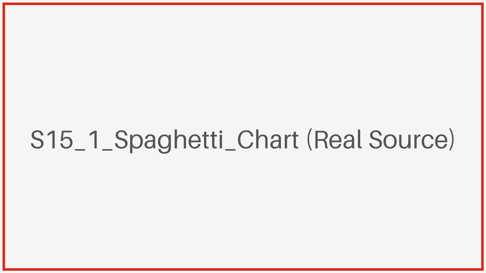
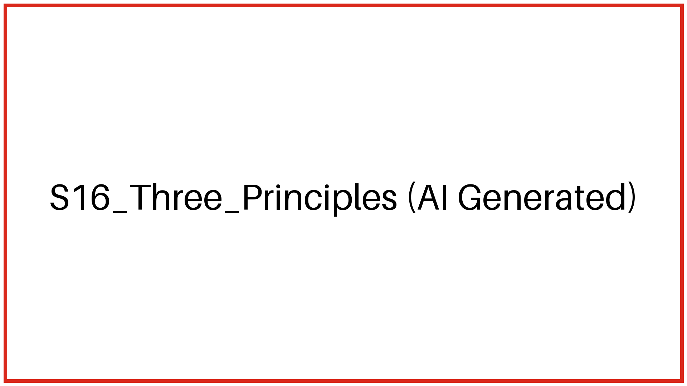
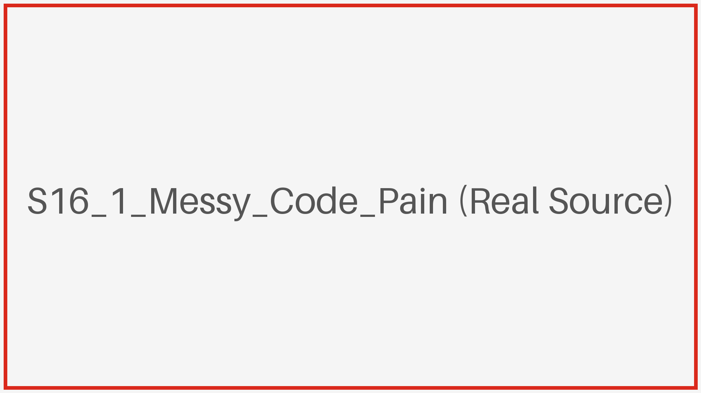
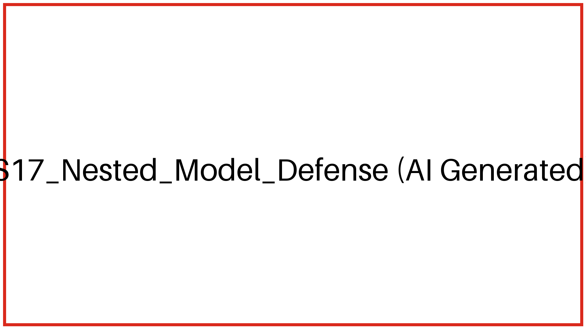
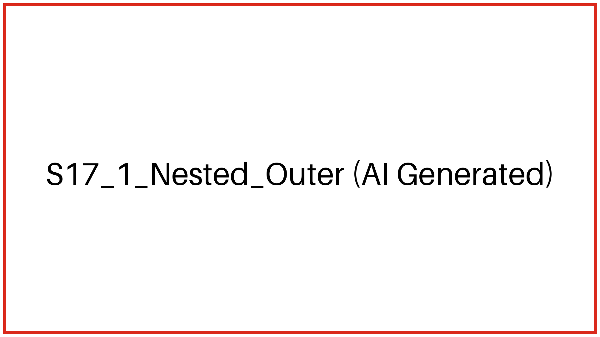
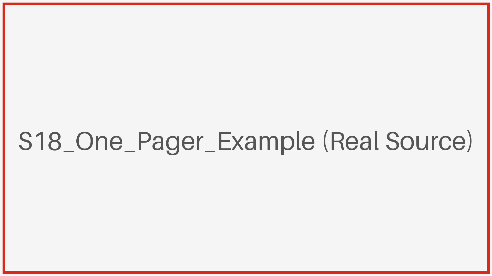

## M05 鉴赏反哺：从偷师到立项

<!-- BUDGET: 5000 chars | STATUS: done -->

> [VISUAL]
> *   **Slide**: `S15_Action_Plan`
> *   **Layout**: `Center`
> *   **Scene**: 黑暗舞台中央打下一束聚光灯，照亮一张空白的蓝图，旁边散落着前六周学过的工具图标（Python、Figma、D3 等）。
> *   **Text**: "从鉴赏到实践：期末实战立项"
> *   **Asset**: 

前三节课我们拆解了顶尖视觉作品的图腾与隐喻，并完成了前六周所有核心技术栈（Python、Figma、D3）的教学。

但鉴赏他人作品与亲手构建项目完全不同。从第七周开始直至期末，**不再有任何新工具课**，我们将全面转入大作业实战。

如何将零散的知识点转化为一个完整且有深度的项目？

这并非随意的界面堆砌，而是一场严密的**认知工程**。今天我们将引入一套标准的立项验证模型，完成从理论到实践的跨越。

### 4.1 社会焦点选题与“流产惨案”

当你们满脑子充斥着炫酷的 Three.js 粒子特效，准备去寻找一个宏大议题时，请立刻踩下刹车。

> [STORY TIME]
> 让我给你们讲一个发生在上两届学长身上的**真实“惨案”**。
> 当时的立项周，有一组同学雄心勃勃，选题叫《近十年全球加密货币流向全景图》。听起来是不是很霸气？切口极其宏大。他们花了整整三周时间写爬虫，结果发现核心交易数据全被交易所 API 锁死，只能拿到极其零散的公开账本。

> [VISUAL]
> *   **Slide**: `S15_1_Spaghetti_Chart`
> *   **Layout**: `Center`
> *   **Scene**: 一张密密麻麻、节点交织在一起毫无重点的“意大利面条”网络图（真实图表灾难截图），旁边标注着“Browser Crash”等字样。
> *   **Text**: "灾难现场：当宏大选题遇到数据断裂"
> *   **Asset**: 

> 到了第 15 周验收前夕，他们的浏览器里不仅拖着 200MB 根本拉不动的 JSON 垃圾数据，而且图表渲染成了一团乱麻般的“意大利面条”。没有焦点，没有故事，只有物理层面的浏览器卡死。最后 3 天，他们含泪推翻重来，把题目缩小成了《某交易所 24 小时内的一次黑客洗钱路径追踪》。
> **项目因为切口太大和数据断裂，险些在最后关头彻底流产。**

为了防止你们重蹈覆辙，在敲下第一行代码前，你们的选题必须通过**“立项三大法则”**的拷问：

> [VISUAL]
> *   **Slide**: `S16_Three_Principles`
> *   **Layout**: `Grid`
> *   **Scene**: 三个并列的红色警示牌，每个警示牌上用醒目的图标标识价值、数据、边界。
> *   **Text**: "选题防线：三大生存法则"
> *   **List**: ["公共价值", "数据获取", "认知边界"]
> *   **Asset**: 

1. **公共价值优先**：项目必须具有社会探讨的价值。不要做闭门造车的自嗨，问自己一个问题：“**如果这个图表消失了，这个世界会损失什么洞察？**”
2. **数据可获取性（DMA 的生命线）**：我们在 M01 中曾提到西方神作背后的**“数据获取鸿沟”**（如《美国移民年轮》依托庞大且完善的历史公共数据库）。当把战场移回国内，有满腔热血但拿不到真实数据，一切都是空中楼阁。作为设计专业的学生，**绝对不要去死磕需要后端鉴权和跨域的复杂 API**！立刻去搜刮现成的、干净的 CSV 或 JSON 静态数据集（如 Kaggle、世界银行或政府开放数据池）。拿不到落地数据的宏大议题，必须当场毙掉，避免跌入数据断层的深渊。
3. **认知边界控制（极度重要）**：不要试图做“近十年全球经济史总结”！把你们的**切口开得极小极深**，像一把锋利的手术刀，狠狠刺入那个最痛的局部截面。

### 4.2 嵌套模型 (Nested Model)：四层排雷防线与兵器谱大收网

当你终于敲定了一个好议题，冲动地想打开 VS Code 写代码时，再次打住。

> [VISUAL]
> *   **Slide**: `S16_1_Messy_Code_Pain`
> *   **Layout**: `Center`
> *   **Scene**: 一个没有地基就直接搭建的摇摇欲坠的数字建筑模型，或者是一张满屏红线报错、逻辑彻底死锁的 VS Code 界面截图。
> *   **Text**: "盲目编码的代价：没有图纸的违章建筑"
> *   **Asset**: 
> *   **Source**: `External`

刚才那个流产的惨案，本质是因为他们只顾着炫技，却忽略了底层的逻辑防线。
为了确保项目稳步推进，我们必须引入信息可视化先驱 Tamara Munzner 提出的嵌套验证模型 (Nested Model of Validation)。该模型包含由外向内相互依存的四层防线，外围的任何崩塌都会导致内层设计的失效。这四层防线恰好映射了我们在前六周学习的工具栈：

> [VISUAL]
> *   **Slide**: `S17_Nested_Model_Defense`
> *   **Layout**: `Split`
> *   **Scene**: 左侧是四个同心圆圈嵌套层（领域层、抽象层、编码层、算法层），右侧是 W01-W06 工具栈兵器谱像拼图一样精准嵌合进对应的圆环中。
> *   **Text**: "嵌套验证模型 × 课程兵器谱大收网"
> *   **List**: ["领域切口", "数据骨架", "视觉编码", "性能底线"]
> *   **Asset**: 

> [VISUAL]
> *   **Slide**: `S17_1_Nested_Outer`
> *   **Layout**: `Split`
> *   **Scene**: 高亮展示嵌套模型的最外两层（领域切口、数据骨架），对应 W01/W02 工具高亮。
> *   **Text**: "外围防线：找准靶心，洗刷数据"
> *   **Asset**: 

1. **第一层：领域问题层 (Domain Situation) —— 即“找准靶心”**
   *   **生涩术语降维**：不要被“领域”两字吓退，它本质上就是**“受众与痛点”**。
   *   **致命威胁**：**“瞄准错误 (Wrong Problem)”**。如果你连受众是谁都不知道，项目不仅毫无公共价值，甚至连基本的**“情感共鸣”**都无从建立。
   *   **收网兵器**：**`W01 领域调研与 Python 基础`**。在这里，我们要跨越“数据鸿沟”，搜寻并整合公开智库上的清洁数据集，避免重蹈写爬虫却被 API 锁死的覆辙。

2. **第二层：数据与任务抽象层 (Data/Task Abstraction) —— 即“备料与切配”**
   *   **生涩术语降维**：“抽象”其实就是**“翻译现实”**。把复杂的现实事件，翻译成计算机能处理的数据结构（如表格、网络）和查询动作（如找极值、看趋势）。
   *   **致命威胁**：**“抽象畸形 (Wrong Abstraction)”**。如果翻译时串味了，无法剔除无关噪音，最终必定会引发**“认知负荷过高”**的灾难。
   *   **收网兵器**：**`W01-W02 Pandas 数据清洗`**。使用 Pandas 将杂乱的原始文本结晶出清爽的结构化骨架，寻找业务洞察的价值锚点。

> [VISUAL]
> *   **Slide**: `S17_2_Nested_Inner`
> *   **Layout**: `Split`
> *   **Scene**: 高亮展示嵌套模型的最内两层（编码层、算法层），对应 W03-W06 工具高亮。
> *   **Text**: "内核防线：视觉重构与性能自保"
> *   **Asset**: 

3. **第三层：视觉编码与交互惯例层 (Visual Encoding & Interaction Idiom) —— 即“让数据说人话”**
   *   **生涩术语降维**：“编码”不是写底层代码，而是**“视觉通道映射”**。决定把哪个数字变成长度，哪个分类变成颜色，并设计符合人类本能的缩放等交互。
   *   **致命威胁**：**“视觉欺骗 (Wrong Idiom)”**。色彩通道的滥用或脱离受众习惯的图表选择，不仅是欺骗，更会导致**“排版水土不服”**。
   *   **收网兵器**：**`W03 Figma 设计原型`** + **`W04/W05 D3.js & ECharts 编码`**。在这里，我们要建立起符合本土受众习惯的阅读秩序。

4. **第四层：算法与实现层 (Algorithm/Implementation) —— 即“引擎底盘”**
   *   **生涩术语降维**：这是最底层的**“前端性能与内存保障”**。
   *   **致命威胁**：**“算力崩塌 (Too Slow)”**。几万个数据节点不加处理直接扔进前端？浏览器瞬间卡死！
   *   **收网兵器**：**`W06 Three.js 与 WebGL 选型`**。我们要果断优化不可见的重叠图元，消除过度绘制。这不仅确保渲染流畅，更是找回被黑压压数据掩盖的真相。

> [TEACHING MOMENT]
> 注意观察这个模型的嵌套顺序。**最外层是领域和抽象，最内层才是视觉和算法。**这意味着什么？
> **“永远不要试图用前端特效的华丽，去掩盖业务逻辑的贫瘠。”** 
> 无论你的 Three.js 粒子流写得多么炫酷，只要最外层的“领域问题层”找错了，你就是在用最高级的技术，极其精确地回答一个毫无意义的问题！

> [ACTIVITY]
> *   **Type**: `Quiz`
> *   **Duration**: `3min`
> *   **Desc**: 随堂测验：嵌套模型的层级诊断
> 
> **Question**: 
> 小明团队计划开发一个《全球近十年经济与医疗波动全景图》，他们收集了海量高质量数据，但在制作第一版原型给用户测试时，用户反馈：“图表五颜六色很酷炫，但我完全不知道你想让我看懂什么”。根据 Tamara Munzner 的“嵌套验证模型”，该项目最可能在哪一层发生了最初的崩溃？
> 
> **Options**:
> A. 领域问题层 (Domain Situation)。未能聚焦特定受众的痛点，导致项目缺乏核心探讨价值与目标。
> B. 数据与任务抽象层 (Data/Task Abstraction)。未能将医疗和经济指标转换为可被计算的数据结构。
> C. 视觉编码层 (Visual Encoding)。使用了错误的颜色通道，导致图表在显示时出现了纯粹的视觉欺骗。
> D. 算法与实现层 (Algorithm/Implementation)。数据量过大导致前端浏览器在渲染时严重卡顿。
> 
> **Answer**: A
> 
> **Explain**: 
> 正确答案是 A。根据本节讲授的嵌套模型（Nested Model），用户反馈“不知道想让我懂什么”属于典型的“瞄准错误 (Wrong Problem)”，即最外层的“领域问题层”崩溃——项目没有明确想要帮哪群人解决什么痛点。B 层对应数据翻译，C 层对应视觉排版，D 层对应代码性能，这些内层防线再坚固（用户觉得“很酷炫”说明 C、D 层表现尚可），也无法拯救最外层靶心的缺失。这也呼应了“不能用特效掩盖业务逻辑贫瘠”的核心原则。

### 4.3 压轴任务：撰写 One Pager 立项提案

有了这套严密的防线，今天最后 15 分钟的任务，就是将立项构思固化为结构化的方案。我们称之为“**One Pager（一页纸）立项提案**”。

> [VISUAL]
> *   **Slide**: `S18_One_Pager_Example`
> *   **Layout**: `Center`
> *   **Scene**: 一张结构清晰、包含四个层级定义的真实 One Pager 项目提案手稿范例。
> *   **Text**: "一张纸定生死：将构思锁定在契约上"
> *   **List**: ["Step 1 撰写痛点愿景", "Step 2 列出交互任务", "Step 3 草绘主视图", "Step 4 确认技术选型"]
> *   **Asset**: 
> *   **Source**: `External`

> [PACING]
> 语气变得严肃、正式，停顿。走下讲台，环视全班。带入项目启动的仪式感。

> [ACTIVITY]
> *   **Type**: `Practice`
> *   **Duration**: `15min`
> *   **Desc**: 撰写期末项目：“四层 One Pager 立项提案”
> Step 1: 【领域层】写出一句话愿景：你要揭示什么特定人群的什么痛点？
> Step 2: 【抽象层】列出数据字段字典与 3 个核心交互任务。
> Step 3: 【编码层】草绘（手绘或 Figma）主视图的隐喻与视觉通道映射。
> Step 4: 【算法层】评估数据量级，确认技术选型（ECharts/D3/Three）。

这份 One Pager 不仅是一份作业，更是你们接下来开发过程中的**核心基准**。
如果在调试代码时迷失了方向，请重新审视这份提案，问问自己：**当前的技术实现是否还在服务于最初的领域问题？**

下课前，请所有小组将 One Pager 提交。我们下周实战见！
