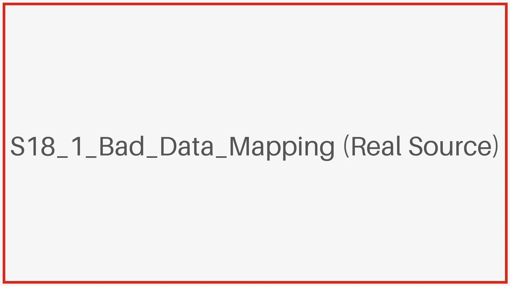
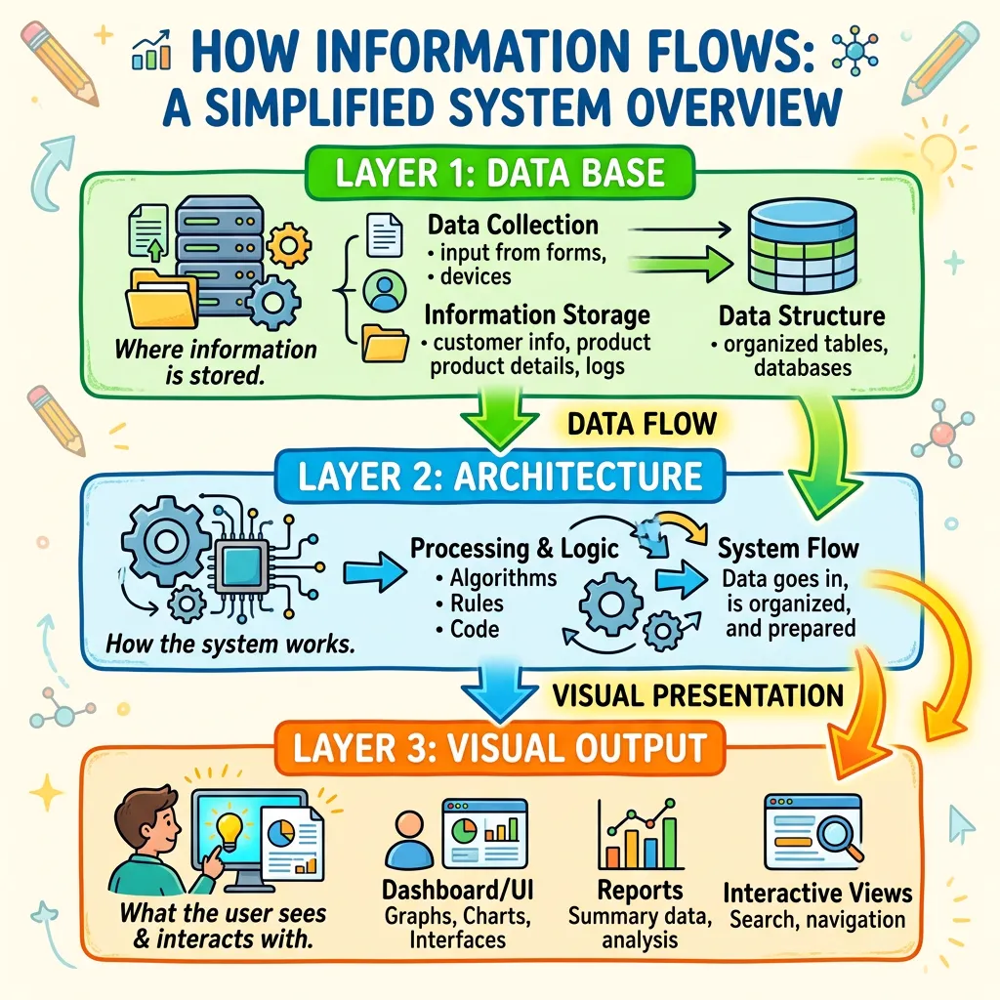
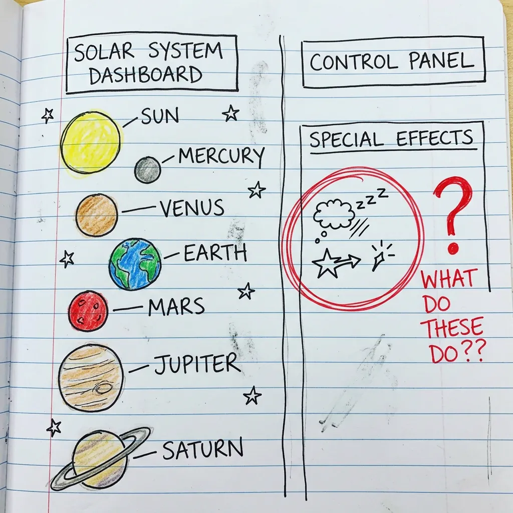
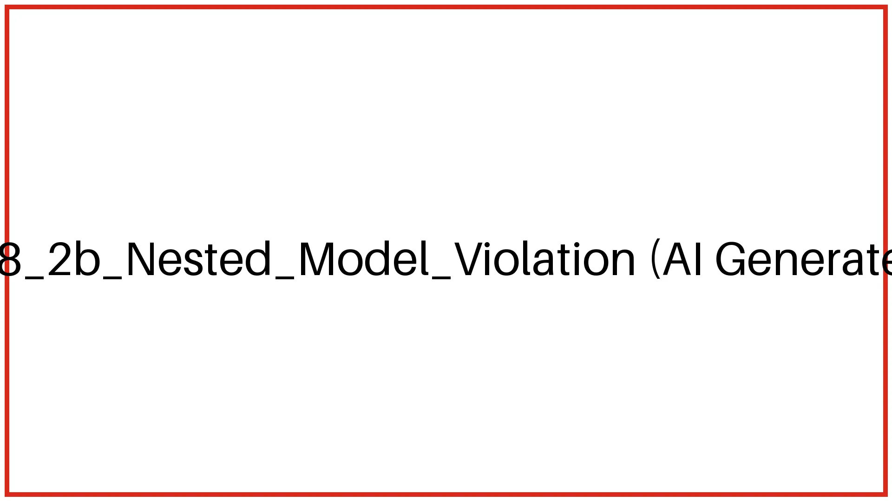
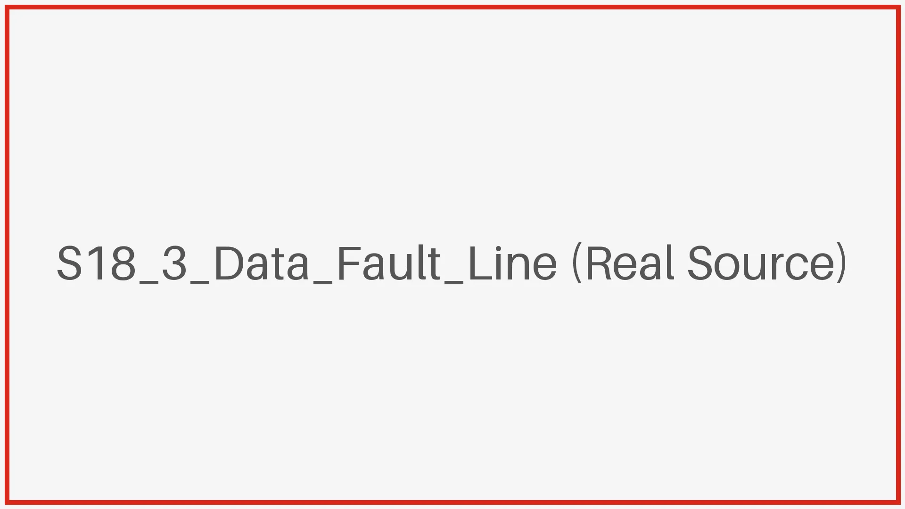
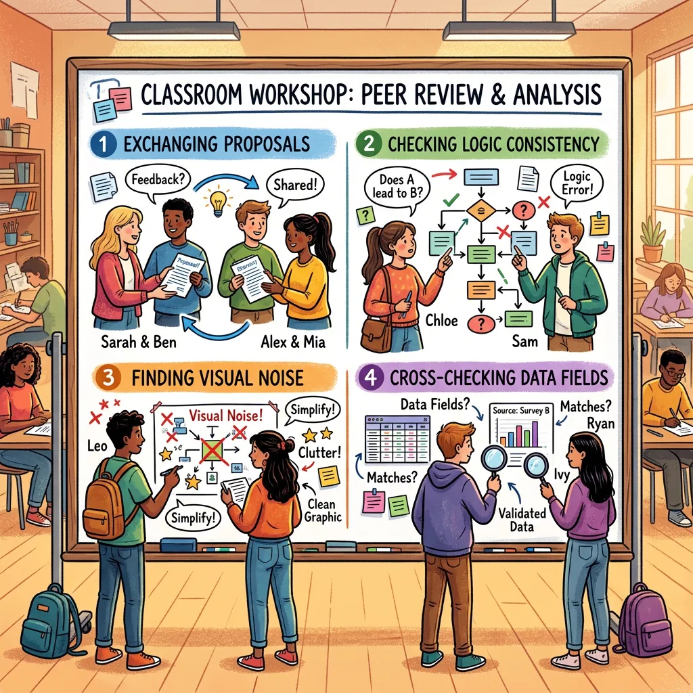

## M06 交叉防御：Critique 互评

<!-- BUDGET: 3000 chars | STATUS: done -->

> [VISUAL]
> *   **Slide**: `S18_Critique_Methodology`
> *   **Layout**: `Full`
> *   **Scene**: 左侧是一张布满红笔批注、指出逻辑漏洞的 UI 草图（One Pager），右侧是清晰的评审维度表，呈现专业严谨的氛围。
> *   **Text**: "Critique：用逻辑排雷"
> *   **Asset**: 

> [PACING]
> （语速放缓，语气转为专业严谨）

在下周进入代码开发阶段之前，今天我们要完成设计周期的关键一环：**Critique 互评**。我知道，让大家拿着红笔去挑同学的刺，很多人心里会觉得尴尬，怕得罪人，想着“要不我随便夸两句‘设计得真好看’就算了”。

但请记住：**今天不当“恶人”，下周同学就会变成“废人”。** Critique 不是针对个人的批评，而是一场**“代码灾难抢险”**。你现在的身份不再是同学，而是**无情的报错编译器**。这不是为了互相赞美，而是为了在前期发现并排除潜在的**逻辑漏洞**。

> [VISUAL]
> *   **Slide**: `S18_1_Bad_Data_Mapping`
> *   **Layout**: `Center`
> *   **Scene**: 一张真实的错误数据可视化截图（离散分类数据被错误赋予 3D 高度导致视觉重叠），配合警示图标。
> *   **Text**: "逻辑断层：当视觉编码违背数据类型"
> *   **Source**: `External`
> *   **Asset**: 

> [CASE STUDY]
> 让我分享一个上届的真实案例。大家看大屏幕上这张错误的数据可视化截图，就是真实的教训。在 **One Pager（一页纸项目提案）互评阶段**，有一个小组的提案收到了诸多“效果肯定很震撼”的赞美。然而，**没有任何人指出**其中的一个基础逻辑错误：他们试图把**离散的分类数据（Categorical Data，比如男/女、苹果/橘子等平等的身份标签）**，**强行拉伸成连续的 3D 高度（Height Channel，代表高低、大小的量化数值）**。这就好比非要用身高来衡量苹果和橘子谁更“高级”一样荒谬，硬生生把平权的标签做成了有等级的物理高度。
> 
> 这导致了什么后果？到了代码开发后期，虽然 D3.js 渲染没有报错，但屏幕上呈现的却是重叠交织的黑色尖刺。他们花了三个通宵写代码，最终产出的图表却无法被用户阅读。这一切的根源，本可以在今天的 Critique 中，通过严格的逻辑审查被提前拦截。

> [TEACHING MOMENT]
> **批判的同理心（Critical Empathy）**：真正的同理心不是敷衍的赞美，而是帮同学排雷。把丑话说在纸上，好过下周把几百行的红色 `undefined` 报错留在屏幕上。今天你的每一次“刁难”，都是在拯救他们下周的睡眠。

### 1.1 Critique 的三大审裁任务

大家看大屏幕上的这套指标体系。Critique 的重心并非评价原型“好不好看”，而是深入检查项目背后的**逻辑底层**，严防 M01 中提到的那 **“4个致命弊端”** 在你们的期末项目中重演。

作为设计者，大家在互评时需要执行以下**三大任务**：

> [VISUAL]
> *   **Slide**: `S18_2_Critique_Diagram`
> *   **Layout**: `Split`
> *   **Scene**: Tamara Munzner 的嵌套模型与郝亚维信息逻辑图的叠合解剖图，三大审裁任务以引出线的形式精准指向模型的不同层级。
> *   **Text**: "Critique 的三个核心维度"
> *   **List**: 数据锚定 / 嵌套模型 / 数据断层
> *   **Source**: `AI_Gen`
> *   **Asset**: 

> [VISUAL]
> *   **Slide**: `S18_2a_Data_Anchoring`
> *   **Layout**: `Split`
> *   **Scene**: 左侧是一张带有夸张“发光星球”和“赛博朋克光晕”的草图，右侧红笔圈出这些特效并打上问号，指出找不到对应的数据列，标记为“视觉噪音”。
> *   **Text**: "任务一：审查数据锚定"
> *   **Source**: `AI_Gen`
> *   **Asset**: 

**第一，审查视觉元素是否有“数据锚定”（即：画出的每个视觉特征，能不能像钉子一样死死钉在对应的数据列上）。**
如图所示，很多 One Pager 充斥着“酷炫的滤镜”、“科技感光环”等冗余形容词。依据**郝亚维老师的《信息可视化设计》工作流**，第一步必须是**建立信息逻辑**。互评时，请拿着红笔指着草图上的那颗发光星球问：“**它的半径死抠的是哪一列数据？它的光晕强度绑定的是哪一列数据？**”如果对方答不上来，或者数据表里根本没有能决定大小和颜色的数值列，这就是毫无意义的**视觉噪音**，会直接导致**“认知负荷过高”**。请划掉并铲除这些无数据支撑的表述。

> [VISUAL]
> *   **Slide**: `S18_2b_Nested_Model_Violation`
> *   **Layout**: `Center`
> *   **Scene**: 一个带有叉号的反面示范：左侧标注“Why 未定”，右侧是纠结颜色的设计图，以示“跨层跳跃”。
> *   **Text**: "跨层跳跃：地基未稳，切勿上漆"
> *   **Asset**: 
> *   **Source**: `External`

**第二，检查是否违背嵌套模型（Nested Model，即没有搞懂问题就开始挑图表）。**
依据 **Tamara Munzner 的 Why-What-How 渐进分析模型**，常见的问题是**跨层跳跃**。刚才屏幕上的 Slide 叫做“地基未稳，切勿上漆”，这就是跨层跳跃的最佳白话隐喻。例如，**任务与数据抽象层（Why 和 What，即你要盖商场还是住宅、手头有砖头还是木材）**还未理清，就直接跨越到了**视觉编码层（How，外墙要刷什么漆）**。对于设计专业学生来说，最常见的通病就是：**连用户是要看“整体趋势”还是“对比极端值”（Why 这个逻辑地基）都没定下来，组员们就开始为了该用“赛博朋克粉”还是“克莱因蓝”（How 这个外墙漆）吵得不可开交！**互评时请核对：当前的**数据特征（What，你的建材）**和**用户任务（Why，建筑的用途）**，是否足以支撑其计划的**视觉表达（How，装修风格）**。如果不匹配，必须立刻推翻重构。

> [VISUAL]
> *   **Slide**: `S18_3_Data_Fault_Line`
> *   **Layout**: `Center`
> *   **Scene**: 左侧是宣称要根据情绪变色的交互文案，右侧是缺失情绪字段的 JSON 数据，下方显示控制台的 undefined 红色报错。
> *   **Text**: "数据断层：无源之水导致的崩溃"
> *   **Asset**: 
> *   **Source**: `External`

**第三，通过交叉扫描揪出“数据断层”（即：想当然地虚构数据）。**
仔细对比对方的 JSON 数据结构与视觉编码草图。如果提案宣称“我们要根据用户的情绪来**缩放**散点大小”，但当你像排雷一样查阅其真实拿到的 JSON 数据源时，发现里面**根本不存在**情绪相关的字段，这就是想当然虚构而导致的**数据断层**！如果现在不把它揪出来，下周代码开发时必然会面临满屏红色的 **`undefined` 致命报错**。现在替他们揪出断层，就是在拯救他们未来的调试时间。

> [ACTIVITY]
> *   **Type**: `Quiz`
> *   **Duration**: `3min`
> *   **Desc**: 知识点检查：分辨“数据锚定缺失”与“数据断层”这两种不同类型的逻辑雷区。
> *   **Question**: 在互评时，张伟审查了同桌的交互大屏设计稿，发现地图上画了许多动态闪烁的“红色光晕”来包裹特定城市节点。但当张伟翻看同桌刚刚从 API 爬取的真实 JSON 数据样本时，发现每一行仅有 `city_name`（城市）、`temperature`（温度）和 `humidity`（湿度）三个基础字段。当询问这些光晕代表什么时，同桌回答“这就代表该城市的雾霾污染指数超标警报啊”。张伟应该在互评表上为这个设计稿标记哪一种致命错误？
> *   **Options**:
>     *   A. 数据断层：视觉元素试图表达的业务概念在真实数据源中根本没有对应字段支撑。
>     *   B. 跨层跳跃：在没有搞懂温度和湿度的关系前，就直接选用了红色光晕这一视觉元素。
>     *   C. 数据锚定缺失：为了追求炫酷的科技感，添加了毫无业务含义的随机视觉噪音。
>     *   D. 交互超界：红色光晕的闪烁效果超出了前端代码库的渲染能力边界。
> *   **Answer**: A
> *   **Explain**: 张伟遇到的是典型的“数据断层”——设计稿（红色光晕代表污染警报）依赖于虚构的数据前提（JSON 里根本没有污染指数或警报判断字段），这在下游代码开发时会直接导致 `undefined` 报错。C（数据锚定缺失）的区别在于，锚定缺失通常是指对方答不上来该元素代表什么（纯粹无业务含义的装饰噪音），而这里的“红色光晕”被明确赋予了业务含义，只是数据基础被想当然地虚构了。B 错误，因为这里不涉及 Why/How 的顺序倒置。（参见本节关于“揪出数据断层”的交叉核对原则，务必核对真实数据字段）

### 1.2 互评执行：下游验证

现在，大家交换提案。我们要站在开发者的视角执行**“下游验证”**（即：就像造房子时包工头要审图纸一样。把自己当成即将接手这套设计的“包工头”程序员，假装现在就要开始搬砖写代码，看看设计图上画的每一个华丽元素，能不能在真实的 JSON 数据地基里找到落脚点）。

为了打破社交尴尬，我们强制执行**“红笔黑客”互评纪律**：
1. **禁止客套**：互评期间，严禁说“配色好看”、“排版很酷”等无用赞美。
2. **物理盘问**：拿着红笔，指着对方草图上的元素当面发问：“这个圆圈的半径，到底死抠的是 JSON 里的哪一行？”
3. **必须找 Bug**：找不到至少一处逻辑断层，不允许交还提案。

请严格审阅对方的设计：一旦发现跨层跳跃、视觉噪音或是缺乏数据支撑的元素，请直接用红笔在图纸上划个大大的叉。不要心软，你现在划掉的每一个冗余元素，都是在帮同学下周保住一把头发。你的专业反馈，将为后续的代码实现彻底扫清障碍。

> [VISUAL]
> *   **Slide**: `S18_4_Critique_Workshop`
> *   **Layout**: `Split`
> *   **Text**: "互评执行：下游验证"
> *   **List**: 1.交换提案 / 2.标注跳跃 / 3.标记噪音 / 4.核对字段
> *   **Source**: `AI_Gen`
> *   **Asset**: 

> [ACTIVITY]
> *   **Type**: `Workshop`
> *   **Duration**: `10min`
> *   **Desc**: 项目逻辑 Critique 互评
> Step 1: 小组间交换 One Pager 提案
> Step 2: 检查嵌套模型，标注逻辑跳跃点
> Step 3: 标记无数据支撑的冗余视觉形容词
> Step 4: 交叉核对数据字段与视觉编码对应关系

> [ACTIVITY]
> *   **Type**: `Quiz`
> *   **Duration**: `3min`
> *   **Desc**: 互评逻辑判断：考察对三大错误（数据锚定缺失/跨层跳跃/数据断层）的判别能力。
> *   **Question**: 小组长 Lisa 在 One Pager 讨论会上说：“我们要用红色和蓝色的渐变来表示用户的年龄段，用节点的大小表示他们的购买力。” 此时，负责数据清洗的组员反驳说：“等等，我们在确定用颜色和大小之前，根本还没讨论过我们的核心用户任务是要做趋势对比还是寻找异常值！” 请问 Lisa 的发言犯了互评体系中的哪种核心错误？
> *   **Options**:
>     *   A. 发生了跨层跳跃：跳过了 Why（用户任务）层直接进入 How（视觉编码）层。
>     *   B. 产生了数据断层：所设想的视觉编码找不到对应的数据字段支撑。
>     *   C. 缺失了数据锚定：引入了大量无法被真实业务数据驱动的视觉噪音。
>     *   D. 忽略了交互逻辑：未能在图表中规划出与用户操作对应的反馈机制。
> *   **Answer**: A
> *   **Explain**: Lisa 在尚未明确 Why（用户任务是要做对比还是寻找异常值）时，就直接进入了 How（颜色和大小的视觉编码），这属于典型的违背 Munzner 嵌套模型的“跨层跳跃”。B 和 C 错误，因为题干并未说明他们没有对应的数据列（排除数据断层），也没有使用无意义的修饰词（排除数据锚定缺失问题）。（参见本节 5.1 关于 Tamara Munzner 的“嵌套模型”的三层递进论述，务必理清任务后再执行视觉编码）

> [PHILOSOPHY]
> 设计的本质不仅是创造，更是不断的**迭代与重构**。高质量的**低保真（Low-Fi）原型**（即不追求视觉美观、甚至无需写代码的草稿阶段），不在于绘制的精细度，而在于背后白纸黑字写下的、**严密的逻辑推演**。

（W07 课程到此结束，期待你们下周带着清晰的项目逻辑，顺利进入代码开发阶段。）
