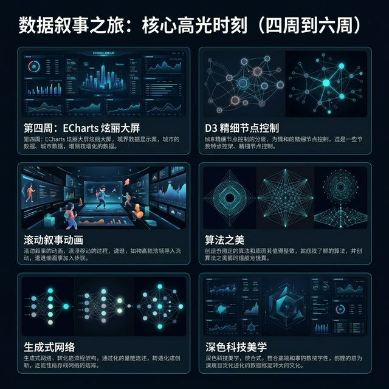
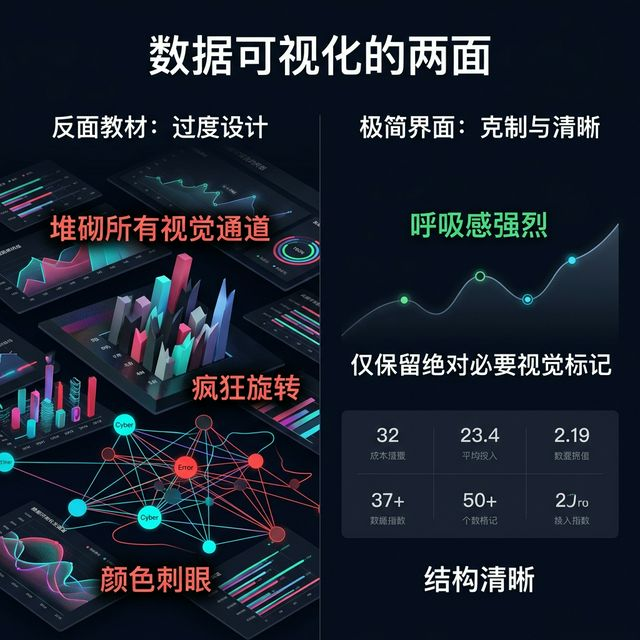
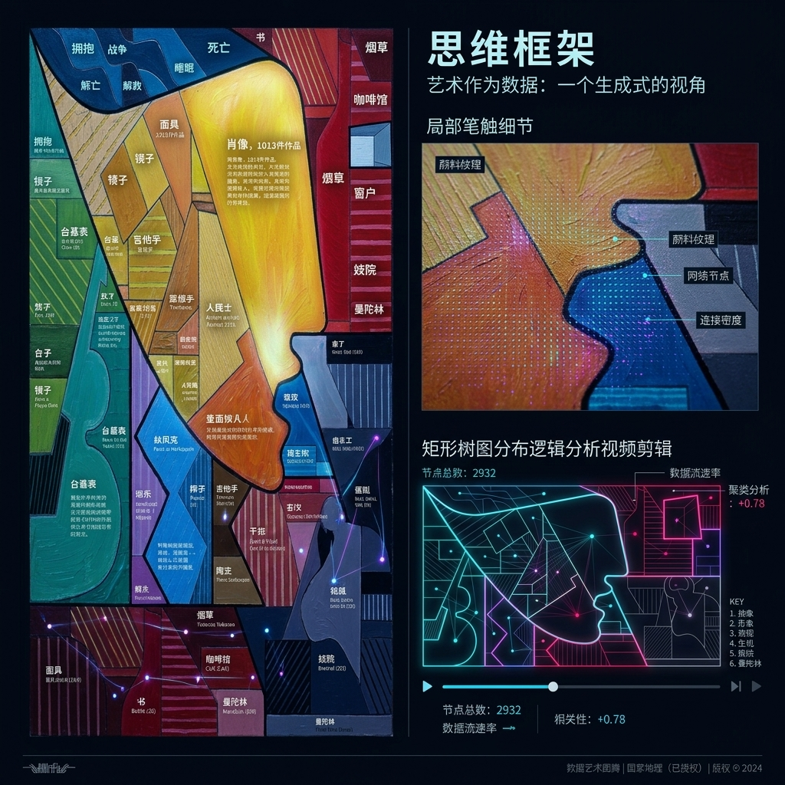

## 模块 1: 勿忘初心：警惕科技狂欢与艺术的回归 (约 20 分钟)
<!-- BUDGET: 3600 chars | SLIDES: ≥7 | STATUS: done -->

> [!NOTE]
> 本模块回顾 W07 项目架构设计，检查各组项目进度与遗留问题，引入最终冲刺阶段的排错、封装与部署主题。在此基础上，深度复盘七周课程的核心脉络，并强调信息可视化作为一种情感叙事媒介的终极本真。回链：能力1（D3/ECharts 交互叙事生成）、能力2（嵌套模型全流程规划）、素质1（信息技术系统性解决可视化问题）、素质3（专业诚信与社会责任意识）。参照 Munzner Ch15 设计实践中的迭代方法论：从问题定义到原型验证的反复精修循环。

> [VISUAL]
> *   **Slide**: `S01_Title_W08`
> *   **Layout**: `Title`
> *   **Scene**: 深邃的数字深渊背景，左侧是密密麻麻、眼花缭乱的复杂 D3.js 代码与杂乱无章的原始图表节点（象征着没有灵魂的科技狂欢）；右侧是经过极简主义美学封装后，宛如艺术品般静谧、直击内核的数据可视化界面。
> *   **Text**: "大音希声：在数据的海洋中寻找最终的情感共鸣"
> *   **Asset**: 

各位同学，欢迎来到《信息可视化设计》这门课程的最后一次理论与实战交汇的课堂。在过去的七周时间里，我们经历了一场从认知觉醒到技术实操的漫长攀登。

在切入今天极度硬核的技术封装和项目联调环节之前，我们首先需要花一点时间，认真回视我们的来路。在上周的课程中，也就是第七周，我们正式启动了综合项目，探讨了如何从宏大、复杂的文化与社会议题中提取洞察，并将其转化为具有人文关怀的原型设计。当你们开始绘制团队的系统架构图，开始分配前端框架的开发角色时，这也意味着我们的课程正在由理论驱动转向了工程驱动。

> [VISUAL]
> *   **Slide**: `S01i_Progress_Check`
> *   **Layout**: `List`
> *   **Scene**: 进度核对表（数据采集、清洗、骨架、交互）。项目逐渐打勾，微弱脉冲光。
> *   **Text**: "项目进度核对表：数据源获取、清洗规则、图表骨架、交互框架"
> *   **Asset**: 

请各个团队在脑海中迅速走查一遍你们的研发现状。你们的数据集是否已经通过了 Tidy Data（整洁数据）的标准清洗？你们的 ECharts 声明式配置或者 D3.js 的图表骨架是否已经在本地终端成功跑通？你们设计的交互逻辑，是否正如第六周所预期的那样，能够通过平滑的丝缕滚动事件触发？我知道，这个时候很多团队正是热火朝天、甚至是焦头烂额的阶段。你们可能沉迷于和大语言模型无休止地对战代码逻辑，或者陷入了反复计算某一个力导向图弹簧系数的死循环里无法自拔。

停下来，深呼吸。从那堆繁杂的代码逻辑和冰冷的控制台中跳出来。我们需要在进行最后的冲刺前，真正搞清楚我们到底在做什么。

**(Pause: 3s)**

> [VISUAL]
> *   **Slide**: `S01b_Seven_Week_Journey`
> *   **Layout**: `Timeline`
> *   **Scene**: 一条像光轨一样延伸的时间轴贯穿画面。每个节点都亮起微缩的图表动画，展示从第一周的心理学概念慢慢演变为动态的复杂网络，象征着大家知识技能层层叠加的过程。
> *   **Text**: "七周的演进：从认知盲区到数据导演的蜕变"
> *   **Asset**: 

让我们重新走一遍这段长达两个多月的成长足迹。这是一段极其关键的心智重塑之旅。回想第一周，当我们第一次接触到“认知外接显卡”这个概念时，很多同学看图表的方式还仅仅停留在辨认数字的大小。我们学习了视觉感知法则，明白了什么是前注意处理（Pre-attentive Processing），什么是格式塔原则。那时的我们，开始意识到，信息设计并不是随意地给数据涂上花花绿绿的颜色，而是真正在劫持和引导观众的视觉神经机制。

> [VISUAL]
> *   **Slide**: `S01c_Week_Milestones`
> *   **Layout**: `Grid`
> *   **Scene**: 网格卡片展示 ECharts 大屏、D3 节点及滚动叙事动画。
> *   **Text**: "技术的攀登：高低阶框架与叙事流动"
> *   **Asset**: 

到了第二周和第三周，我们深入了符号的隐喻层面和数据提取的深渊。我们学会了如何拆解数据的基因组——从数据类型到属性层面，我们像外科医生一样剖析结构。我们懂得了为什么那些带有地理约束的数据绝不能强行喂给条形图，为什么在处理具有强烈对比属性的数据集时，我们需要毫不留情地舍弃冗余的“数据墨水”。每一次对图表的精简，都是对信息传递效率的一次拔高。

随后，在第四和第五周，我们在技术层面迎来了剧烈的爆炸。我们不仅学会了用 ECharts 这种高阶的声明式框架快速搭建出恢弘的仪表盘，在享受这种“Vibe Coding”自然语言驱动的快感时，我们也没有放弃对底层的追问。我们潜入了 D3.js 的世界，一砖一瓦地控制每一个 SVG 的生命周期，去捏造那些能够传达绝望、狂喜或混乱的力导向图态。当我们第一次看到满屏幕的节点因为引力模型而聚集成星系时，那是一种创世般的震颤。

而在第六周，我们掌握了讲故事的终极武器：滚动叙事（Scrollytelling）。我们懂得让数据在用户的指尖顺滑流动，如同电影导演控制摄像机轨迹一般，将干瘪的数据点还原成了一个个活生生、充满悬念的事件现场。

这就是你们这七周的经历。从对图表一无所知，到如今手握重器，具备了搭建企业级数据看板和艺术级交互网页的全面能力。你们不再是工具的使用者，而是成为了赛博空间的叙事者。

> [VISUAL]
> *   **Slide**: `S01e_Tech_Hubris_Warning`
> *   **Layout**: `Split`
> *   **Scene**: 左侧为堆砌过载的图表网络；右侧为极简克制界面。
> *   **Text**: "警惕：技术权力的反噬与迷失"
> *   **Asset**: 

然而，随着技术的精进，我也观察到了一个危险的苗头，这是每一届学生在进入最后大项目时都会遭遇的陷阱——科技的狂欢带来的权力膨胀。

当你们发现自己可以通过区区几行代码，就调用百万级的顶点数据，当你们可以使用最顶尖的物理引擎让屏幕里的散点如流星雨般飞舞时，一种难以抑制的炫技欲望就被点燃了。你们想把饼图做成 3D 的，想把柱状图加上赛博朋克风格的霓虹灯特效，想在用户每滑动一下页面时就触发一场震耳欲聋的视觉轰炸。你们希望在同一个页面里塞下十五个交互图表，好证明自己在这个学期有多么努力。

这种冲动非常危险。过度的视觉武装不仅会杀死数据本身的逻辑，更会彻底屏蔽掉受众与你作品之间建立情感连接的可能性。这就好比在一场交响音乐会上，所有乐器同时以最大音量奏响——最终留给听众的只有难以忍受的噪音。

> [PHILOSOPHY]
> **大音希声：技术退场与情感登场**
> 在数据的浩瀚海洋里，绝对且冰冷的精确性仅仅适合企业内部的财务报表系统和枯燥的工业监控后台。
> 
> 作为数字媒体艺术（DMA）专业的学生，你们不仅是数据的搬运工，更是数字时代的情感共鸣放大器。在这个被生成式 AI 和巨量数据裹挟、充满着喧嚣的科技世代之中，最顶级的技术运用往往体现为一种极致的克制。中国古典美学中所推崇的“大音希声，大象无形”，在这里找到了最完美的注脚。最高境界的图表，不应该是刺目的炫耀，而是让你在第一眼看到时，彻底忘记技术的存在。

> [VISUAL]
> *   **Slide**: `S01f_Hao_Social_Projects`
> *   **Layout**: `Quote`
> *   **Scene**: 极简散点图揭示难民迁徙坐标。
> *   **Text**: "社会焦点整合设计：为无声的数据赋予心跳"
> *   **Asset**: 

真正伟大的可视化项目，绝不是为了向观众炫耀你的代码写得有多复杂，也不是为了展示你掌握了多少种酷炫但无用的动效库。就像我们在教材第六章看到的那些社会焦点项目一样，那些设计师试图触及的，是深层的道德境遇和生存危机。

当你的受众，无论是街头的普通市民，还是安静的美术馆里的驻足者，通过链接打开你们的数据艺术作品时，他们应该在第一眼只感受到你想要传递的那种巨大的情感冲击波。这种冲击力，可能是对全球变暖带来的人类生存版图缩小的无声震撼，可能是对城市化进程中留守儿童数量攀升的深沉痛心，或者是对某种被忽视的罕见病群体生活困境的强大悲悯力量。

> [VISUAL]
> *   **Slide**: `S01h_Emotion_Impact`
> *   **Layout**: `Full Screen`
> *   **Scene**: 观众沉浸思考的面部特写。屏幕光影投射脸庞。
> *   **Text**: "情感冲击力：超越逻辑的直觉共鸣"
> *   **Asset**: 

在这个体验的震撼瞬间，底层那种如同野兽般庞大的千万级千万条数据清洗过程，以及那些复杂且精密的图表生成算法，都应该完美地、毫无痕迹地隐没在幕后，浑然不觉。只有当技术主动退步，把聚光灯让出来，叙事和艺术的情感才能真正登上前台。

**(Pause: 3s)**

> [STORY TIME]
> **Exp1: 消失在纽约的大屏幕上的航线**
> 几年前，纽约现代艺术博物馆（MoMA）曾展出过一件探讨流离失所现象的可视化作品。这件作品的开发团队面临着一个庞大的数据集，里面记录了数十年间几百万难民和流亡者的迁徙轨道。起初，开发团队使用了极其复杂的粒子流体渲染技术（Particle Fluid Simulation）和 GPU 加速的实时寻路算法。最终生成的初稿画面简直色彩斑斓，宛如绚丽的银河系，每一次点击都会引发潮水般的绚烂动画。
>
> 然而，在经过策展人的内测后，主创团队做出了一个极其痛苦的决定：彻底推翻这个充满炫技感的高阶技术版本。为什么？因为这种极度华丽、带有强烈数字乌托邦狂欢性质的视觉效果，彻彻底底地消解了难民流亡之路那本该有的苦难、血泪与沉重。最终展出的定稿版本中，高阶技术被大幅度“降维隐身”——整个巨型显示屏变成了深沉且压抑的暗黑色调。那些活生生的人的命运，被化为了一根根极其微弱、摇摇欲坠的暗淡白线。这种近乎枯槁的处理方式，反而让现场的观众深深被触动，甚至有人潸然泪下。这个案例深深地告诉我们，技术只是配角，情感维度的共鸣才是统御全局的真正主君。不要用杂乱的代码去掩盖苍白的内核，让复杂归于平静。

> [VISUAL]
> *   **Slide**: `S01g_Data_Ethics_Case`
> *   **Layout**: `Text`
> *   **Scene**: 泄露隐私轨迹的模糊数据节点网络。
> *   **Text**: "数据版权与道德底线：不仅仅是调参，更是责任与敬畏"
> *   **Asset**: 

当然，在这条探寻真相的路上，我们也绝不能因为追求巨大的情感震撼，而逾越另一条致命的神圣红线。这就是我们今天必须在第一模块重点强调，也是每支大作业团队绝对不能违背的思想阵地——数据伦理与知识产权的边界。

我知道很多同学在搜集大作业素材时，为了获得所谓的“一手数据”，利用课余时间编写了粗糙的脚本，通过各种非官方渠道强行爬取了大量带有个人隐私背景的数据源，或者直接在 GitHub 上 Fork 挪用了他人的数据清洗成果而没有在项目中做出任何标注。同学们，这不仅是一种严重的学术不端，更是对被凝视者的再一次无情伤害。你把别人活生生的人生遭遇，当成了供自己毕业作品调参测试的无名耗材。

> [CASE STUDY]
> **Exp2: 剑桥分析与被滥用的信令数据危机**
> 曾有某个海外学术团队为了展示一种极具创意的 D3.js 高维地理交互可视化效果，私自调用并且未作任何脱敏处理地展示了一个地区成千上万底层用户的基站轨迹信令数据。虽然这个交互图表在技术上堪称登峰造极，甚至一度被一家知名的设计杂志提名了年度大奖。但最终，随着社会对于个人隐私权利曝光的愤怒，该团队不仅被立刻撤回了所有奖项提名，其主创人员甚至面临着严厉的法律诉讼指控和所在大学的除名处分。
> 
> 作为将来的媒体创作者，当你们把那些看似冰冷的坐标点投射在大屏幕或网页上时，你必须时刻牢牢记住，每一个光点背后都是一个真真切切的、会呼吸的活人。他们有自己的家庭羁绊、有琐碎的生活轨迹、有根本不想被大众猎奇注视的秘密空间。这就要求大家在最后冲刺阶段，不仅要在代码仓库里认认真真地写好 `README.md`，庄重地声明数据引用来源，更要在可视化设计中，主动加入隐私模糊、数据聚合处理等强有力的技术保护策略。

> [LIFE CONNECT]
> 试着回想一下，当大家在每年年底，在各大社交软件、或是网约车软件上查看自己被机器自动生成的“年度乘车路线图”或者“年度深夜外卖榜单”时。在你们分享朋友圈的那一秒冲动之后，你们是不是也曾隐隐感到一丝，被一个看不见的巨形机器系统全面监控的焦虑与不安？这正是我们平时常说的大数据剥削。你们绝不能让自己的期末作品，成为这种冷血数字监控体系的帮凶。我们手里的键盘和前端代码，应该是打破世界偏见、传递人性温暖的工具，而不是一把冰冷的解剖刀。

**(Pause: 3s)**

> [VISUAL]
> *   **Slide**: `S01j_Frames_Of_Mind`
> *   **Layout**: `Split`
> *   **Scene**: 左侧展示被誉为“数据艺术终极图腾”的《Frames of Mind》（心智的结构）全景图——远看是一幅极具立体主义情感冲击率的抽象油画；右侧是它的局部笔触细节大图，以及 Morning Viz 关于其严密 TreeMap 分布逻辑的解析视频片段。
> *   **Text**: "终极图腾：Frames of Mind（心智的结构）与艺术的回归"
> *   **Asset**: 

在你们经历了 D3.js 的代码崩溃和 AI 生成的科技狂欢后，在我们即将进入今天最残酷的修 Bug 环节之前，我必须给你们看最后一件作品，作为我们这门课的“终极图腾”。

如果在屏幕上展示百万级节点已经让人感到麻木，那么请看这幅由国家地理著名可视化设计师 Alberto Lucas López 创作的《Frames of Mind》。它不仅在 2018 年包揽了 Kantar 信息之美大奖和 Malofiej 金奖，更是对我们行业的一次“媒介反叛”。这不是用 WebGL 渲染的屏幕像素，而是用传统油画颜料，在 1.5 米宽的物理画布上，一笔一划画出来的关于毕加索 8000 件作品的严密数据聚类分析。

在这里，可视化彻底回归了人文与物理触感。这种带有极强生命力的笔触，让冰冷的数据真正拥有了体温。

> [KEY TAKEAWAY]
> **Alberto 宣言：媒介的底座是人文**
> *"Infographics is the pearl of journalism. First comes the journalism, then the art."*
> （信息图表是新闻学的明珠，但如果没有人文的底座，哪怕它再炫酷，也只是一堆毫无意义的像素。）

> [VISUAL]
> *   **Slide**: `S01k_Refocus_Action`
> *   **Layout**: `CTA`
> *   **Scene**: 脉冲准星对焦 `npm start` 纯文本，象征实战状态回归。
> *   **Text**: "准备好了吗？让我们正式跨越雷区，开启终极缝合"
> *   **Asset**: 

那么，在经历了这番灵魂深处的洗礼和冗长的认知回顾之后，你们是否已经准备好收拾起浮躁的炫技心态，真正像一个成熟的数据架构师和有责任感的艺术家那样，去直面最后的技术深水区了呢？

既然我们明白了要用克制的技术去服务深远的意境，那么，我们如何才能确保在这最后冲刺的交付过程里，不出任何灾难性的洋相呢？想象一下，当一个饱含你们团队几个星期心血、极具感染力的叙事页面，仅仅因为一个小小的 CSS `z-index` 层叠错误，导致大段的悲剧文字全部像垃圾一样堆叠在一起、根本无法认读时，所有的艺术感染力都会在瞬间沦为一出荒诞的喜剧。

接下来的课程中，我们将不再有更多形而上的抒情。我们将直接切入这门课收官之战中最冷酷、最血肉模糊的代码调优与缝合战场。也就是从错误堆栈中抢救作品的深水区。

这就是 Module 2 的核心要务。

---
