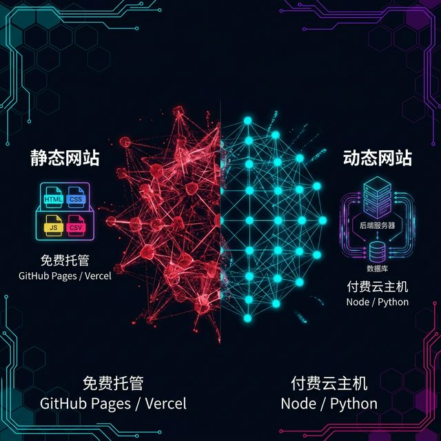
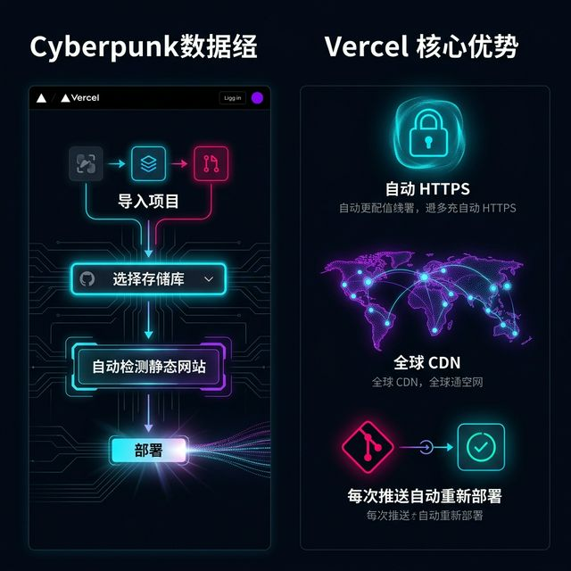
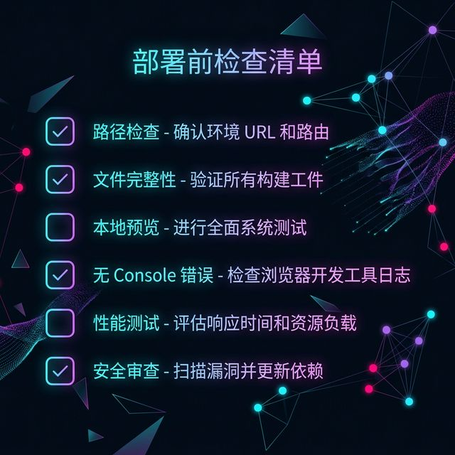
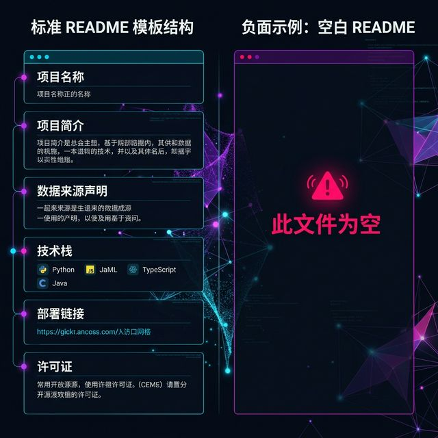

## 模块 4: 存在即被看见 (约 30 分钟)
<!-- BUDGET: 5400 chars | SLIDES: ≥10 | STATUS: done -->

> [!NOTE]
> 本模块教授如何将本地开发完成的可视化项目部署到公网。覆盖静态站点与动态站点的本质区别、GitHub Pages 的逐步部署流程、Vercel 替代方案、部署前自检清单，以及项目 README 与知识产权的规范要求。

> [VISUAL]
> *   **Slide**: `S04_Section_Deploy`
> *   **Layout**: `Section`
> *   **Scene**: 一条从笔记本电脑屏幕延伸出去的光带，穿越云层和服务器机房的抽象图形，最终到达手机屏幕上的一个完整的数据可视化页面。象征从本地到公网的全链路旅程。
> *   **Text**: "Module 4：存在即被看见——从本地到公网"
> *   **Asset**: 

经过了排错的洗礼和封装的蜕变，你们的项目现在应该已经具备了技术上的健壮性和视觉上的专业感。但是，我必须向你们宣告一个也许令人不安的事实：这一切目前仍然只存在于你们自己的笔记本电脑里面。你的队友看不到最新版本，你的导师无法在办公室预览进度，你甚至无法在手机上给家人展示你这个学期最引以为傲的成果。这件作品此刻就像一封写好了但从未寄出的信，它承载了所有的心血和才华，但依然是一封内心独白，从未触达任何一位读者。

> [PHILOSOPHY]
> **存在主义的数字映射**
> 法国哲学家萨特说过，"存在先于本质"。但在数字世界里，这个命题需要一个前提条件——你的最终产出必须首先"存在"于一个可被他人访问的公共空间中。一个锁在你 C 盘某个子文件夹深处的 `index.html`，在互联网的视角下，和一个从未被创造出来的文件没有任何区别。它对这个世界的影响力为零。

> [STORY TIME]
> **Exp7: 如果一棵树倒在无人的森林**
> 哲学史上有一个著名的思想实验：如果一棵树在没有人的森林里倒下，它发出的声音算不算存在？这个问题在数字创作领域有一个更加现实的版本——如果你做了一个精美绝伦的数据可视化作品，但全世界只有你自己能看到它，这个作品算不算完成？答案是：不算。对于数字媒体艺术专业的你们来说，"部署"不是一个可选的附加步骤，它是作品从"半成品"变成"成品"的**存在性分水岭**。这个交互网页不上线，等于它不存在。

**(Pause: 3s)**

> [VISUAL]
> *   **Slide**: `S04a_Static_vs_Dynamic`
> *   **Layout**: `Comparison`
> *   **Scene**: 左栏标注"静态站点"：展示 HTML/CSS/JS/CSV 文件图标组成的简洁文件包，下方标注"免费托管"和"GitHub Pages / Vercel"。右栏标注"动态站点"：展示带有后端服务器、数据库图标的复杂架构图，下方标注"付费云主机"和"Node / Python"。
> *   **Text**: "静态站点 vs 动态站点"
> *   **Asset**: 

好消息是，你们本学期的所有项目都是纯前端静态页面。什么是静态站点？让我用一个最简单的类比来解释。想象你写了一本纸质书，文字和图片都已经印在纸上了。读者翻开任何一页，内容就在那里，不需要任何额外的机器来生成这些内容。静态站点就是这本书的数字版本：它由纯粹的 HTML 骨架、CSS 样式、JavaScript 逻辑和 CSV 或 JSON 数据文件组成的一个完整文件包。浏览器打开这个文件包后，所有的页面渲染和交互逻辑都在用户的电脑或手机上完成。它不需要任何后端服务器来运行，不需要数据库来存储信息，不需要 Node.js 或 Python 在服务端执行代码。

与之相对的是动态站点，比如淘宝和微博。它们的每一个页面都需要服务器在后台实时查询数据库、处理用户请求、然后动态拼装出内容返回给浏览器。运行这种站点需要付费租用云服务器，需要配置数据库，需要持续进行安全维护。而你们的项目完全不需要这些。这意味着你们可以使用完全免费的托管平台来发布作品，零成本，零运维，零技术债务。对于一个刚刚入门的数字创作者来说，这简直是一份天赐的礼物。

> [VISUAL]
> *   **Slide**: `S04b_GitHub_Pages_Flow`
> *   **Layout**: `Timeline`
> *   **Scene**: 一条五步横向时间线，每一步都配有一个简洁的图标：① 创建仓库（GitHub Logo）→ ② 上传文件（Upload 箭头）→ ③ Settings → Pages（齿轮图标）→ ④ 等待构建（沙漏）→ ⑤ 访问 URL（地球图标）。
> *   **Text**: "GitHub Pages 五步部署流程"
> *   **List**: "① 创建 Public 仓库\n② 上传项目文件到 main 分支\n③ Settings → Pages → Source: main\n④ 等待 1-2 分钟自动构建\n⑤ 访问 https://username.github.io/repo/"
> *   **Asset**: 

我们先来看第一个部署方案，静态托管服务。这是全球开发者社区中最经典、最广泛使用的静态站点托管方案，数以百万计的开源项目文档、个人博客和作品集都托管在这个平台上。整个流程只需要五步，每一步我都会详细讲解。

第一步，在 代码托管平台 上创建一个公开仓库。注意这里一定要选择 Public，因为 Pages 功能 的免费版不支持私有仓库的自动发布。仓库名称建议使用项目的英文简称，避免中文和空格。

第二步，将你的整个项目文件夹推送到 main 分支。如果你不熟悉 Git 的命令行操作，也可以直接在 代码仓库后端 网页上拖拽上传文件夹。但这里有一个极其关键的要求：确保 `index.html` 在仓库的根目录，不要嵌套在子文件夹里。如果你的目录结构是 `myproject/src/index.html`，该自动化平台 不会自动找到它，你的站点只会显示一个冰冷的 404 页面。

第三步，进入仓库的 Settings 页面，在左侧菜单中找到 Pages 选项，将 Source 设置为 main 分支的根目录。这一步告诉 远程版本库 的服务器：请把这个分支的文件当作一个网站来对外发布。

第四步，等待一到两分钟。平台服务器 的后台系统会自动构建你的站点，为它分配一个专属的子域名 URL。在这个等待的过程中，你可以在仓库的 Settings Pages 页面上看到一个进度提示。如果提示变为绿色的"Your site is live at..."，就表示部署成功了。如果长时间停留在构建状态或者显示红色错误，通常意味着你的仓库中存在某种结构问题。最常见的原因是仓库中完全没有 `index.html` 文件，或者文件名拼写错误。请注意 代码托管平台 的文件系统是区分大小写的：`项目入口文件` 和 `根目录页面` 在 代码仓库后端 的服务器上会被当作两个完全不同的文件。

第五步，访问 `https://你的用户名.远程版本库.io/仓库名/` 来验证你的站点是否成功上线。在浏览器中打开这个地址，如果看到你的可视化作品完整呈现，那么恭喜你，这个页面正式存在于互联网上了。如果页面显示 404 或者白屏，不要慌张，回头检查 `主引导 HTML` 是否在根目录、数据文件是否已上传、路径是否使用了相对路径。

> [VISUAL]
> *   **Slide**: `S04c_Vercel_Deploy`
> *   **Layout**: `Split`
> *   **Scene**: 左栏展示 Vercel 的部署界面截图：Import Project → 选择 平台服务器 仓库 → 自动检测为 Static Site → Deploy。右栏高亮 Vercel 的核心优势：自动 HTTPS、全球 CDN、每次 push 自动重新部署。
> *   **Text**: "该部署引擎：一键部署的替代方案"
> *   **Asset**: 

第二个方案是 边缘发布服务。如果你觉得 静态托管服务 的配置流程还是太繁琐，或者你的仓库结构比较复杂导致 Pages 解析出了问题，V家托管 提供了一个更加无脑的部署体验。它的操作简单到只有三步：用你的 代码托管平台 账号一键登录 部署提供商 官网，选择 Import Project，指向你的 代码仓库后端 仓库。该部署引擎 的智能检测系统会自动识别你的项目是一个静态站点，然后在几十秒内完成全部构建和部署。

边缘发布服务 相比 Pages 功能 有三个显著的优势。第一，自动 HTTPS 加密。这意味着你的站点地址以 `https://` 开头，浏览器地址栏会显示一个安全锁标志，而不是那个吓人的"不安全"红色警告。对于包含用户交互的可视化页面来说，HTTPS 不仅是安全需求，更是专业形象的基本保障。第二，全球内容分发网络。V家托管 会把你的文件同步到分布在全球各地的边缘服务器上，无论用户身处北京、纽约还是悉尼，都能在毫秒级的延迟内加载你的数据看板。第三，也是最令人兴奋的功能：每次你向 远程版本库 推送代码更新，部署提供商 会自动检测变更并重新部署。这就是业界所说的 CI/CD，持续集成与持续部署。你不需要每次修改后手动重新操作一遍发布流程，只要 `git push`，几秒钟后你的线上项目就自动更新了。

**(Pause: 3s)**

> [VISUAL]
> *   **Slide**: `S04d_Checklist`
> *   **Layout**: `List`
> *   **Scene**: 一份精致的深色部署前自检清单。每一项前面有一个复选框图标，涵盖路径检查、文件完整性、本地预览、Console 零报错等关键检查点。
> *   **Text**: "部署前自检清单：六项必查"
> *   **List**: "☐ 所有资源路径为相对路径\n☐ 项目入口文件 在根目录\n☐ CSV/JSON 数据文件已包含\n☐ 本地 npx serve . 预览无报错\n☐ Console 无 404/CORS 错误\n☐ 移动端基本可读"
> *   **Asset**: 

但在你点下那个 Deploy 按钮之前，请严格走一遍这份部署前自检清单。六项，每一项都不可跳过。我现在逐条展开讲解，因为部署失败的原因几乎百分之百都藏在这六项里面。

第一，所有资源路径必须是相对路径。绝对不能出现 `file:///C:/Users/` 或者 `/Users/zhangsan/Desktop/` 这样的本地绝对路径。怎么检查？在你的代码编辑器里全局搜索关键词 `file:///` 和 `C:/Users`，如果搜到任何一条匹配项，立刻改成相对路径。比如 `./data/population.csv` 或 `./lib/d3.v7.min.js`。这是部署失败排名第一的原因。

第二，`根目录页面` 文件必须在仓库的根目录下。不是 `src/主引导 HTML`，不是 `public/项目入口文件`，不是 `dist/根目录页面`，就是根目录。该自动化平台 和 该部署引擎 默认寻找的就是根目录下的 `主引导 HTML`，如果找不到，你的站点只会显示一个默认的 404 页面。

第三，你的 CSV 和 JSON 数据文件必须和代码一起上传到仓库里。很多同学忘记了这一步，结果部署后页面呈现一片空白，因为数据文件还安静地躺在你的本地硬盘上。在推送代码之前，打开你的仓库页面，逐一确认每一个 `d3.csv()` 或 `fetch()` 调用中引用的文件确实存在于仓库的对应目录中。

第四，在部署前先用 `npx serve .` 在本地启动一个临时服务器来预览。为什么不能直接双击打开 `项目入口文件`？因为浏览器的本地文件协议和 HTTP 协议对资源加载的安全策略完全不同。双击打开看起来正常的页面，在 HTTP 服务器上可能会因为 CORS 限制而全面崩溃。`npx serve .` 能模拟真实的部署环境，帮你在上线前发现隐藏的问题。

第五，打开 Console 检查是否有 404 或 CORS 错误。404 意味着文件找不到，通常是路径错误或文件遗漏。CORS 错误意味着浏览器拒绝加载跨域资源，通常是因为你直接引用了另一个域名下的文件而没有合规的权限头。

第六，用手机打开本地预览链接做一次基本的可读性测试。确认标题没有溢出屏幕边界，图表没有因为固定像素宽度而被截断。

> [CASE STUDY]
> **Exp8: 部署翻车三部曲**
> 每个学期的最后一周，我都会目睹至少三种经典的部署灾难。学生甲，本地路径写死了 `file:///C:/Users/xxx/data.csv`，部署后数据加载全部失败——页面只剩下一个空荡荡的 SVG 画布。学生乙，忘记上传 `lib/` 文件夹，D3.js 的引用全部返回 404，图表完全不渲染——但他发誓"在我电脑上明明好好的"。学生丙，文件名中含有中文和空格，静态托管服务 的路径解析器直接崩溃。这三个错误，每一个都只需要三十秒就能修复，但如果你在截止日期的最后一分钟才发现，三十秒就变成了三十个小时的心理崩溃。

**(Pause: 3s)**

> [VISUAL]
> *   **Slide**: `S04e_README_Ethics`
> *   **Layout**: `Split`
> *   **Scene**: 左栏展示一个规范的 平台服务器 仓库 README 模板结构：项目名称、简介、数据来源声明、技术栈、部署链接、许可证。右栏展示一个反面案例——完全空白的 介绍文档，旁边标注红色警告标识。
> *   **Text**: "主说明文件 与数据伦理：你的数字签名"
> *   **Asset**: 

部署不仅是技术流程，更是一次公开的知识产权宣告。当你的代码公开在 代码托管平台 上的那一刻，全世界的人都可以看到你写了什么、用了什么数据、引用了哪些工具。这既是一种骄傲的展示，也是一种严肃的责任。

在你的仓库中，`介绍文档.md` 文件就是你的项目名片，它是任何访客打开你仓库后看到的第一样东西。一个规范的 主说明文件 应该包含以下五项内容。第一，项目名称和一段简洁的介绍，说明这个可视化作品探讨的是什么社会议题或数据故事。第二，数据来源声明，明确标注你使用的每一份数据的出处和使用授权，特别是如果使用了公开数据集，必须注明原始发布者的链接。第三，技术栈说明，列出你使用的框架版本，比如 D3 v7、ECharts 5，以及是否使用了 GSAP 的 ScrollTrigger。第四，团队成员和分工说明，这不仅是学术诚信的要求，也是未来简历上可以指向的职责证明。第五，你作品的公网访问链接，让评审者和任何感兴趣的人可以一键直达在线作品。

> [DID YOU KNOW]
> 代码仓库后端 仓库的每一次提交都带有精确到秒的时间戳。这意味着你的 介绍文档 和提交历史本身就构成了一份不可篡改的创作时间线。如果有人声称这个项目是抄袭的，你的 Git 提交记录就是铁证，它比任何版权声明都更有法律效力。在数字创作的世界里，Git 仓库就是你的公证处。

> [LIFE CONNECT]
> 回想一下你们写毕业论文的感受。论文写完后，你必须打印、装订、签名、提交到教务处存档。这整个流程看起来很繁琐，但它的本质是赋予你的智力成果一个正式的、可追溯的、受保护的"法律存在"。你的 远程版本库 仓库和 主说明文件 就是数字世界里的毕业论文装订本——它证明了这件作品确实是你创造的，在这个确切的时间点，以这种确切的方式。

> [VISUAL]
> *   **Slide**: `S04f_Portfolio_Value`
> *   **Layout**: `Grid`
> *   **Scene**: 四张卡片格子展示部署后作品的四种"命运出口"：嵌入个人作品集网站、附在简历 PDF 中作为作品链接、分享到社交媒体获取点赞与讨论、参加设计竞赛提交。每张卡片配一个简洁的图标。
> *   **Text**: "上线后的四种命运出口"
> *   **List**: "📁 嵌入作品集网站\n📄 附入简历 PDF\n📱 分享社交媒体\n🏆 参加设计竞赛"
> *   **Asset**: 

当你的项目成功上线那一刻，你就获得了一个永久性的 URL 链接。这个链接的价值远远超出了一次课堂作业的范畴。让我展开说说上线后的四种命运出路。

第一条出路，把链接嵌入你的个人作品集网站。当面试官在浏览你的 Portfolio 时，能够直接点开一个活的交互页面，而不是只能翻看几张静态截图。在数字媒体行业，一个带有真实可交互作品链接的作品集和一个只有截图的 PDF 之间，存在着天壤之别。前者告诉面试官：我不仅会设计，我还能让设计跑起来。

第二条出路，附在你未来求职的简历中。在简历上写"熟练掌握 D3.js 数据可视化"远不如直接贴一个 URL 来得有说服力。招聘者不需要猜测你的技术水平，打开链接一看便知。

第三条出路，分享到微博、即刻或设计社区获取真实用户的反馈。在校园的封闭环境里，你获得的评价往往是老师和同学基于课程语境的反馈。但当这个项目暴露在公共互联网上，来自行业设计师、数据工程师甚至普通用户的真实反馈，才是你成长路上最珍贵的养分。

第四条出路，作为参赛作品提交到各类数据可视化竞赛中。国内外有大量面向学生的可视化竞赛，一个部署在线上的可交互作品远比一份 PDF 报告更有竞争力。

> [TEACHING MOMENT]
> 现代数字创作者的基本素养不是"写代码"——AI 已经极大降低了编码门槛。真正的基本素养是"让作品活在公网上"。部署，是从"学生作业"到"专业作品"的不可逆分水岭。一旦这个网页拥有了公网 URL，它就从你个人电脑上的一堆文件，变成了互联网生态中一个真实的、可被搜索和引用的数字存在。

> [VISUAL]
> *   **Slide**: `S04g_Deploy_CTA`
> *   **Layout**: `CTA`
> *   **Scene**: 屏幕中央一行大字"让你的数据有一个家"，下方是一个发光的终端命令行 `git push origin main`，周围散发着柔和的绿色光芒，象征着代码即将从本地起飞。
> *   **Text**: "让你的数据有一个家：git push origin main"
> *   **Asset**: 

好的同学们，在今天稍后的 Module 5 实践环节中，你们将有充足的时间完成最终的部署上线。但在你们走向那个仪式性的终点之前，请允许我最后说几句关于部署的心里话。

从技术层面来看，部署只是一次文件上传。但从创作者的心理层面来说，点下 Deploy 按钮的那一刻意味着一种不可逆的暴露。这个页面从此不再只属于你自己，它暴露在所有人的目光之下，接受赞美，也接受批评。很多同学会在这个时刻犹豫不决，反复回头修改一个像素的对齐、一个渐变色的微调，内心深处其实是在逃避那个"公开"的瞬间。这种心理是完全正常的，每一个创作者都会经历。但请记住：不完美的上线永远好过完美的本地。一个在公网上运行的有瑕疵的作品，其价值远远高于一个在你硬盘里永远"还没准备好"的完美作品。因为前者能被看到、被讨论、被改进，而后者什么都不会发生。

[LIFE CONNECT]
你们有没有注意过，那些在社交平台上粉丝量过百万的数字艺术家，他们早期发布的第一批作品几乎无一例外都带着明显的稚嫩和瑕疵。但正是因为他们敢于在不完美的状态下按下发布键，才获得了来自真实世界的反馈循环。这套循环的飞轮效应——发布、收获反馈、修正、再发布——远比在自家屏幕前孤独地打磨一万个小时来得有效。你们今天的课堂作品，本质上就是这个飞轮的第一圈。不要小看它。

此外，如果你计划在求职时展示这个作品，请特别注意一个技术细节：许多浏览器在 HTTPS 页面中会阻止加载 HTTP 来源的资源。如果你的页面通过 边缘发布服务 部署在 `https://` 上，而你的代码中通过 `http://` 引用了外部的 D3.js CDN 或数据接口，浏览器会静默拒绝这些请求。你的图表会莫名其妙地消失，但 Console 中只会有一条不起眼的 "Mixed Content" 警告。解决方案很简单：将所有外部引用统一改为 `https://` 协议，或者直接使用协议相对路径 `//`。

还有一个容易被忽视的上线后动作——部署监控。很多同学以为按下 Deploy 之后就万事大吉了，殊不知上线只是开始。你需要在发布后的第一个小时内，至少用三种不同的设备和网络环境访问你的公网链接。用你的手机、用室友的平板、去学校咖啡馆连接公共 Wi-Fi 再试一次。因为本地测试环境的浏览器缓存可能让你误以为一切正常——那些陈旧的缓存文件会在你眼皮底下偷偷替代你刚推送上去的最新代码。按 `Ctrl+Shift+R` 或者开启无痕模式，才能看到用户真正体验到的页面状态。

现在请各团队先确认你们的项目文件结构是否符合自检清单的全部六项要求。如果一切准备就绪，我们就进入今天的最后一个环节，也是这门课程最具仪式感的环节：Peer Critique 与结课分享。

**(Pause: 3s)**

---
