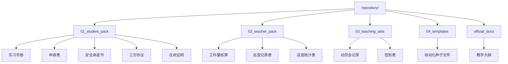

# 2026届毕业实习文档索引与使用协议 (Protocols & Index)

> **该文件是实习文档调用的单一事实来源 (SSOT)。**
> Agent 在执行任何涉及实习文件的任务时，必须优先查阅此表。

**更新日期**: 2026-02-12
**适用范围**: 广州南方学院数字媒体艺术专业 2026届毕业实习

## 📂 资源库全景图 (Repository Map)

所有路径相对于: `实习指导/knowledge/repository/`

---

## 🚀 按角色调用指引 (Role-based Protocols)

### 🧑‍🎓 学生/Agent 助手 (Student Pack)
**路径**: `knowledge/repository/01_student_pack/`

| 常用文件 | 文件名 (Key) | 关键动作 |
| :--- | :--- | :--- |
| **手册** | `附件3：广州南方学院毕业实习手册.doc` | **核心文件**。含月志(每月1篇)、鉴定表、报告。 |
| **申请** | `附件2：...毕业实习（分散）申请表.docx` | 实习开始前提交。 |
| **承诺** | `附件2-1：实习安全承诺书.doc` | **必须手写签名**。 |
| **协议** | `附件4：三方协议样本.doc` | 签署三方协议。 |
| **证明** | `附件1：在岗实习证明——交辅导员.docx` | 实习期间提交证明。 |
| **突发** | `附件5：设计学院突发事件报告流程.docx` | 发生紧急情况时的上报流程。 |

### 🧑‍🏫 教师 (Teacher Pack)
**路径**: `knowledge/repository/02_teacher_pack/`

| 常用文件 | 文件名 (Key) | 关键动作 |
| :--- | :--- | :--- |
| **工作量** | `广州南方学院毕业实习指导阶段性工作量核算.docx` | 核算指导课时 (3阶段: 30%/50%/20%)。 |
| **巡查** | `附件4-1：...实习巡查记录表(最终替换版).docx` | 走访企业时填写，需附照片。 |
| **统计** | `附件4：...实习巡查统计表.docx` | 学期末汇总巡查情况。 |

### 🏫 教学佐证 (Teaching Aids)
**路径**: `knowledge/repository/03_teaching_aids/`

| 常用文件 | 文件名 (Key) | 关键动作 |
| :--- | :--- | :--- |
| **会议** | `附件1：毕业实习动员培训会记录.docx` | 动员大会记录存档。 |
| **签到** | `附件3：安全教育签到表.docx` | 安全教育课签到。 |

### 🤖 自动化模版 (Templates for Agent)
**路径**: `knowledge/repository/04_templates/`

> **注意**: 此目录包含用于程序生成的“纯净”模版。
> 当用户指令如 `/write_internship_log` 触发时，Agent 应读取此处的种子文件。

*   `template_internship_manual.doc`: 实习手册种子
*   `template_application_form.docx`: 申请表种子
*   `template_safety_commitment.doc`: 安全承诺书种子
*   `template_tripartite_agreement.doc`: 三方协议种子

---

## 📜 官方与大纲 (Official Baseline)
**路径**: `knowledge/repository/official_docs/`

*   `2025-2026-1+2022级+数字媒体艺术+毕业实习+教学大纲.doc`: **绝对基准**。任何评分标准、学分争议以此为准。

## ⚠️ 版本控制协议
1.  **只读原则**: `01_student_pack` 中的文件是分发给学生的最终版，严禁修改结构。
2.  **生成原则**: 若需为学生生成内容，请使用 `04_templates` 中的文件，并另存为新文件，**绝不直接覆盖模版**。
3.  **引用路径**: 在所有 Script 或 Task 中，引用文件必须使用上述相对路径。
