# S01: 实习动员 (Internship Mobilization)

> [PHILOSOPHY]
> **Subject**: 游戏的规则 (The Rules of the Game)
> 学校是新手村，职场是开放世界。在新手村，有空气墙保护你；到了开放世界，每一次“红名”都可能掉落装备（信誉）。今天我们不谈大道理，只谈如何在这个新地图里“存活”并“练级”。
> **Role**: 实习导师 (Career Mentor)
> **Audience**: 2026届全体实习生
> **Goal**: 交付生存指南，明确通关路线，装备法律护盾。
>
> **References**:
> *   [实习手册](../knowledge/library/01_student_pack/附件3：广州南方学院毕业实习手册.md)
> *   [申请表](../knowledge/library/01_student_pack/附件2：广州南方学院毕业实习（分散）申请表.md)
> *   [承诺书](../knowledge/library/01_student_pack/附件2-1：实习安全承诺书.md)
> *   [三方协议](../knowledge/library/01_student_pack/附件4：三方协议样本.md)
>
> **tags**: [CareerSurvival, LegalSelfDefense, Professionalism]

## 1. 开场：新手村的最后一课

> [VISUAL]
> *   **Slide**: `S01_Cover`
> *   **Layout**: `Center`
> *   **Asset**: 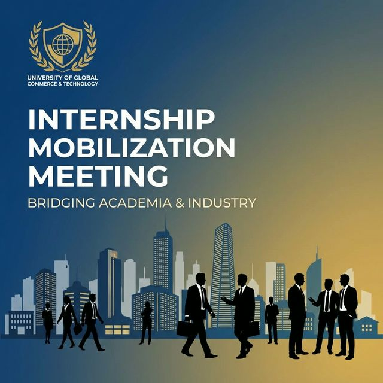
> *   **Text**: "2026届毕业实习动员会"
> *   **Scene**: 标题页。主视觉为校徽与中央大标题。背景透出职场剪影。

请大家看屏幕。同学们好。今天把大家召集起来，是要在大家踏出校门前，做最后一次“出征检查”。

从今天起，你们的身份就要从"学生"切换成"职场新人"了。

> [VISUAL]
> *   **Slide**: `S01_Game_Mode`
> *   **Layout**: `Split`
> *   **Asset**: 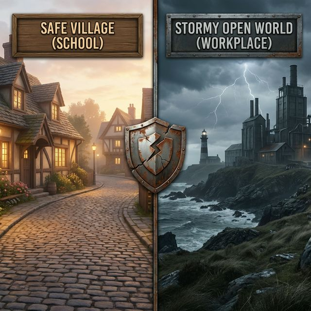
> *   **Scene**: 左边是温馨的新手村（学校/Easy Mode），右边是风雨交加的荒野（职场/Hard Mode）。中间是一个破裂的护盾图标。

英国法学家梅因（Henry Maine）说过：进步社会的运动，是"从身份到契约"的运动。在学校，你靠"学生"身份受保护；到了职场，没人管你是谁，大家只认那张签了字的契约。一个合同日期写错，就可能白干一个月——职场没有补考键。

所以今天，我们就聊两件事：**怎么生存**，以及**怎么守好契约**。

---

## 2. 通关路线图 (The Roadmap)

> [VISUAL]
> *   **Slide**: `S01_Timeline_Matrix`
> *   **Layout**: `Flow`
> *   **Asset**: 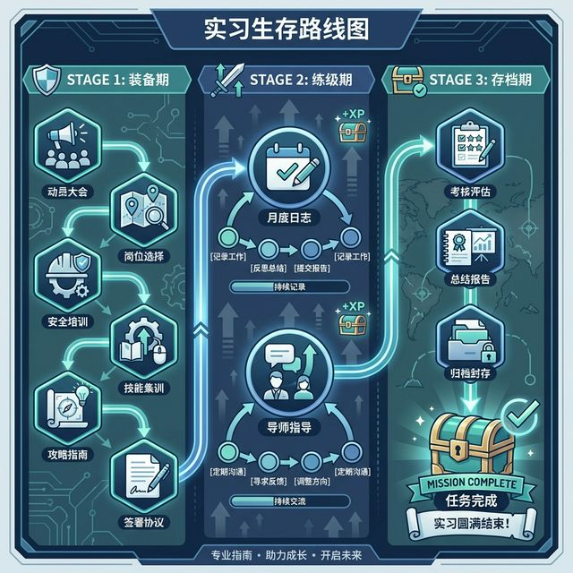
> *   **Text**: "实习主线任务：通关路线图"
> *   **Scene**: 三阶段实习时间轴，标注为“装备期”、“练级期”、“存档期”。重点高亮第一阶段的“6个关键任务点”。

这门实习课本质上是一份**职场生存攻略**。请看大屏幕，我们将整个实习过程拆解为三个阶段，每个阶段都有明确的权重和主线任务：

1.  **装备期 (30%)**：*Start Now*。准备不足，开局即溃败。
2.  **练级期 (50%)**：*1月-4月*。这是漫长的实战，活下来是关键。
3.  **存档期 (20%)**：*4月底*。通关结算，拿回你的学分。

### 第一阶段：装备期 (Before Departure)
**主线任务：搞定合规性**

不要以为实习是从去公司那天开始的，**无准备，不出征**。我们为大家设置了**6个强制存档点（战前会议）**，缺一不可：

1.  **动员** (Now)：对齐目标，统一认识。
2.  **选点** (基地宣讲)：选对地图，明确方向。
3.  **护盾** (安全教育)：确立底线，保护自己。
4.  **技能** (岗前培训)：临阵磨枪，积累资本。
5.  **攻略** (任务指导)：明确规则，确保拿分。
6.  **契约** (三方协议)：签署护盾，规避风险。

### 第二阶段：练级期 (During Internship)
**主线任务：刷怪、留痕**

进入公司后，你将面临真正的职场规则。记住这三条生存法则：

**1. 露脸即考勤 (Rule of Presence)**

> [VISUAL]
> *   **Slide**: `S01_Meeting_Evidence`
> *   **Layout**: `Full`
> *   **Asset**: 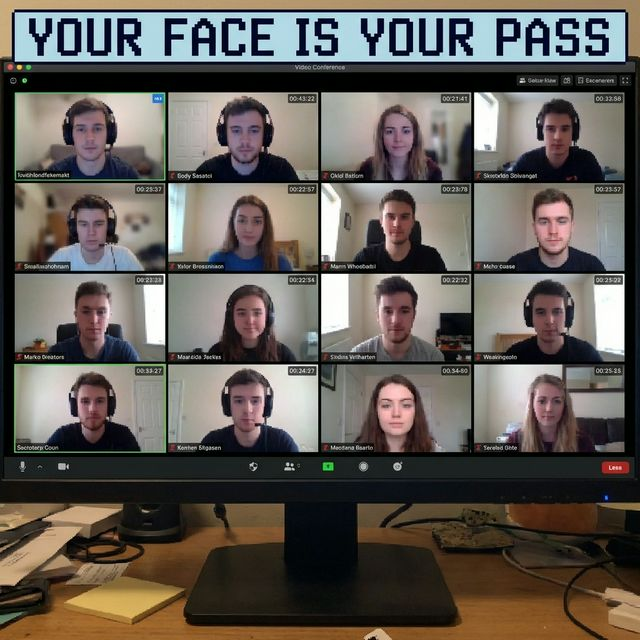
> *   **Caption**: "Your Face is Your Pass（露脸即考勤）"
> *   **Scene**: 线上会议“开摄像头”的截图墙。右侧文字：Your Face is Your Pass（露脸即考勤）。

> [!IMPORTANT]
> **线上会议铁律**：
> *   所有线上召集，**必须全程开启摄像头**。
> *   这就是你的打卡记录。**没露脸 = 没来 = 旷工**。
> *   没有摄像头请用手机，这不是商量，是底线。

**2. 留痕即战绩 (Rule of Record)**
*   **写月志**：这不是作文，是你的**职场复盘日记**。
*   **保持联络**：遇到困难（尤其是不公正待遇），第一时间联系校内导师。导师是你唯一的场外援助，请至少保持2次有效沟通。

**3. 守时即信誉 (Rule of Integrity)**
*   **严禁随意请假**。职场没有寒暑假，请假直接影响考勤权重。

### 第三阶段：存档期 (After Internship)
**主线任务：通关结算**

4月底，带着你的战利品回来复命：
*   **鉴定表**（带红章的通关文牒）
*   **总结报告**（你的冒险回忆录）
*   **归档**（换取最终学分）

---

## 3. 评分机制：谁决定你的等级？

当你完整走完这张路线图，最后的结果将由谁来评定呢？

> [VISUAL]
> *   **Slide**: `S01_Grading_System`
> *   **Layout**: `Flow`
> *   **Asset**: 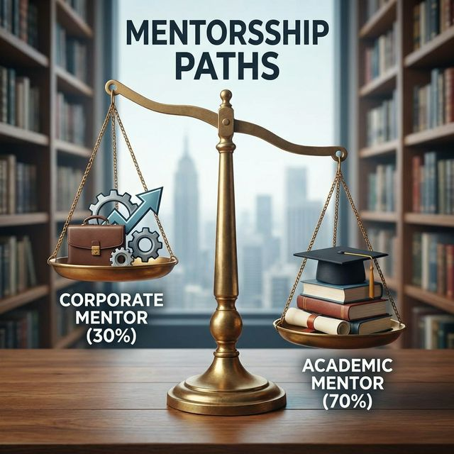
> *   **Scene**: 通关评价体系天平图。左侧30%（企业导师）：关键词“工作表现/黑盒”；右侧70%（校内导师）：关键词“文档留痕/白盒”。

这门课的评分很现实，实行**双BOSS制**：

1.  **企业导师 (30%)**: **你的顶头上司**。
    *   他看得见你每天迟不迟到、眼里有没有活、肯不肯学。
    *   **Tip**: 我们会做回访的。请大家委婉地提醒企业导师，评分要**客观真实**，全部打100分反而会被系统判定为“数据异常”。

2.  **校内导师 (70%)**: **你的战略顾问**。
    *   我看不到你干活的背影，我只能看到你提交的**月志**和**报告**。
    *   如果你干得很辛苦，但文档写得敷衍了事，那在我的视角里，你的战绩就是零。**学会汇报，也是职场的核心技能。**

---

## 4. 核心装备与“时间法则”

> [VISUAL]
> *   **Slide**: `S01_Story_Case`
> *   **Layout**: `Split`
> *   **Asset**: 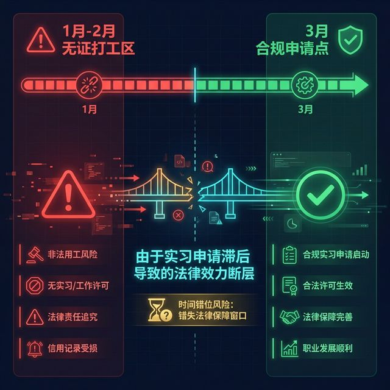
> *   **Scene**: 时间错位风险对比图。左侧是 1月-2月 的“无证打工区”（深红色警戒），右侧是 3月 的“合规申请点”。展示由于申请滞后导致的法律效力断层。

请大家看这组对比图。左边的红色区域就是很多同学容易踩进去的“时间陷阱”。

> [STORY TIME]
> **Subject**: 被“时间”卡住的学长
> 跟大家讲个往届的事故。你们有位学长辛辛苦苦实习了三个月，最后却被判定实习无效。为什么？因为他在**1月**就开始去公司打工，但他的《安全承诺书》和《申请表》却是**3月**才交的。在法律逻辑里，这叫“先斩后奏”，学校无法为他那两个月的安全负责，那两个月自然也不算校内实习。
> **Moral**: 程序正义 > 实质正义。时间顺序错了，一切归零。

> [VISUAL]
> *   **Slide**: `S01_Time_Logic`
> *   **Layout**: `Flow`
> *   **Asset**: 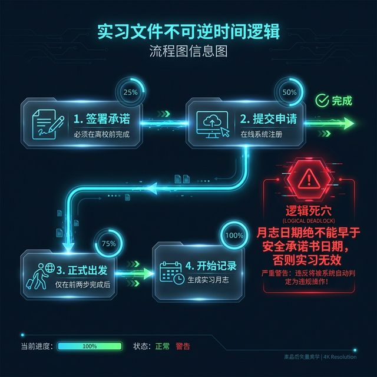
> *   **Text**: "不可逆的时间法则：文件递交顺序"
> *   **List**:
>     1. **签署承诺**: 先补签《安全承诺书》（离校前必签）
>     2. **提交申请**: 再填《分散实习申请表》（系统申报）
>     3. **正式出发**: 前两步搞定，方可前往公司
>     4. **开始记录**: 实习开始后，产生《实习月志》
> *   **Scene**: 不可逆的时间法则流程图。高亮红色警示牌：**逻辑死穴**——月志日期绝不能早于安全承诺书日期，否则实习无效。

请看这张流程图，它揭示了实习的“不可逆时间法则”。在学校，你的“学生”身份受保护；到了职场，大家只认那张签了字的“契约”。这些文档就是你从身份转向契约的转折点。

最关键的底线是：前两步——《安全承诺书》和《分散申请表》——必须先于一切。

**如果你还没出发**，很简单，按顺序走：先签承诺书，再提交申请表，手续齐了再去公司报到。

**如果你已经在岗**，别慌，现在就是补救窗口。学校紧急召开动员会就是为了帮大家“补齐护盾”。请你们**立刻补签全套手续**，签署日期按老师统一通知填写，必须早于实际入职日期且避开节假日。只有纸面上的时间逻辑对了，你之前的实习天数才能被系统认可，后面的月志和鉴定才有合法效力。

底线请记死：**月志日期绝不能早于承诺书日期**。否则哪怕你辛辛苦苦实习完了，那段时间也只能算个人行为，学校无法为你背书。

> [VISUAL]
> *   **Slide**: `S01_Doc_Checklist`
> *   **Layout**: `Split`
> *   **Asset**: 
> *   **Text**: "核心装备包（护盾值）"
> *   **List**: 申请表, 安全承诺书, 三方协议
> *   **Scene**: 核心装备包：申请表、承诺书、三方协议。每样东西旁边标注着“护盾值”。

接下来，我们要逐一检查这三件核心装备。这就是你们在职场上的护身符。
它们分别对应着你的身份证明、安全保障和法律契约。我们要搞清楚每一份该怎么填，每一个坑该怎么避。

> [ACTIVITY]
> **Type**: `Practice`
> **Duration**: `2 min`
> **Task**: 装备秒查
> 既然谈到了核心装备，请大家现在打开手机，登录我们的课程平台。在“资料包”里找到这三份表格的电子模版。大家看看，现在的你，已经搞定了哪几个？

> [VISUAL]
> *   **Slide**: `S01_App_Form_Detail`
> *   **Layout**: `Center`
> *   **Asset**: 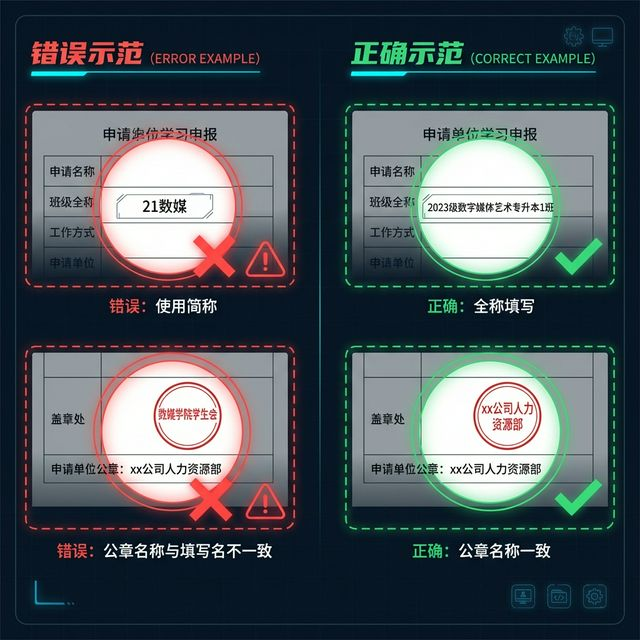
> *   **Text**: "装备一：分散实习申请表（通行证）"
> *   **Scene**: 申请表局部特写。红圈圈出“班级全称”和“盖章处”。两个错误示范被打叉（简称、章名不符）。
> *   **Search**: 实习申请表 填写规范 班级全称 公章一致性

> [SPEECH]
> 首先看第一件，“出村通行证”——**[申请表](../knowledge/library/01_student_pack/附件2：广州南方学院毕业实习（分散）申请表.md)**。
>
> 请看屏幕上的错误示范。这里有两个超级大坑，每年都有人掉进去：
> 第一，**班级名称**。千万别写什么“21数媒”，教务系统根本不认！一定要写全称，比如“2023级数字媒体艺术专升本1班”，错一个字都要被打回来重填。
>
> 第二，**名称一致性**。你填在表格里的公司名，必须和最后盖章的全称**一字不差**。多一个"市"字、少一个"市"字都不行。
>
> 另外，签字栏是找**你的实习导师**签，不要惯性思维去找辅导员。记住，哪怕你还没缴费，只要你要去实习，这个流程现在就得走！

> [VISUAL]
> *   **Slide**: `S01_Safety_Commitment`
> *   **Layout**: `Grid`
> *   **Asset**: 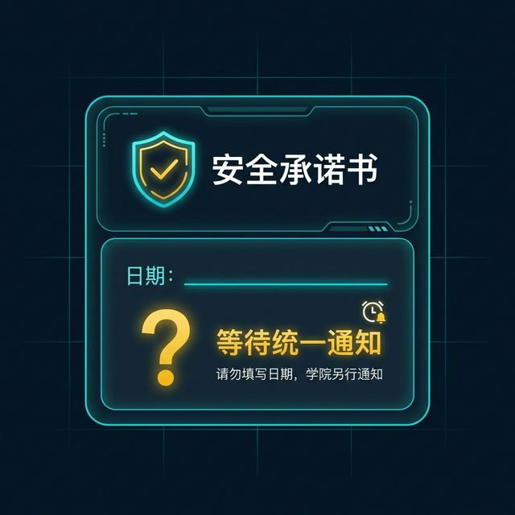
> *   **Text**: "装备二：安全承诺书（日期陷阱）"
> *   **Scene**: 承诺书底部日期栏特写。日期处打了一个巨大的问号（?），旁边注明“Wait for Signal”。
> *   **Search**: 实习安全承诺书 签署日期 法律效力

> [SPEECH]
第二件是你们的"免责护符"—— **[安全承诺书](../knowledge/library/01_student_pack/附件2-1：实习安全承诺书.md)**。
动作很简单：打印，手写签字。但请注意画面上那个问号——**日期先别填**，等学院统一通知。刚才讲过了，填错日期，整份文件的法律效力就存疑。

> [VISUAL]
> *   **Slide**: `S01_Tripartite_Agreement`
> *   **Layout**: `Comparison`
> *   **Asset**: 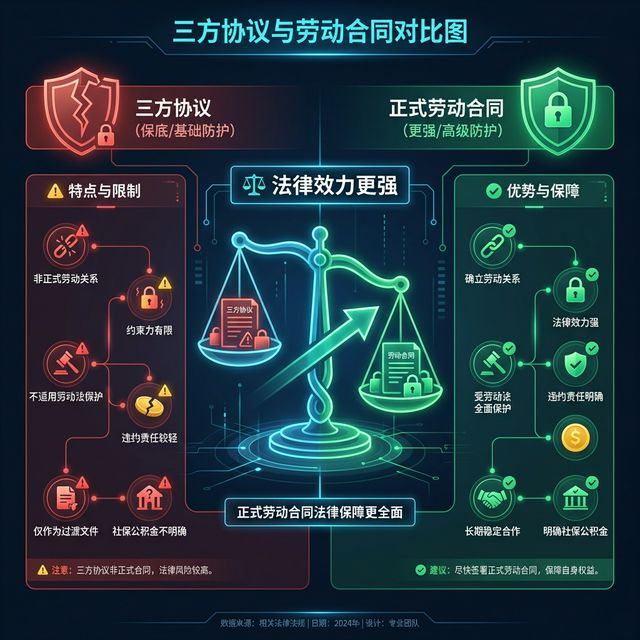
> *   **Text**: "装备三：三方协议 vs 劳动合同"
> *   **Scene**: 左侧是三方协议（保底），右侧是正式劳动合同（更强）。天平倾向右侧。
> *   **Search**: 三方协议 劳动合同 区别 实习权益

> [SPEECH]
第三件是**[三方协议](../knowledge/library/01_student_pack/附件4：三方协议样本.md)**，这是你们的“劳动合同平替”。

关于这份文件，有三个“生死攸关”的填写细节，请大家用红笔把它圈起来：

第一，**薪资栏绝不可留空**。
写具体的数字，或者写“按当地最低工资标准执行”。这不仅仅是填空题，这是法律对你们劳动价值的保护。留空，就等于给了别人随意定价的权利。

第二，**最佳时间法则：先预审，再盖章**。
千万不要填完就急着去公司盖章！填好后，先拍照发给你的校内导师看一眼。
导师说“OK，没问题”，你再去盖章。这就叫“预审”。
否则，一旦盖错了——最常见的就是**HR手一抖，把公章盖到了“学校意见”那一栏**，或者盖住了文字——你就得厚着脸皮找老板盖第二次。相信我，那种尴尬你不想体验。

第三，**日期留白**。
在最终确认无误前，签署日期先别填。给自己留一颗“后悔药”，防止因流程滞后导致的时间逻辑错误。

如图所示，如果公司愿意直接跟你签正式的劳动合同，那个法律效力更硬（右侧），可以直接替代三方协议。但如果公司不签，那左边的这份协议就是你最后的底线。

> [VISUAL]
> *   **Slide**: `S01_Stamp_Signature`
> *   **Layout**: `Grid`
> *   **Asset**: 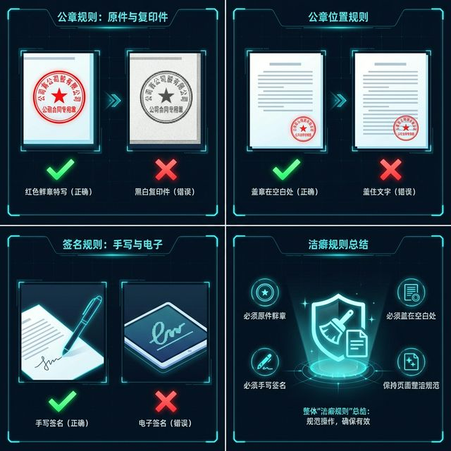
> *   **Text**: "洁癖规则：红章与真迹"
> *   **Scene**: 四格漫画风格的规则展示：1.红章特写（对）vs 黑白复印件（错）；2.盖章在空白处（对）vs 盖住字（错）；3.手写签名（对）vs 电子签名（错）。
> *   **Search**: 公章使用规范 实习证明 红色鲜章 手写签名

> [SPEECH]
最后，我有必要强调一下关于印章和签名的 **“洁癖”** 要求。

请看屏幕上的这组对比：
第一，必须是**红章**！复印件是黑白的？不行。电子章？教务系统不认。请务必让公司盖红色的鲜章。

第二，**别挡字**。看右边的图示，盖章的时候提醒一声HR，“麻烦帮我盖在空白处”。千万别压住日期或签名，压住了，这份文件就废了。

第三，**手签**。所有签名，必须是**手写**的。在这个环节，请收起你们的iPad和电子签名，回归最原始的笔墨。

---

## 5. 安全：你不是孤岛

> [VISUAL]
> *   **Slide**: `S01_Safety_Alert`
> *   **Layout**: `Grid`
> *   **Asset**: 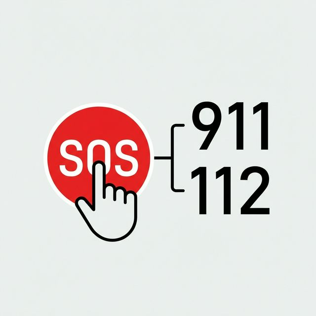
> *   **Text**: "紧急汇报流程：校外不孤单"
> *   **Scene**: 一个醒目的红色求救按钮图标，连接着两位老师的电话。

最后，在这个新发下来的《突发事件汇报流程》里，我想特别强调一点。

去年有位同学被宠物咬伤，这本是一件意外。但他做对了一件事：**第一时间联系老师**。所以我们能马上帮他走保验、找医院。

大家记住，**实习不是把你扔进海里不管了**。
*   遭到不公正待遇？
*   不管遇到工伤、生病、还是任何让你觉得“不对劲”的事。
*   **马上摇人**！校内导师就是你的后盾。

---

## 6. 客服热线 (Contacts)

> [VISUAL]
> *   **Slide**: `S01_Contacts`
> *   **Layout**: `Center`
> *   **Asset**: 
> *   **Scene**: 紧急联系人信息卡片。大字展示张巍老师和夏莉娜老师的姓名与手机号，背景简洁方便拍照。

任何搞不定的状况，尤其涉及到生命安全或法律风险的，直接打这两个电话：

*   **实习总负责**: 张巍老师 (134-5049-1232)
*   **数字媒体艺术**: 夏莉娜老师 (139-5816-1459)

把这两个号码存进手机通讯录，备注设为“紧急联系人”。无论是实习遇到困难，还是个人安全问题，第一时间联系老师，我们都在后方支持你们。

---

## 7. 结语

好了，装备检查完毕。

职场这条路，或许会有风浪，但请相信，它也充满了通过挑战后的成就感。

带上你们的专业，带上你们的契约精神，**出发吧**。

接下来，我来为大家解说具体的“副本”（实习基地）。
