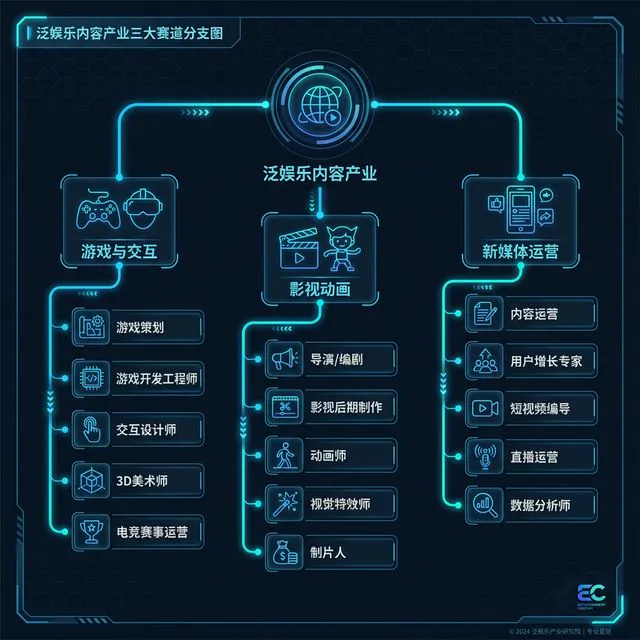
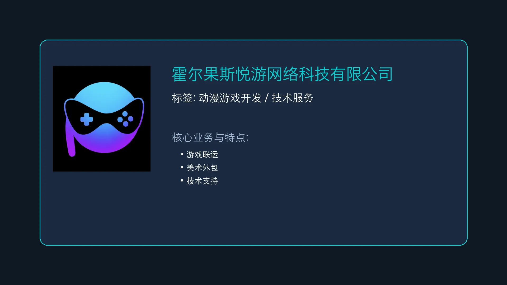
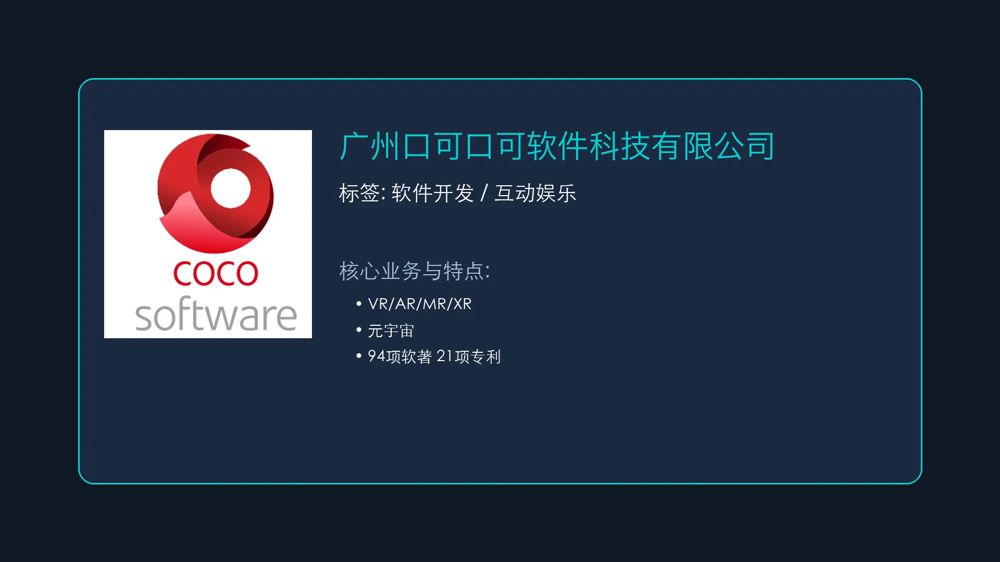
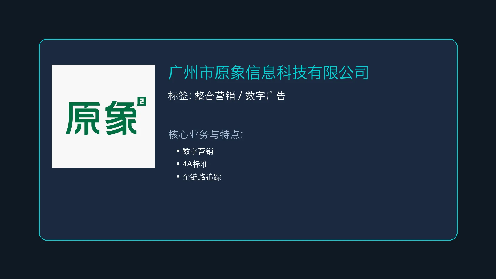
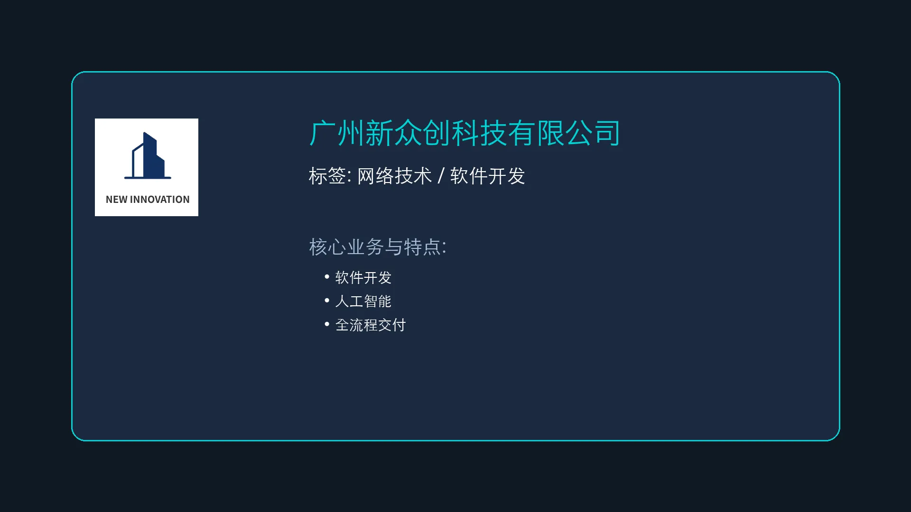
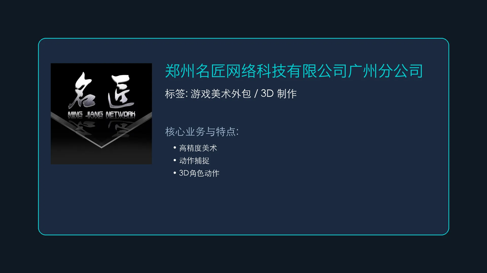
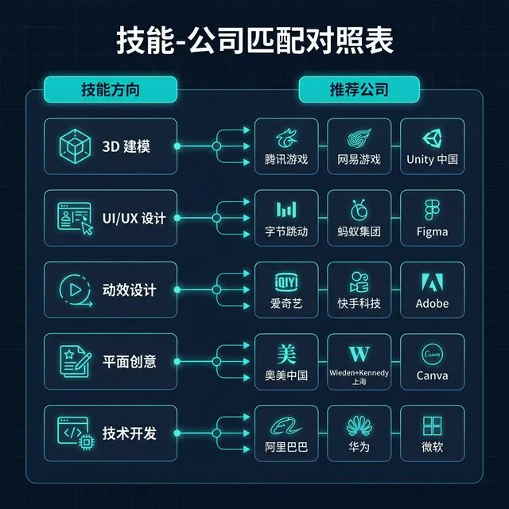
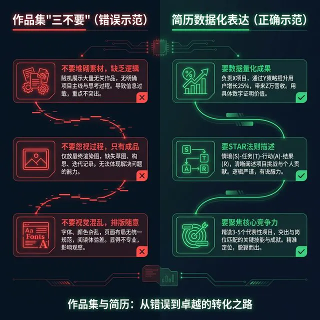
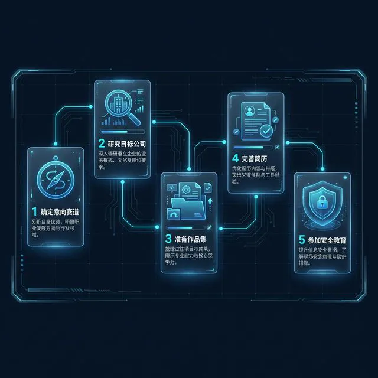

# S02: 基地宣讲 (Base Presentation)

> **Role**: 专业负责人 (Program Director)
> **Audience**: 数字媒体艺术系实习生
> **Goal**: 介绍实习基地，提供岗位选择指导。
>
> **References**:
> *   参见 [S03: 安全与纪律教育](scripts/S03_Safety.md)
>
> **tags**: [CareerPlanning]

## 1. 行业方向概览 (Industry Overview)

> [VISUAL]
> *   **Slide**: `S02_Industry_Map`
> *   **Layout**: `Flow`
> *   **Asset**: 
> *   **Scene**: 泛娱乐内容产业三大赛道分支图：游戏与交互、影视动画、新媒体运营，各赛道下方列出典型岗位。

同学们
作为数字媒体艺术专业的学生，我们的实习方向主要聚焦在**"泛娱乐内容产业"**。听起来很大，其实拆开来看，**屏幕上这张图**已经帮你们梳理好了。

目前最主流的三个赛道：

1.  **游戏与交互设计 **Game & Interaction****：包括 UI/UX 设计、游戏美术、技美等。如果你平时痴迷于拆解游戏界面、研究按钮为什么放在那个位置——这条路适合你。
2.  **影视动画 **Film & Animation****：包括模型、动画、特效、后期合成等。如果你的显卡因为渲染而日夜嘶吼——恭喜，你已经在这条路上了。
3.  **新媒体运营与视觉设计 **New Media & Visual****：包括短视频制作、品牌设计、运营策划等。如果你刷抖音的时候，脑子里想的不是"好笑"，而是"这个转场怎么做的"——那你天生属于这里。

**(Pause: 3s)**

赛道没有高下之分，只有适不适合。选错赛道比选错公司更可怕——就像一个天生的画家被丢进了写代码的岗位，痛苦的不只是他，还有他的同事。

---

## 2. 重点实习基地介绍 (Key Internship Bases)

> [VISUAL]
> *   **Slide**: `S02_Base_Logos`
> *   **Layout**: `Full`
> *   **Scene**: 展示 5 家重点推介公司的 Logo（悦游、口可口可、原象、新众创、名匠）与核心业务关键词。

根据学院与企业的深度合作，今年我们将重点推介**屏幕上这五家**优质实习基地。分别是：悦游、口可口可、原象、新众创，以及名匠。我逐一给大家介绍。

### 1. 霍尔果斯悦游网络科技有限公司

> [VISUAL]
> *   **Slide**: `S02_Base_Yueyou`
> *   **Layout**: `Grid`
> *   **Asset**: 
> *   **Scene**: 悦游公司简介卡片：Logo + 标签"动漫游戏开发 / 技术服务" + 核心业务关键词 + 广州分公司信息。

*   **标签**: 动漫游戏开发 / 技术服务

**第一家，悦游。** 他们的主营业务是动漫游戏的开发和技术服务——从前端界面到后端逻辑，从美术资产到技术架构, 由广州分公司。

适合什么样的同学呢？如果你对游戏行业感兴趣，想亲手参与一个游戏从概念到落地的过程，悦游是个不错的起点。

### 2. 广州口可口可软件科技有限公司

> [VISUAL]
> *   **Slide**: `S02_Base_Coco`
> *   **Layout**: `Grid`
> *   **Asset**: 
> *   **Scene**: 口可口可公司简介卡片：Logo + 标签"软件开发 / 互动娱乐" + VR/AR/MR/XR 技术栈 + 知识产权数据（94 项软著、21 项专利）。

*   **标签**: 软件开发 / 互动娱乐

**第二家，口可口可。** 这个名字很好记。他们是一家**高新技术企业**，手握近百项 VR 领域的知识产权——94 项软件著作权、21 项专利。核心业务是虚拟现实、增强现实、混合现实的研发与应用。

简单说，他们做的是**"让你走进屏幕里"**的技术。他们的产品包括 Cave 虚拟现实交互系统、元宇宙虚拟教学实验室等等，和多所高校都有深度合作。

技术氛围浓厚，适合对交互技术感兴趣，想在 XR 领域扎根的同学。

### 3. 广州市原象信息科技有限公司

> [VISUAL]
> *   **Slide**: `S02_Base_Yuanxiang`
> *   **Layout**: `Grid`
> *   **Asset**: 
> *   **Scene**: 原象公司简介卡片：Logo + 标签"整合营销 / 数字广告" + 服务品牌案例 + 校企合作数据。

*   **标签**: 整合营销 / 数字广告

**第三家，原象。** 这家公司的前身是 2006 年成立的广告公司，到现在已经快 20 年了，是业内知名的数字营销机构，服务标准对标 4A 级广告公司。他们做过老干妈、燕之屋等知名品牌的营销策划。

> [CASE STUDY: 从广告公司到信息科技公司]
> 原象的发展轨迹本身就是一个行业缩影。2006 年创立时叫"原象广告"，2018 年更名为"原象信息科技"。名字的变化，折射的是整个广告行业从传统媒介向数字化转型的浪潮。今天的营销，不再只是做海报、拍广告片，而是数据驱动、全链路追踪、精准投放——这就是"数字营销"的内涵。

他们和广东财经大学共建过实习基地，和广州美术学院也有产学研合作。适合想做创意设计、品牌视觉和新媒体营销的同学。

**(Pause: 3s)**

### 4. 广州新众创科技有限公司

> [VISUAL]
> *   **Slide**: `S02_Base_XZC`
> *   **Layout**: `Grid`
> *   **Asset**: 
> *   **Scene**: 新众创公司简介卡片：Logo + 标签"网络技术 / 软件开发" + 核心业务关键词。

*   **标签**: 网络技术 / 软件开发

**第四家，新众创。** 他们的业务方向是网络技术与软件开发，经营范围涵盖**动漫游戏开发**、软件外包服务、人工智能基础软件开发等。

如果你对技术开发本身感兴趣——不只是做美术资产，而是想深入了解一个产品从需求到上线的完整链路——新众创可以给你这个机会。

### 5. 郑州名匠网络科技有限公司广州分公司

> [VISUAL]
> *   **Slide**: `S02_Base_MingJiang`
> *   **Layout**: `Grid`
> *   **Asset**: 
> *   **Scene**: 名匠公司简介卡片：Logo + 标签"游戏美术外包 / 3D 制作" + 核心技术（动作捕捉系统专利）+ 高校合作案例。

*   **标签**: 游戏美术外包 / 3D 制作

**最后一家，名匠。** 名字起得好——"匠"字就是他们的基因。这是一家专注高精度美术资产制作的公司，母公司在郑州，是高新技术企业，拥有动作捕捉系统的发明专利。

他们招聘时的要求很明确：3D 角色动作设计、多风格动画制作——这些都是硬功夫。母公司和河南工程学院共建了动画学院，广州分公司今年也在积极与高校拓展校企合作。

适合模型、材质、渲染方向的同学，去那里就一个字：**磨**。把手艺磨到行业水准。

---

## 3. 如何选择适合你的基地 (Selection Strategy)

五家公司介绍完了。你们现在可能在想：**"都挺好，但我该选哪个？"**

> [PHILOSOPHY: 霍兰德的六边形]
> 职业心理学家约翰·霍兰德提出过一个经典理论：人的职业兴趣可以分为六种类型——现实型、研究型、艺术型、社会型、企业型、常规型。每个人都是一个独特的六边形。最好的职业选择，不是去"最好的公司"，而是去那个和你的六边形**形状最像**的地方。

所以，选基地不是选"哪个最牛"，而是选"哪个最像你"。我有三个维度供大家参考：

### 1. "Skill Match" (技能匹配)

> [VISUAL]
> *   **Slide**: `S02_Skill_Match`
> *   **Layout**: `Full`
> *   **Asset**: 
> *   **Scene**: 技能-公司匹配对照表：左列为技能方向（3D 建模、UI/UX、动效、平面创意、技术开发），右列为对应推荐公司。

不要只看公司名气，**要看你的作品集里装的是什么**。请大家看屏幕上这张匹配表：

*   如果你的作品集里全是 3D 场景和角色模型——**名匠**可能比原象更适合你。
*   如果你擅长做动效和界面交互——**口可口可**和**悦游**是首选。
*   如果你的强项是平面创意和品牌设计——**原象**在等你。
*   如果你对程序开发有兴趣——**新众创**值得考虑。

### 2. "Career Path" (职业路径)

问自己一个问题：**未来 3 年，你想成为专家还是管理者？**

*   **专家路线**：去垂直领域的公司（如名匠），把一项技术练到极致。毕业的时候，你的作品集就是你的通行证。
*   **综合路线**：去创意型或技术型公司（如原象、新众创），接触全流程。你可能不会在某一项上做到顶尖，但你会成为一个"能拉通全链路"的人。

两条路没有对错，只有先后。很多行业大佬的路径是：**先当 3 年专家，再转综合管理**。

### 3. "Culture Fit" (文化契合)

实习不仅是工作，更是体验企业文化。公司的氛围会深刻影响你的工作体验。

*   游戏公司通常组织扁平、氛围自由，但项目赶上线时加班多；
*   营销公司节奏快、创意压力大，但成就感来得也快——今天做的方案，下周可能就上线了；
*   技术公司相对稳定，注重流程和规范，适合喜欢"按部就班"出成果的同学。

> [ACTIVITY]
> *   **Type**: `Poll`
> *   **Topic**: "你的"梦中情司"是哪一种？"
> *   **Options**: A. 游戏大厂 (卷但有钱) / B. 独立工作室 (自由有趣) / C. 营销机构 (体系完善) / D. 技术公司 (全能锻炼)
> *   **Duration**: `3 min`
>
> (点评学生选择，强调不同性格适合不同土壤)

**(Pause: 3s)**

看结果。选 A 的同学，你们要做好心理准备——游戏行业的"996"不是传说。选 B 的同学很浪漫，但独立工作室的风险也高，项目说没就没。选 C 和 D 的同学务实，这两类公司的培养体系通常更完善。

但无论你选哪个，记住一句话：**没有完美的公司，只有不断成长的你。**

---

## 4. 简历与面试准备 (Preparation)

> [VISUAL]
> *   **Slide**: `S02_Portfolio_Tips`
> *   **Layout**: `Comparison`
> *   **Asset**: 
> *   **Scene**: 左侧：作品集"三要三不要"清单；右侧：简历"数据化表达"示例对比（反面 vs 正面）。

选好了心仪的方向，下一步就是**让自己配得上那个方向**。重点讲两件事：作品集和简历。

### 1. 作品集 (Portfolio)

> [TEACHING MOMENT]
> 作品集的本质不是"我做了什么"，而是"我能做什么"。它不是相册，是武器。

三条铁律：

1.  **删减法**：不要把大一到大四的作业全部怼进去。招聘经理平均花 **30 秒**浏览一份作品集。30 秒，3 个项目，每个项目 10 秒。**只放你最好的 3 个项目。**
2.  **针对性**：投游戏公司就多放游戏美术，投广告就多放平面创意。一套作品集走天下的时代过去了。你得为每个目标公司"定制"一份。
3.  **讲故事**：每个项目不要只放最终效果图。加一页过程——你的思考路径、你解决的问题、你的迭代版本。**过程比结果更能打动面试官。**

### 2. 我们的 **Resume**，也就是简历

> [DID YOU KNOW]
> 据统计，HR 在初筛时，平均浏览一份简历的时间只有 **6 秒**。6 秒决定你是进入面试还是进入回收站。

一条核心原则：**用数据说话。**

*   ❌ "负责设计工作。" ——这等于什么都没说。
*   ✅ "独立设计了 3 套角色原画，其中 2 套被项目采纳，最终上线。" ——这就有画面了。

再举个例子：

*   ❌ "参与过短视频制作。"
*   ✅ "独立策划并制作了 12 条品牌短视频，累计播放量超 50 万。"

数字是最有说服力的语言。哪怕你的项目规模不大，也要想办法量化你的贡献。

**(Pause: 3s)**

---

## 5. 结语与下一步

> [VISUAL]
> *   **Slide**: `S02_Next_Steps`
> *   **Layout**: `Split`
> *   **Asset**: 
> *   **Scene**: 接下来的行动清单：1. 确定意向赛道 2. 研究目标公司 3. 准备作品集 4. 完善简历 5. 参加安全教育课程。

> [LIFE CONNECT: 找工作就像找对象]
> 有句老话说得好：找工作就像找对象——合适比优秀重要。你可能觉得某家公司很"高大上"，但如果那里的文化让你浑身不舒服，你也干不长。反过来，一家看起来不那么光鲜的公司，如果能让你每天都学到东西，那就是最好的选择。

好，今天的基地宣讲就到这里。总结一下，大家回去之后需要做五件事——屏幕上已经列出来了：

1.  **确定意向赛道**：游戏、影视、还是新媒体？先定大方向。
2.  **研究目标公司**：上官网看、上招聘平台看、问学长学姐。
3.  **准备作品集**：记住——删减、针对、讲故事。
4.  **完善简历**：数据化、量化、每个字都有重量。
5.  **参加下一节安全教育课程**：这是出发前的**保命符**，一个都不能少。

希望大家都能找到心仪的"练兵场"。接下来，请大家认真聆听**安全教育**课程。

谢谢大家。
