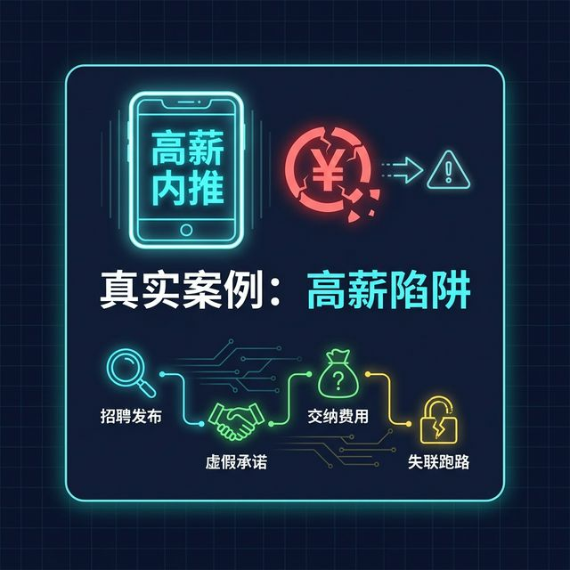
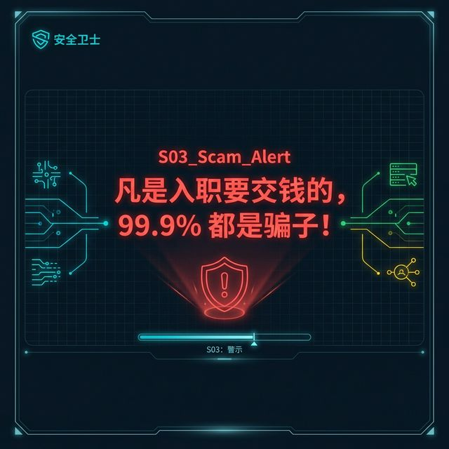
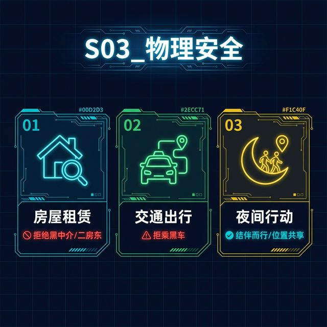
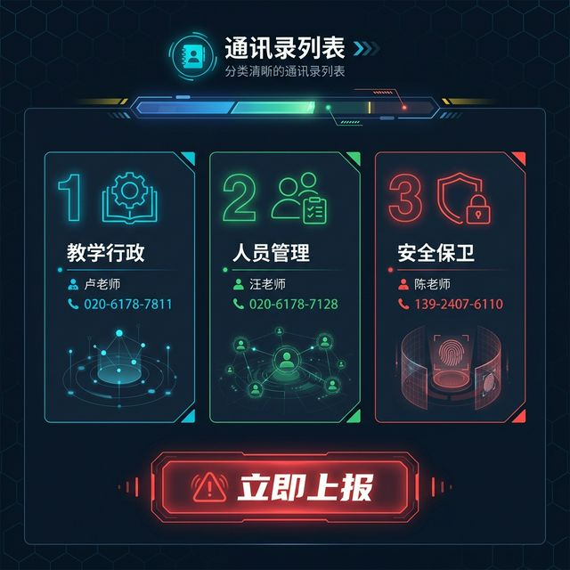
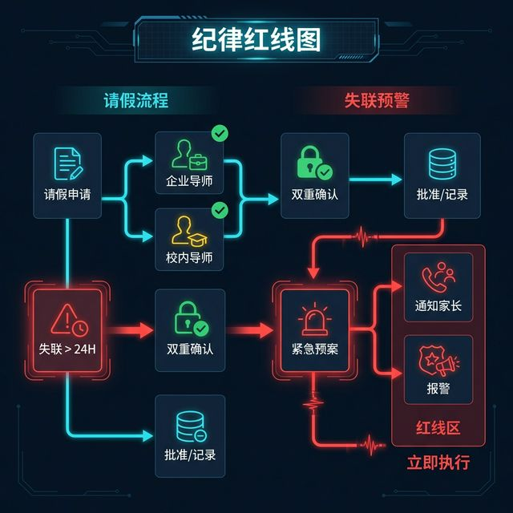
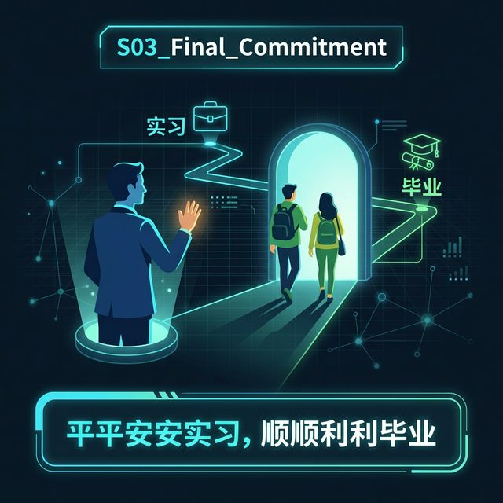

# S03: 安全与纪律 (Safety & Discipline)

> **Role**: 实习指导教师 (Internship Instructor)
> **Audience**: 全体实习生
> **Goal**: 严肃强调实习安全红线，确保学生平安实习、顺利毕业。
>
> **References**:
> *   [教师群会议纪要](../knowledge/repository/03_teaching_aids/教师群会议1/教师群会议1.txt)
> *   [工作群指示](../knowledge/repository/03_teaching_aids/工作群指示1/工作群指示1.md)
>
> **tags**: [SafetyFirst] [AntiFraud] [EmergencyProtocol] [Activity] [Humanistic]

## 1. 开场：安全是底线 (Safety First)

> [VISUAL]
> *   **Slide**: `S03_Cover`
> *   **Layout**: `Title`
> *   **Scene**: 标题页，严肃而温馨的风格，文案："安全实习，平安归来"。
> *   **Asset**: 

同学们好。请大家先看屏幕。
在动员大会上，我们已经强调了**实习的时间逻辑**和**材料规范**。特别是**法定节假日严禁落款**这一条，这是法律红线，也是评价你职业素养的底线，请务必死记硬背下来。

今天这节课，我们不谈材料，只谈**生存**。
作为“社会人”，你们从迈出校门那一刻起，就是自己安全的第一责任人。我的任务是交给你们一份“护身符”，确保大家不仅能顺利拿学分毕业，更能平平安安地回来。

---

## 2. 人身安全：防诈骗与防风险 (Personal Safety)

> [VISUAL]
> *   **Slide**: `S03_Scam_Case`
> *   **Layout**: `Split`
> *   **Scene**: 昏暗背景，手机显示"高薪内推"，旁边是破碎钱币。文字："真实案例：高薪陷阱"。
> *   **Asset**: 

请同学们看大屏幕。
老师不仅关心你们的学业，更关心你们的口袋和安危。
去年就有个惨痛的真实案例：一位同学急于找实习，相信了网上所谓的“高薪内推”，对方要求先交两千块“保密费”和“培训费”。
结果呢？钱刚转过去，公司就人去楼空了。这种利用“求职焦虑”设置的陷阱，每年都在割新人的韭菜。

> [STORY TIME]
> 这里的核心教训是：任何在入职前要求产生金钱往来的行为，都是诈骗的预警信号。

请同学们看大屏幕上的这组红色警示。
时刻保持警惕：**正规的实习单位，绝不会以任何名义向学生收取费用。**
凡是要求你先交钱才能入职的，无论是押金、服装费还是系统入驻费，**百分之九十九点九都是骗子**。遇到这种情况，请立即拉黑，并向我报告。

> [VISUAL]
> *   **Slide**: `S03_Scam_Alert`
> *   **Layout**: `Title`
> *   **Scene**: 黑底红字，警示语："凡是入职要交钱的，99.9% 都是骗子！"
> *   **Asset**: 

除了资金账户，也要注意生活半径里的陷阱。
在外租房的同学，请务必检查房源的合法性，不租住没有证件的“黑公寓”或二房东的房子；出行时，即便再急也坚决不坐“黑车”。
女生尽量避免深夜单独外出。你们的安全，是家人和老师最大的牵挂。

> [VISUAL]
> *   **Slide**: `S03_Physical_Safety`
> *   **Layout**: `Card`
> *   **Scene**: 三个图标警示：1. 🏠 房屋租赁（拒绝黑中介）；2. 🚗 交通出行（拒乘黑车）；3. 🌙 夜间行动（结伴/位置共享）。
> *   **Asset**: 

大家请看这张图标，我们总结了三个核心警示点：
首先是 **房屋租赁**，要坚决拒绝黑中介，确保租房合同上有正式的物权证明；
其次是 **交通出行**，绝对不能因为图便宜或图方便去坐非法的营运黑车；
最后是 **夜间行动**，建议三人以上结伴，并且主动向密友或家长开启手机的位置共享功能。

---

## 3. 紧急响应机制：黄金15分钟 (Emergency Protocol)

虽然我们不希望意外发生，但必须做好万全的备战准备。一旦发生突发情况，比如发生了工伤、突发急病或者遇到了合同纠纷，请大家务必保持绝对冷静。

> [VISUAL]
> *   **Slide**: `S03_Contact_Card`
> *   **Layout**: `List`
> *   **Scene**: 分类清晰的通讯录列表。分为：教学行政（卢老师）、人员管理（汪老师）、安全保卫（陈老师）。
> *   **Asset**: 

正如屏幕上这张联系卡所示，请现在拿出手机，我们做一个互动，存好以下三个关键号码。
**牢记“黄金时间”原则**：
遇到突发事件，必须 **立即向上报告**。这里的立即，就是 **Immediately**。
**注意：学校规定老师必须在接报后 10 分钟内上报学院。这意味着你们必须争分夺秒，第一时间联系我们！你拖延的一分钟，可能就是救援的致命缺口。**

第一是 **教学行政类**，凡是涉及换单位、成绩认定或者学分问题的，存好卢老师的办公电话：020-6178-7811。
第二是 **人员管理类**，如果是生病请假或者是心理压力太大了，存好汪老师的电话：020-6178-7128。
第三是 **校园安保类**，涉及刑事或者人身威胁的紧急协调，存好陈老师电话：139-2407-6110。

如果是火灾、暴力或者重症等紧急时刻，请跳过老师，直接拨打 **110、119 或 120**。

> [ACTIVITY]
> **Type**: `Practice`
> **Duration**: `2 min`
> **Task**: “紧急救生圈”存号演练。请全体同学将屏幕上的三个号码存入手机通讯录，并分类标注。

---

## 4. 结语：责任与契约 (Discipline)

最后，我要强调纪律。
**严禁擅自离岗。**
实习期间的请假，必须经过“企业导师”和“校内导师”的双重批准，不是你自己发个微信说不来就不来了。
如果失联超过24小时，学校将立即启动黄色预案，通知家长并报警寻找。

> [VISUAL]
> *   **Slide**: `S03_Discipline_Rule`
> *   **Layout**: `Diagram`
> *   **Scene**: 纪律红线图：1. 请假 = 双重确认（企业+校内）；2. 失联 > 24H = 紧急报警。
> *   **Asset**: 

这里我们要明确责任的边界：
如果你请假，必须同时拿到企业导师和校内导师的签字或线上确认；
一旦发生失联超过一昼夜的情况，为了你的安危，我们会启动最高等级的紧急响应。

> [PHILOSOPHY]
> **Subject**: 契约与自然状态 (Contract and State of Nature)
> **Ref**: 托马斯·霍布斯《利维坦》 (Thomas Hobbes, "Leviathan")
> **Body**: 
> 政治哲学家霍布斯曾说，在没有规则约束的“自然状态”下，人与人的关系是“所有人对所有人的战争”，充满了孤独、贫困与恐惧。
> 你们签署的《三方协议》和学校的纪律，本质上不是枷锁，而是一份“社会契约”。
> 我们通过放弃一点点“想走就走的自由”，换取了整个社会协作体系对你的保护。
> 当你处于这份契约保护之下，你就不是孤胆英雄，而是身后站着学校与法律支持的职业人。

> [VISUAL]
> *   **Slide**: `S03_Final_Commitment`
> *   **Layout**: `Image`
> *   **Scene**: 老师目送学生远行的背影或毕业典礼温馨画面。配文："平安实习，顺利毕业"。
> *   **Asset**: 

同学们，实习是你们职业生涯真正意义上的起点。
所谓职业精神，第一条就是“对自己负责”。
守护好自己的安全，就是守护好家人的期待。
我在这里等着你们，带着满满的职场经验与平安的承诺，回来参加毕业典礼！

祝大家平安通关，职场顺利！
