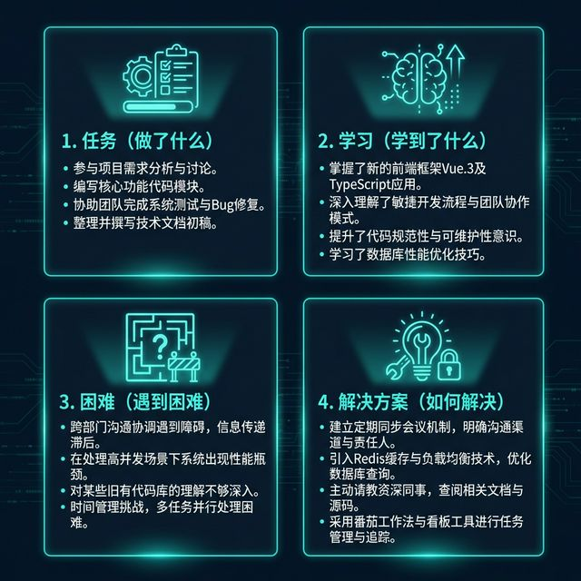
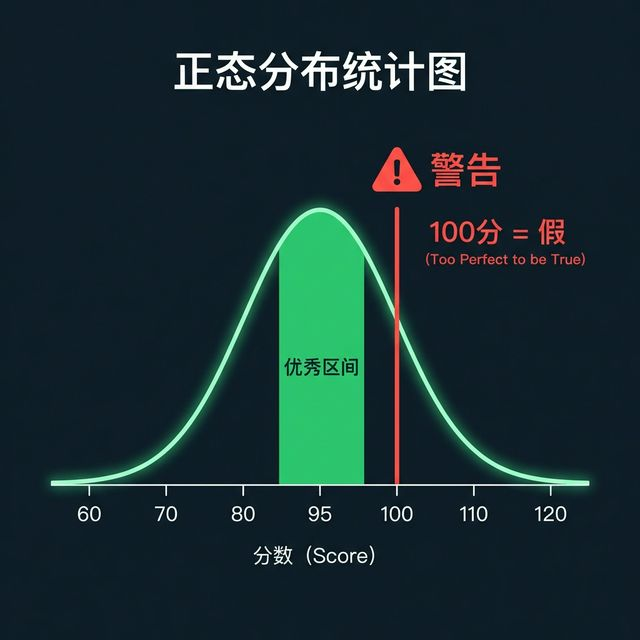
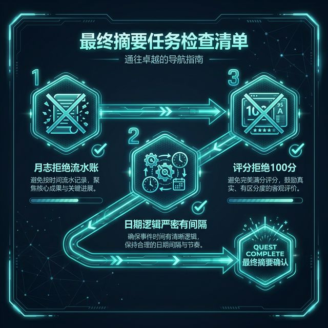

# S04: 岗前培训 (Pre-job Training)

> **Role**: 资深导师 (Senior Mentor)
> **Audience**: 即将开启实习旅程的学生
> **Goal**: 详解《实习月志》与《鉴定表》的填写攻略，确保过程合规、结果高分。
>
> **References**:
> *   [实习手册](../knowledge/library/01_student_pack/附件3：广州南方学院毕业实习手册.md)
> *   [工作群指示](../knowledge/repository/03_teaching_aids/工作群指示1/工作群指示1.md)
>
> **tags**: [ExecutionGuide] [LogWriting] [ScoringStrategy]

## 1. 开场：从“规则”到“攻略” (From Rules to Strategy)

> [VISUAL]
> *   **Slide**: `S04_Title_Cover`
> *   **Layout**: `Title`
> *   **Asset**: 
> *   **Scene**: 标题页。标题“岗前培训：高分攻略”，副标题“Pre-job Training: How to Score High”。

同学们好。
前面的课程，我们讲了**生存底线**（安全、纪律）。
这节课 S04，我们不谈底线，只谈**上线**——如何写好文档，拿到漂亮的实习成绩。

---

## 2. 进阶时间逻辑：月志闭环 (Advanced Time Logic)

S01 强调了“先申请后实习”的大逻辑。现在我们进入实操层面的**微观逻辑**——《实习月志》。

这也是最容易出错的地方。请看其**内部循环**：

> [VISUAL]
> *   **Slide**: `S04_Three_Dates_Logic`
> *   **Layout**: `Diagram`
> *   **Asset**: 
> *   **Scene**: 三个方块依次排列：1. 学生总结日期 -> 2. 老师意见日期 -> 3. 学生整改日期。重点是每个方块之间的红色不等号“≠”，强调这三个日期绝不能是同一天。这个流程形成了一个时间的闭环，每一个节点的日期都必须逻辑自洽，体现出真实的流转过程，而非瞬时完成。

**核心公式：学生总结日期 < 老师意见日期 < 学生整改日期**

*   **Scene 1**: 比如你在 3月30日 写完总结。这代表你完成了当月的任务梳理。
*   **Scene 2**: 老师必须在 3月31日 或之后 审阅并签署意见。这中间留出的时间，证明老师确实仔细研读了你的周志并给出了反馈。
*   **Scene 3**: 如果老师提了整改建议，你的整改提交日期必须比老师的意见日期还要晚，哪怕只是晚一天。这在档案审查中非常关键，它勾勒出了一个“发现问题-提出建议-付诸行动”的完整链条。

**切记**：这三个日期如果撞在同一天，逻辑上就是“秒回”，在教务系统的严密算法中，这种“零间隔”流转会被直接判定为数据作假。请大家在填写时，多一点耐心，让时间流动起来。

---

## 3. 核心作业：月志怎么写？ (Monthly Log Guide)

《实习月志》直接关联校内导师评分（占比70%）。很多同学会被判定为“流水账”，怎么破？

**黄金四要素 (The Golden 4)**：

> [VISUAL]
> *   **Slide**: `S04_Log_Four_Elements`
> *   **Layout**: `Card`
> *   **Asset**: 
> *   **Scene**: 四张卡片组成的矩阵。左上：Task (做了什么)；右上：Learning (学到了什么)；左下：Difficulty (遇到了什么困难)；右下：Solution (如何解决的)。

不要只写“我今天画了图”。要按照这个结构写：

1.  **Task —— 做了什么**: "完成了《XX项目》主角的三视图设计，包含正、侧、背三个面。"（量化工作）
2.  **Learning —— 学到了什么**: "掌握了 Blender 的 UV 展开新技巧，提升了贴图效率。"（技能增量）
3.  **Difficulty —— 遇到困难**: "在导出为 FBX 格式时，骨骼绑定出现错位。"（真实问题）
4.  **Solution —— 如何解决**: "查阅官方文档并请教主美，发现是轴向设置问题，修正后解决。"（解决能力）

**Tips**：每月一篇，至少 4 篇。内容越具体，分数越高。

---

## 4. 文档攻坚：评分的艺术 (The Art of Scoring)

S01 讲了公章要盖红色、不能压字。这里不再赘述。
我要重点讲一个**心理博弈**——关于分数的拿捏。

> [VISUAL]
> *   **Slide**: `S04_Score_Distribution`
> *   **Layout**: `Chart`
> *   **Asset**: 
> *   **Scene**: 一个正态分布图。大多数分数在 85-95 区间，100分 区域被打上“Warning”标签。
> *   **Text**: "100分 = 假 (Too Perfect to be True)"

很多企业导师对你们很好，想给满分，也就是 100 分。
**千万别！**

*   **拒绝满分**：在教学评估体系里，全班都拿100分会被视为“数据异常”或“评价失效”。这会导致你的《鉴定表》被直接退回，你需要重新找企业盖章、重新提交。如果错过了教务系统的结课窗口，你的实习成绩将直接记为零分，影响毕业时间。
*   **黄金区间**：建议请企业导师打 **85-95分**。这既是高分，又显得真实、客观、有区分度。

---

## 5. 特殊策略：在岗证明 (On-Post Proof Strategy)

最后，教大家一个职场小策略——《在岗证明》。

> [VISUAL]
> *   **Slide**: `S04_Proof_Duration`
> *   **Layout**: `Image`
> *   **Asset**: 
> *   **Scene**: 一张《在岗证明》样本，高亮"实习期限"一栏。
> *   **Text**: "Aim for 1 Year (争取写一年)"

*   **建议时长**：为利于就业统计与档案记录，建议争取填写**一年**实习期（例如：2026年3月 - 2027年3月）。
*   这会让你的简历看起来更稳定，不是“打短工”。当然，最低标准必须满足学校要求的**4周**。

---

## 6. 结语 (Conclusion)

> [VISUAL]
> *   **Slide**: `S04_Final_Checklist`
> *   **Layout**: `List`
> *   **Asset**: 
> *   **Scene**: 最终清单：1. 月志拒绝流水账；2. 日期逻辑不仅要对，还要有间隔；3. 评分拒绝100分。这份清单是你们通向“优秀实习生”的最后一道防火墙，请务必拍照留存。

S04 的内容就到这里。
S01 给了你们**护盾**（安全），S04 给了你们**攻略**（高分）。

剩下的，就看你们在职场这个“开放世界”里的表现了。
你要记住，这不仅仅是一份简单的实习作业，这更是你作为职业人的第一张正式名片。
一张写满逻辑、诚意与敬畏心的名片，能让你在起步的瞬时就甩开那些敷衍了事的竞争者。
良好的记录习惯，是你职业尊严的基石。

祝大家通关顺利，高分毕业！

---

## 7. 互动与思考 (Activity & Reflection)

> [ACTIVITY]
> **Type**: `Practice`
> **Duration**: `3 min`
> **Task**: “日期自检”
> 请大家拿出手机，在日历里模拟一下你下个月的“月志流转”。假设你 25 号做完任务，请标注出预期的总结日、导师审阅日和可能的整改日。看看你的逻辑链条是否能避开所有的节假日？

> [PHILOSOPHY]
> **Subject**: “存档”的深度 (The Depth of Recording)
> 在游戏领域，有一个词叫“环境叙事”（Environmental Storytelling）。你的实习文档其实就是你职业生涯初期的环境叙事。当你以后回顾这些文档时，看到的不仅是日期和字数，更是你从“稚嫩”走向“靠谱”的每一步留痕。靠谱，是职场中最高级的才华。
