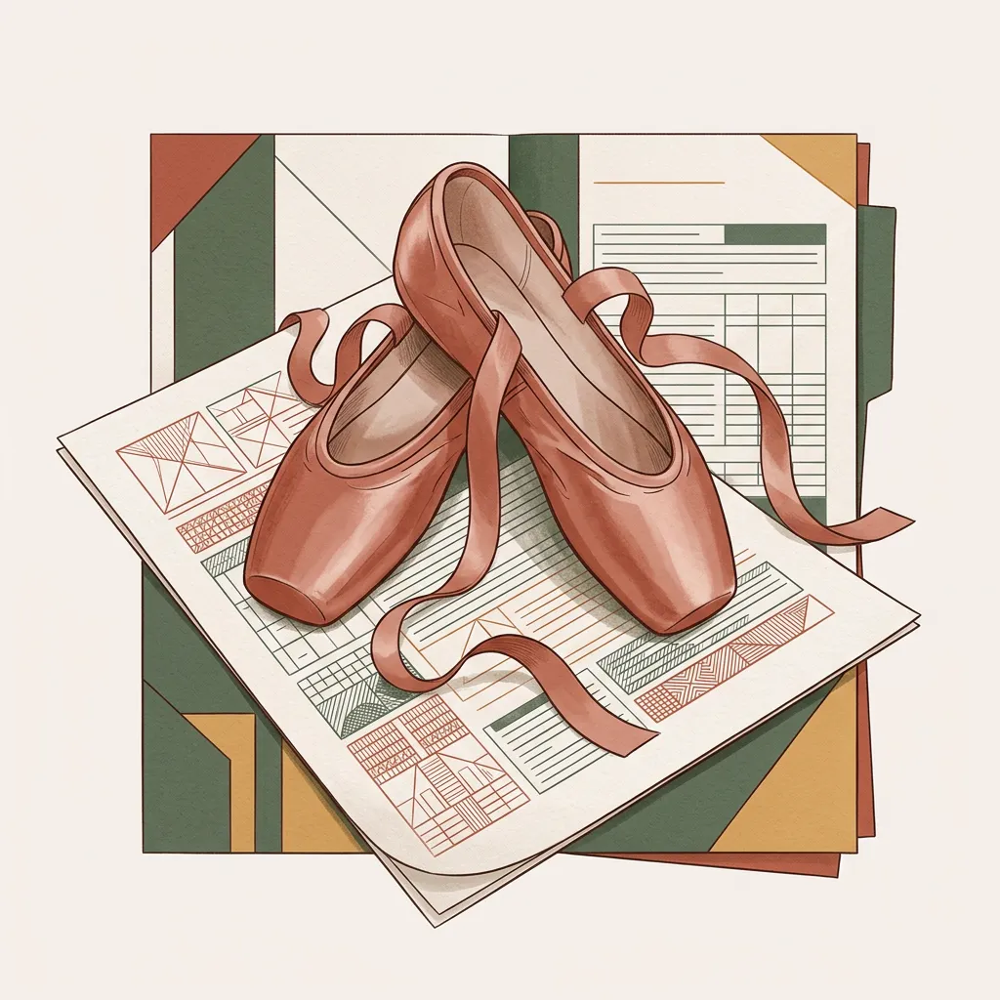

# 6月30日首堂课陈述大纲与核心要点

---

## 🧭 第一部分：确立航线——“以终为始”的开题倒推法

7 月 8 日的**现场开题答辩**（由三名专业教师组成的审核队伍）是我们现阶段的最终目标，因此所有准备工作必须以此为起点进行倒推。

**🎯 7月8日现场交付清单：**
1.  **答辩 PPT（首要任务）**：现场宣讲的核心依据。
2.  **开题报告（必印材料）**：需要现场打印出来，递交纸质版给评委审查。
3.  **任务书与绪论（防御性材料）**：强烈建议有能力的同学提前写好。现场评审老师可能会随时抽查这三样材料中的某一项，甚至全部。

**📅 倒推行动时间轴：**
1.  **6月10日 - 6月13日（确定选题）**：可 1-4 人组队。但记住，**毕业论文（设计说明）必须一人一题**。
2.  **7月3日（完成底稿）**：最好能在此时间点完成《绪论》和《任务书》的初稿撰写。（在此期间与指导老师线下见面沟通不少于 2 次）
3.  **7月4日（制作 PPT）**：文字材料基本敲定后，大家可以开始全力制作答辩 PPT。
4.  **7月8日（现场答辩）**：请带齐答辩 PPT、开题报告、任务书和绪论这几份材料，现场迎战。

**📮 定稿（7月末-8月初）：**
答辩通过并根据评委意见修改后，将进入教务系统正式录入阶段：
*   **7月18日 - 7月30日**：必须在系统中提交正式版**《任务书》**。
*   **7月30日 - 8月10日**：提交正式版**《开题报告》**。

## 🚫 第二部分：选题历届踩坑雷区

> [!IMPORTANT]
> **设计意图**：开场直接指出历届极易踩坑的违规操作，明确量化要求。

### 第一区：与灵感无关
好的选题必须基于真实的需求，而非个人情感宣泄或灵感降临。毕业设计是在展示你解决问题的能力啊。

### 第二区：漏斗模型与真实行动

*   **倒三角漏斗式痛点法**：
    *   痛点推导应像倒三角漏斗一样：社会趋势 $\rightarrow$ 行业痛点 $\rightarrow$ 最后的具体需求。
    *   **🔗 漏斗与学术标题的映射关系**：我们在第七部分会讲到“三段式学术标题”（理论 + 客体 + 用户），它其实完美映射了漏斗的三个层级：
        1. **理论视角** $\rightarrow$ 对应顶层的**行业趋势或者是学术地图**。
        2. **研究课题（客体）** $\rightarrow$ 对应中层的**微观行业痛点和设计瓶颈**。
        3. **目标用户** $\rightarrow$ 对应漏斗底部的**最微观的用户痛点或具体需求**。
*   **💡 锦囊选项：Job to be Done (JTBD) 模型**：
    *   我们调研和看事物的信息渠道要多元。在报告、新闻里看到的内容，或者在采访过程中听到的“用户反馈”，不一定都是准确的。
    *   **我们要看行动，行动才是真实的。** 选题必须能帮助用户完成某个具体的“任务（Job）”。

### 第三区：推敲出有价值的行为（死守底线）
不管是制作毕业作品还是写毕业论文，都应该强调我们所付出的劳动是必须要有价值的。以下是必须符合的指标要求：
1.  **社会契合度 $\ge$ 75%**：学院的论文标准上着重提到了，选题必须与实际结合，具备明确的社会价值或生产价值。
2.  **人文价值**：除了社会/生产价值外，绝对不能少了一样：即“以人为本”的人文价值的结合。
3.  **避免空泛与重复**：题目绝不能空泛（如“论中国设计之美”），**且绝不能与近3年的毕业设计题目重复**。
4.  **政治与合规红线**：严禁违背党的基本原则；严禁抄袭他人毕设或竞赛作品，所有素材必须原创。

## 🩰 第三部分：作为“底线合同”的四双舞鞋与两套策略

> [!TIP]
> **设计意图**：将教务硬性指标比作芭蕾舞者的“舞鞋”与必须履行的“合同”，并提供基于“能力”与“价值”的双向推导策略。

*   **要点一：这双“舞鞋”就是你的“底线合同”**
    *   **无商量余地的死要求**：本部分罗列的四个创作方向的硬性指标，就是大家必须要穿上的“舞鞋”。未达标将直接导致不及格，毫无商量余地。
    *   **及格保障与合同约束**：换个角度看，这也是对同学们的一份保障——这双“舞鞋”本身就是一份必须履行的“合同”，只要你严格达成要求（履约），就能守住及格的底线。

*   **要点二：选鞋跳舞的两种做法**
    *   在仔细核对这四双“舞鞋”（合同指标）的具体要求之前，我们可以想象一个芭蕾舞演员的背景，这里有两种不同的选型路径：
    *   **路径 A【能力优先】（选好鞋子定舞蹈）**：
        *   **做法**：先选好了“鞋子”（锁定某份硬性合同），再去决定怎么跳舞。即从既定的鞋子（技术能力、硬性要求）出发，想方设法跳出一支好看的舞，反推并挖掘作品的最终价值。
        *   **适用人群**：偏向技术流、有特别钟爱的软件或表现手法，希望在毕设中锁死某种特定工具或视觉语言的同学。
    *   **路径 B【价值优先】（定好舞蹈选鞋子）**：
        *   **做法**：先想好了跳什么舞，再去选最合适的“鞋子”。即先确立核心的意图和价值基点（想表达什么意图），再去寻找和签署最适合支撑该意图的“舞鞋合同”（创作方向和技术手段）。
        *   **适用人群**：阅读量大、内心情感丰富、自我原则强、对社会议题有强烈感悟，清晰知道自己未来表达意图的同学。

*   **要点三：四双“舞鞋”的具体参数（硬杠杠合同）**
    *   **【实验动画/动画制作】**：单片 $\ge$ 3分钟（不含片头尾），2-4人组 $\ge$ 5分钟。**硬性配套**：$\ge$ 1000字文字剧本、完整分镜头脚本、30秒预告片，**$\ge$ 20种原创周边**（含实物作品集）。
    *   **【实验电影/影视制作】**：单人 $\ge$ 10分钟，2-4人组 $\ge$ 20分钟（实验影像统一 $\ge$ 20分钟）。**硬性配套**：30秒预告片、高品质摄影集（$\ge$ 40张、8英寸以上单幅作品），**$\ge$ 20种周边**。
    *   **【游戏交互/概念设计】**：现场可运行互动游戏原型（或5分钟以上预演视频），完整 UI 设计，关卡 $\ge$ 3-4关，简易教学视频。**硬性配套**：精美A4作品集（$\ge$ 30页），**$\ge$ 20种周边**。
    *   **【交互影像/交互绘本】**：漫画分镜 $\ge$ 40页/人。动态数字影片 $\ge$ 3分钟，真人互动时长 $\ge$ 40%。**硬性配套**：30秒预告，**$\ge$ 20种周边**。

## 🛠️ 第四部分：实战拆解——开题报告“10大核心要件”与 AI 赋能

> [!NOTE]
> **设计意图**：提供标准化的武器库，引导学生直接使用 SSOT（单一事实源）模板进行撰写。

*   **要点一：开题报告的“10大核心骨架”与格式红线**
    *   *（注：完整骨架、题目拟定红线及特定专业 Checklist 已固化至下发物料 `B02_开题报告骨架模板.md` 中，请引导学生直接使用模板）*
*   **要点二：AI 大模型辅助调研**
    *   学会使用现代 AI 大模型（如 NotebookLM）。建议利用社媒平台搜索相关教程，借助“梯子”与 AI 进行深度的学术文献总结与痛点挖掘。
*   **要点三：确立你的“学术巨人”与理论框架**
    *   通过提问如 *“有什么经典的理论/框架可以深入研究[具体问题]？”*，快速锁定核心理论支撑。
    *   **防脱节公式**：引入理论时必须遵循**“是什么-有什么-怎么用”**的逻辑（已集成至 `B02` 骨架），交代清楚理论核心层级，以及在具体的关卡/界面设计中如何落地运用。

## 🛡️ 第五部分：灵魂拷问与学术自查——开题防坑 11 问

> [!WARNING]
> **设计意图**：强调学术合规底线与定性逻辑审查。具体的 11 问已分别集成至 `B01` 与 `B02` 文件中作为强制自查项。

*   **要点一：定性逻辑审查（集成至 B02 骨架模板）**
    *   *向学生强调在填写开题报告时，必须直面模板中的“灵魂拷问”提示（包括：MVP 边界、痛点真伪、The Gap 挖掘、齿轮咬合与抗压进度）。坚决打破“自我感动”，杜绝理论与实践两张皮。*
*   **要点二：定量指标与合规审查（集成至 B01 任务书规范自查单）**
    *   *强调底线意识：要求学生在提交材料前，必须使用 `B01` 进行“一票否决”级的自查。包括文献数量与格式、数据统计底线（样本 N<25 不写百分比）、严禁“Reference-13 埋尸法”及排版纪律。*

## ⚖️ 第六部分：知己知彼——评分标准与答辩通关技巧

> [!CAUTION]
> **设计意图**：明确游戏规则，告知残酷的淘汰率，并传授现场生存指南。

*   **要点一：残酷的成绩梯度与构成**
    *   毕设成绩 = **论文 50% + 作品 50%**。总分里，**指导教师占 50%，答辩委员会占 50%**。
    *   严格执行正态分布，**优秀率控制在 10-15%**。若答辩组一致认为不通过（低于60分），直接进入二辩。
*   **要点二：现场通关三板斧**
    *   **材料齐备**：强烈建议打印纸质版《任务书》与《开题报告》带至现场。
    *   **时间控制**：宣讲流利简洁，严控在规定时间内。
    *   **痛点精准**：一句话说明痛点、对标竞品及最终产出承诺。证明自己“在解决真问题，且具备落地的技术能力”。

## 🎤 第七部分：课堂实操——定题采访与课后任务

> [!NOTE]
> **设计意图**：将理论转化为行动，在课堂最后锁定学生状态，并布置可量化的推进任务。

*   **环节一：现场讲解与初步采访**
    *   讲完前面的干货与雷区后，专门采访各位同学目前的想法和倾向（想选哪条路径、大概对什么方向感兴趣）。
    *   教师在现场做初步记录，摸清全班的创意底盘。
*   **环节二：下发指南与最终讲解**
    *   向同学们下发配套物料 **《B04_学术定题与标题拟定指南》**。
    *   简明扼要地向同学们讲解**“三段式学术标题结构”（理论视角 + 研究客体 + 目标用户）**以及“坚决不能以工具为核心”等定题死红线。
    *   **重点辨析“研究客体”**：强调研究客体真正的定义是你具体要解决的**“设计维度”、“美学规律”或“学术问题”**（如“游戏关卡设计中的视觉引导”），而不是泛泛的媒介本身。
    *   **重申理论的武器属性**：理论（如格式塔心理学、具身认知理论等）是我们在撰写论文时，用来论证实战合理性、完成知行合一闭环论证的“科学武器”。
*   **环节三：方案提供（课后任务）**
    *   让同学们带着《指南》回去思考。
    *   **硬性任务**：结合今天讲的“漏斗模型”和“定题公式”，每个同学至少提供 **3 个备选方案**，并提交给老师进行最终的把关和选择。
