<!-- BUDGET: 3000 chars | STATUS: pending -->

## M01_毕业设计档案归档全流程指南
> [VISUAL]
> *   **Slide**: S01_Archive_Pain
> *   **Layout**: `Full`
> *   **Scene**: 一个疲惫的毕业生面对着堆积如山的纸质文件，手中拿着一个被打满红叉的档案袋，表情崩溃
> *   **Text**: 档案打回 崩溃重做
> *   **Asset**: 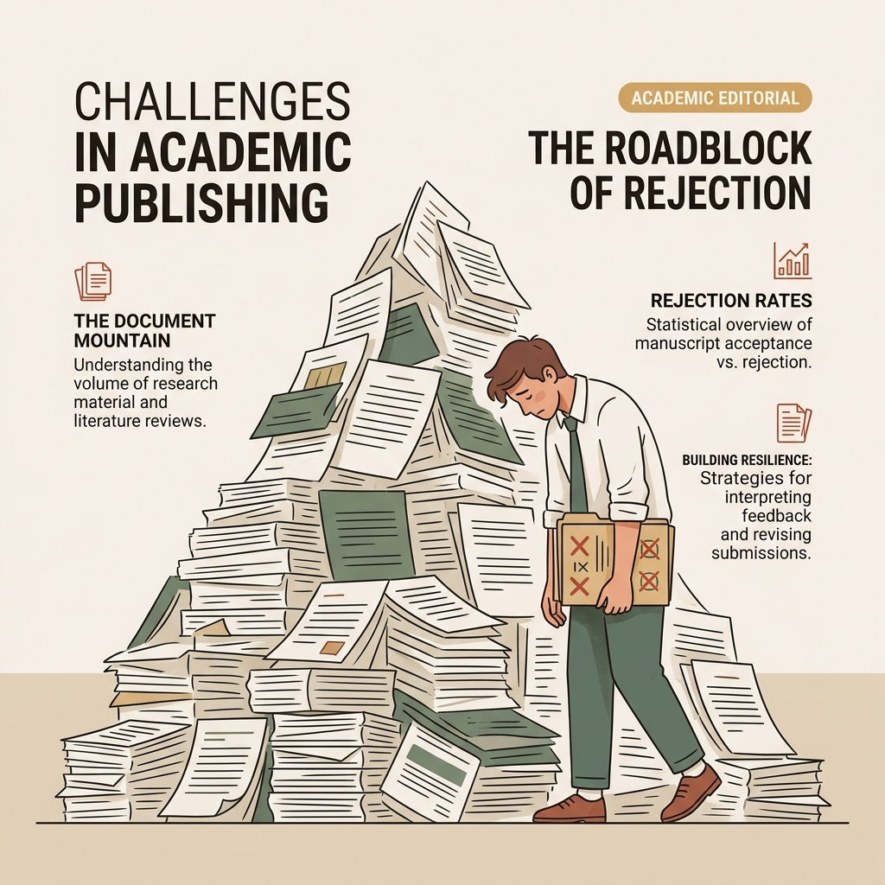
> *   **Source**: AI Generated
> *   **RenderMode**: `pedagogical`

同学们，恭喜大家顺利熬过了熬夜爆肝的设计阶段，也挺过了令人心跳加速的毕业答辩。但就在你们以为可以顺利拿到毕业证、彻底解放的时候，很多学长学姐却在一个看似最简单的环节上“翻了车”。

> [STORY TIME] 
> 去年有一位 25 届的学姐，答辩拿了优秀的成绩，开开心心地把档案袋交到教务处。结果教务老师只扫了一眼，就直接把档案袋退了回来。原因是什么？她的导师签字日期比答辩日期晚了一天。就因为这“一天”的倒挂，她整套厚厚的档案袋里所有涉及签名的文件，全部作废，必须重新打印、重新找四位老师挨个补签。当她抱着重打的材料站在炎热的走廊里等老师时，心态彻底崩溃了。

**(Pause: 3s)**

对，这就是我们要讲的，能让人瞬间崩溃的——**毕业设计档案的归档整理**。

### 全局底线：所有表格严禁留白

> [VISUAL]
> *   **Slide**: S02_Title
> *   **Layout**: `Center`
> *   **Scene**: 标题画面，文字清晰醒目，带有警示意味的档案袋图形
> *   **Text**: 26届毕业归档：一次过审的通关指南
> *   **Asset**: 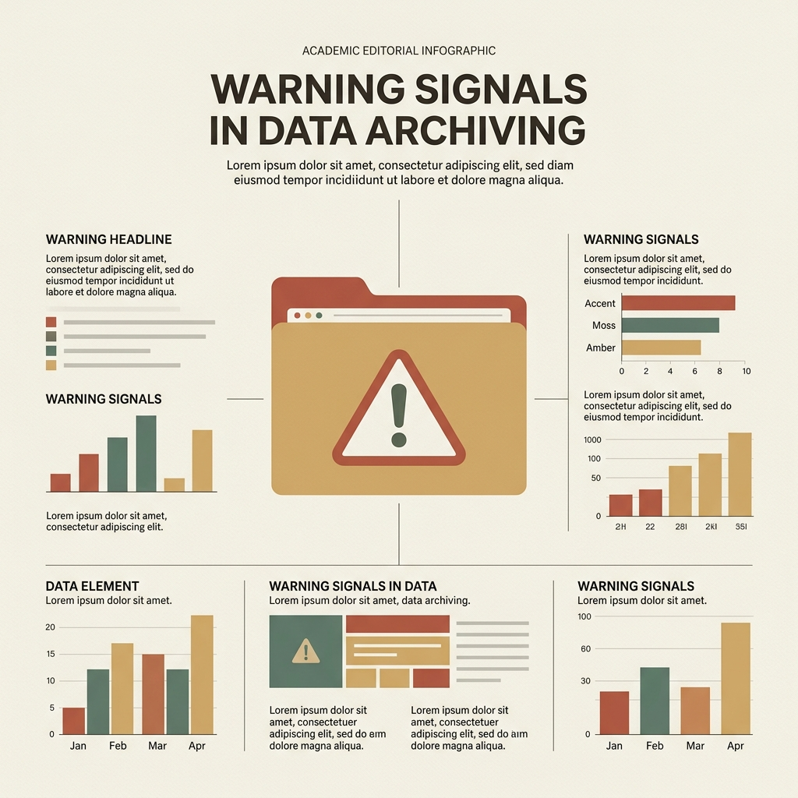
> *   **Source**: AI Generated

每年都有同学因为填错了一个**日期**、少签了一个**名字**，或者把文件**装订顺序**弄反了，导致整个档案袋被打回重做。为了让大家能清清爽爽地离校，今天我们就来把这份《归档指南》彻底拆解，帮你们**一次性通关**。

> [VISUAL]
> *   **Slide**: S03_Global_Rule
> *   **Layout**: `Split`
> *   **Scene**: 【双图拼接实拍】左图：《过程性材料归档目录》实拍照片，红框圈出"选题变动申请表"一行，展示最右侧打勾栏内手写了斜杠"/"，旁边标注"无此事项→手写斜杠"；右图：相同目录表中漏填留白的实拍照片（或示意图），用红笔圈出空白格，标注"❌审核不通过"。
> *   **Text**: 全局兜底原则：绝不留白
> *   **Asset**: 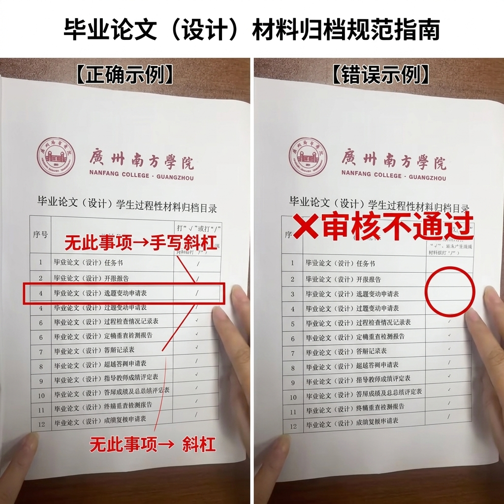
> *   **Source**: Real Photo (Processed)

在开始具体流程前，我们先牢记一个“全局兜底原则”。任何文件中出现的**签名栏**、**日期栏**，以及《过程性材料归档目录》中没有发生的文件项（比如你并没有申请“选题变动”），**一律不得留空**。

哪怕这项内容对你并不适用，你也必须在对应的位置手写划上**斜杠 ( / )**。

> [VISUAL]
> *   **Slide**: S03b_Date_Format
> *   **Layout**: `Split`
> *   **Scene**: 【双图拼接实拍】左图：《论文》封面打印件实拍，红框圈出下方日期落款处，显示"二〇二六年五月"（圆圈"〇"，非数字"0"），标注"封面：中文大写"；右图：《任务书》进度安排表格实拍，红框圈出表格内文字中的"2025年8月30日"（阿拉伯数字格式），标注"表格内：阿拉伯数字"。
> *   **Text**: 封面大写 表格数字
> *   **Asset**: 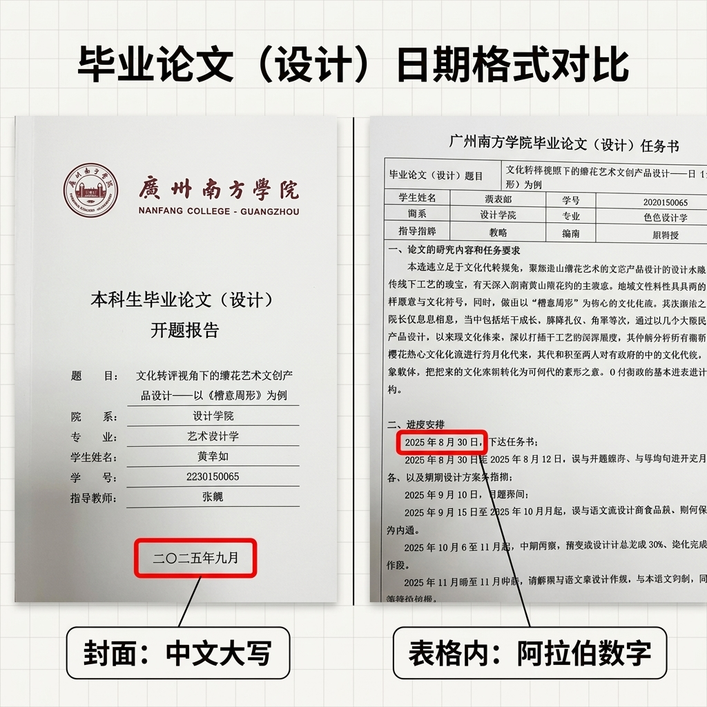
> *   **Source**: Real Photo (Processed)
> *   **RenderMode**: `pedagogical`

> [WARNING: 日期格式的玄机]
> 请注意，档案里的日期有两种完全不同的写法：
> 所有**「封面类」**的文件——也就是单独作为一页的封面，比如档案袋封面、汇编封面、论文封面——必须用中文大写，比如“**二〇二六年五月**”，记得是圆圈的“〇”，不是零。
> 而所有**「内部表格的落款」**——也就是你在某张表格里手写签字时填的那个日期——统一用阿拉伯数字，精确到日，比如“**2026年4月25日**”。
> 简单记忆：**「单独的封面页」用中文大写，「表格里手签日期」用数字。**

搞清楚了“严禁留白”这条全局底线，第一步就是准备我们的载体——档案袋。

### 档案外壳：双份档案手写封面

> [VISUAL]
> *   **Slide**: S04_Folders
> *   **Layout**: `Split`
> *   **Scene**: 【双图拼接实拍】两个牛皮纸档案袋并排正面朝上，右上角分别打上铅笔手写标记①②；左图（原件）："指导教师"栏手写"张巍"（绿色✅，标注"正确：不写职称"）；右图（处理后）："指导教师"栏手写"张巍 副教授"（红叉❌，标注"错误：写了职称"）。
> *   **Text**: 双份准备 绝对无涂改
> *   **Asset**: 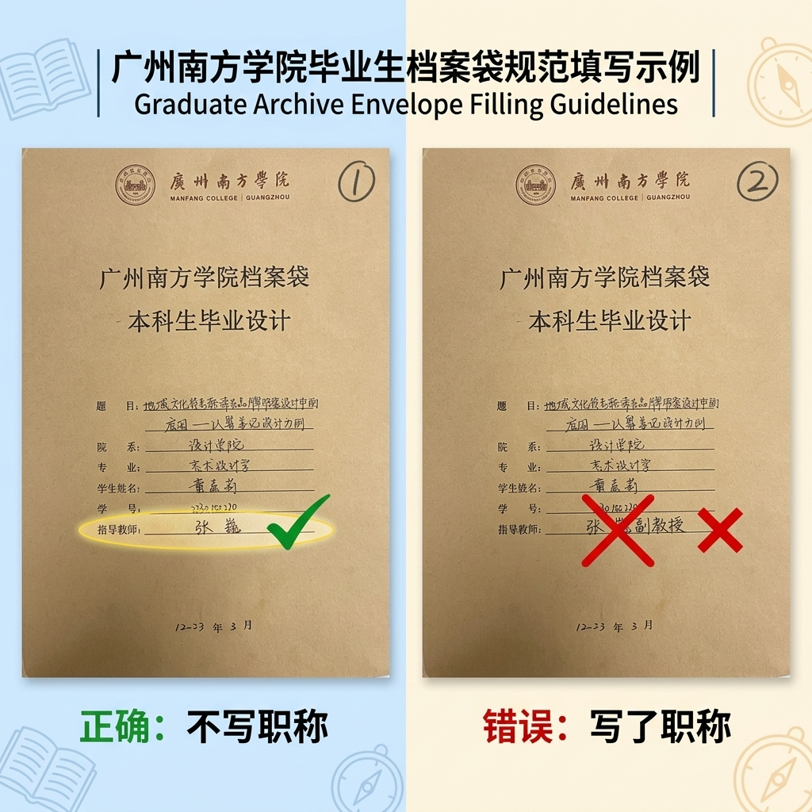
> *   **Source**: Real Photo (Processed)
> *   **List**: 准备双份 / 手写封面 / 禁写职称 / 大写年月

每位同学需要准备**两份档案袋**，右上角用铅笔分别标注 **①（原件）** 和 **②（复印件）**。①号袋装全部原件最终提交给院系留档，②号袋是你自己留存的备份，里面装的必须是①号袋所有材料的**黑白复印件**。

封面信息必须**手写**，居中对齐，而且**绝对不能有任何擦除或涂抹的痕迹**，写错了就换个新袋子。注意，指导老师的姓名后面**不要写职称**。落款时间统一写：**二〇二六年五月**。

### 装袋顺序：从主到辅从轻到重

> [VISUAL]
> *   **Slide**: S05_Binding_Order
> *   **Layout**: `Grid`
> *   **Scene**: 【实拍照片加工，桌面俯拍】三份材料错落平铺于桌面，上方带有大标题"装袋顺序：从主到辅，从轻到重"。图内带有清晰的气泡标签指向对应材料：① 胶装论文（淡绿色封面，放最上层）；② 过程汇编（下方左侧封面带"汇编"字样，夹在中间）；③ 设计手册（下方右侧长标题白底封面，垫底压稳）。
> *   **Text**: 主辅分明 压稳底盘
> *   **Asset**: 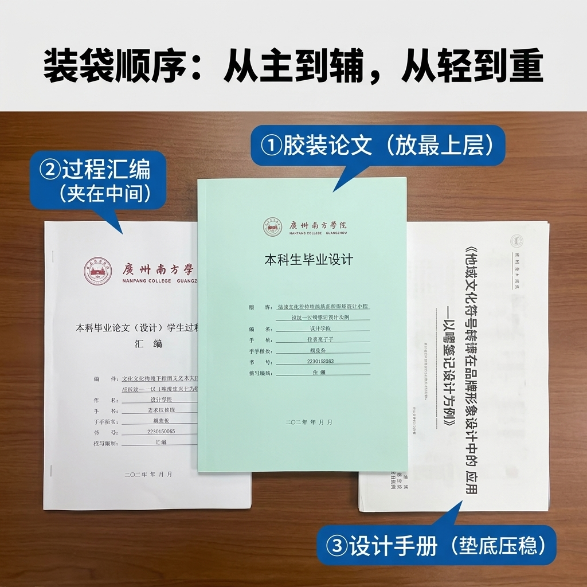
> *   **Source**: Real Photo (Processed)
> *   **List**: 胶装论文 / 过程汇编 / 设计手册

装袋的时候，这三叠材料的顺序也是定死的：最上面是**胶装的论文原件**，中间是厚厚的**过程性材料汇编**，最下面压底的是**设计手册**。

记忆口诀：**从主到辅，从轻到重**——论文是你的核心成果，是主角，放最上面；设计手册最厚重，垫底压稳。

顺带提醒大家，在把这本**胶装论文**放进去之前，一定要做两项高频防坑检查：第一，《原创性声明》页的签字时间必须填**2026年4月20日**；第二，**逐页检查正文的页眉**——Word 排版时页眉经常会莫名其妙消失，每一页都必须正常显示。

**(Pause: 2s)**

跨过了外壳装袋这一关，这三大件里面，最容易让你们跑断腿去重印的是什么？没错，就是被夹在中间的“过程性材料汇编”。

### 过程材料：左侧三钉单独打印

> [VISUAL]
> *   **Slide**: S06_Process_Materials
> *   **Layout**: `Split`
> *   **Scene**: 【双图拼接实拍】左图：《过程性材料汇编》封面实物拍摄，带有"规范封面格式"的教学标签；右图：左侧装订边缘的微距特写，用红圈标出三颗订书钉位置①②③，并带有醒目提示框"左侧三颗钉，均匀分布"。
> *   **Text**: 过程性材料汇编：左侧三颗钉
> *   **Asset**: 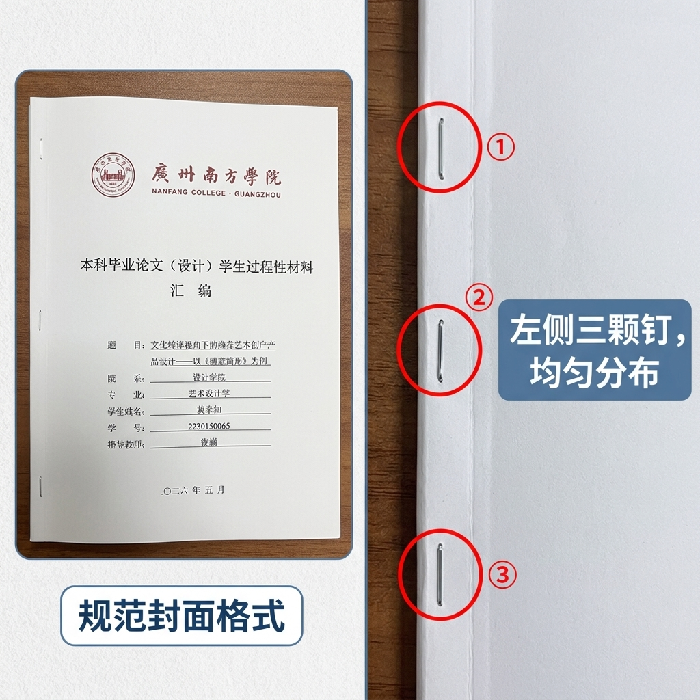
> *   **Source**: Real Photo (Processed)
> *   **List**: 单独双面 / 规范排版 / 左侧三钉

汇编材料里面包含了从任务书到查重报告足足 **12 项文件**，具体清单就是你手里那份目录表上的 12 行，等会我们会逐个过一遍。

> [VISUAL]
> *   **Slide**: S06c_Checklist
> *   **Layout**: `List`
> *   **Scene**: 【实拍照片加工】基于《过程性材料归档目录》实拍照片，左侧用大括号包裹 1-12 项并带有醒目提示框"核心工艺：12 项文件必须独立、双面打印，严禁合并连印！"；右侧用红色箭头指向第 11 行"终稿查重检测报告"，标注"必须放最后一页"。
> *   **Text**: 12 项文件 单独双面打印
> *   **Asset**: 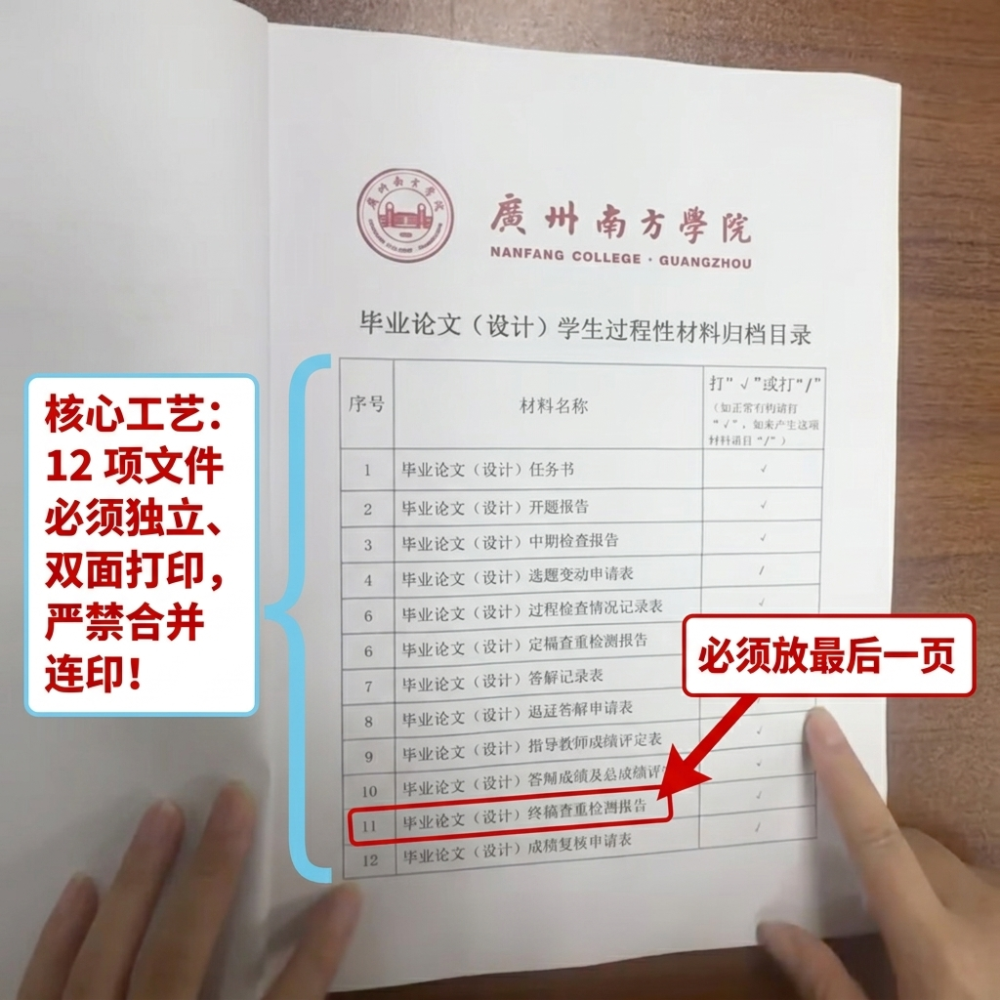
> *   **Source**: Real Photo (Processed)

这里的关键工艺是什么？每一份附件必须**单独、双面打印**——所谓“单独”，指的是**绝不允许把多个附件合并成一个 PDF 或 Word 连在一起打印**。每份文件必须独立打印出纸，最后再叠装在一起。为什么？因为在双面打印机制下，如果你把文件合并了，后一个附件的封面极有可能直接被印在前一个附件最后一页的背面！排版格式上，正文类文件统一使用**宋体、小四号字、1.5倍行距**（具体以各附件模板标注的格式为准）。

> [TECH NOTE: 打印避坑指南]
> 维普系统导出的定稿和终稿查重检测报告，只允许打印“**简洁版**”，也就是仅仅一张纸的版本。千万不要把你那厚厚一叠的“全文对照版”打出来塞进去。

> [VISUAL]
> *   **Slide**: S06b_Plagiarism_Report
> *   **Layout**: `Split`
> *   **Scene**: 【对比图加工】左图（正确）：展示维普《查重报告》实体打印件截图（1页），绿框高亮右上角"简洁报告"字样，加盖✅并标注"正确：仅需打印 1 页的简洁版"；右图（错误）：一张厚达几十页的模拟装订文件，加盖❌并标注"错误：严禁打印几十页的全文对照版"。
> *   **Text**: 查重报告：只要简洁版
> *   **Asset**: 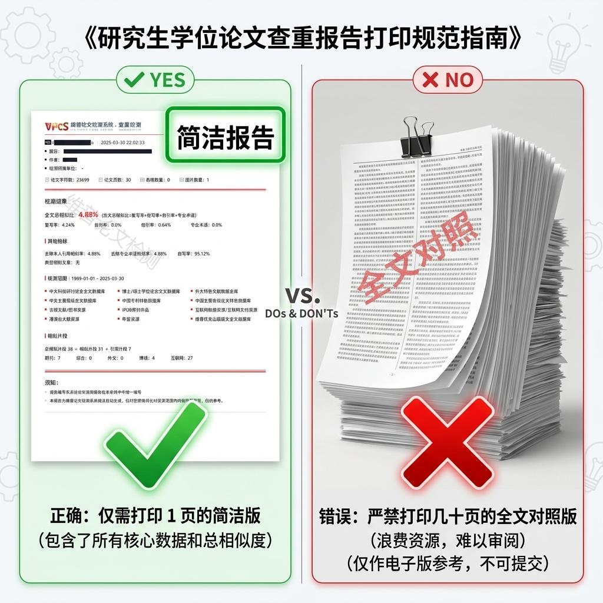
> *   **Source**: Real Screenshot (Processed)
> *   **RenderMode**: `pedagogical`

**特别注意**：终稿查重检测报告（时间为2026年5月）必须作为**汇编材料的最后一页**，而定稿查重报告仅需按照目录顺序放在终稿的前面即可。等你把这 12 项文件按目录顺序理好之后，必须使用**"左侧三颗钉"**进行规范装订：强烈建议去打印店借用厚层订书机，在文件左侧边缘，从上到下**均匀打三颗订书钉**（因为12份文件太厚，普通小号订书机打不透容易伤手）。切忌散装或者随便拿个夹子夹起来。

搞定了厚厚的汇编，教务老师审核时还会盯着什么看？他们看的是你的时间线。

### 时间逻辑：倒推时间严禁穿越

> [VISUAL]
> *   **Slide**: S07_Date_Logic
> *   **Layout**: `Flow`
> *   **Scene**: 【三图横向拼接实拍 + 箭头时间轴】将三份文件的签字落款处实拍照片横向排列，依次为：图1《任务书》（红框标出"2025年8月30日"）；图2《开题报告》（红框标出"2025年9月22日"）；图3《中期检查报告》（红框标出"2025年11月15日"）。三图间用显眼的红色大箭头连接，顶部配以大字标题："时间线逻辑倒推：单向递增，严禁逆序"。
> *   **Text**: 时间线逻辑倒推
> *   **Asset**: 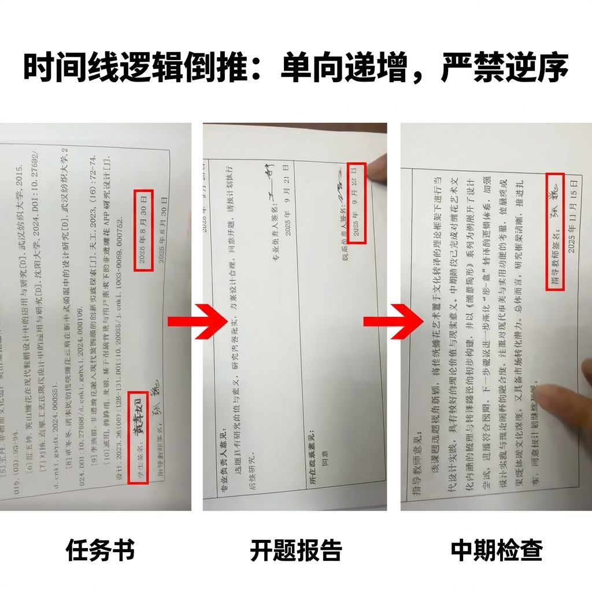
> *   **Source**: Real Photo (Processed)
> *   **List**: 任务书 / 开题报告 / 中期检查

这部分文件，核心雷区叫做“**时间线穿越**”。教务审核时，看的就是你们的**时间逻辑是否合理**。

比如：
- **任务书**落款：2025年8月30日。注意：任务书里的**导师职称**一栏，**一律留空**，不需要去判断是教授、副教授还是讲师。
- **开题报告**封面：2025年9月。注意，这是一个系统特例，因维普系统限制，它只能输出阿拉伯数字年月，无法精确到日，也不用中文大写。**⚠️ 系统避坑**：在维普系统里导出开题报告时，系统会在下载预览界面默认把年份识别成2026年。你需要在点击下载之前，先把那个年份字段手动改成"**2025年9月**"，再点导出保存。
- **中期检查报告**：2025年11月15日。

另外，开题报告还涉及**导师签字**——导师签字时间必须是**2025年9月20日**，后面还有两个审核节点：专业负责人9月21日、院系负责人9月22日。这三个日期是定死的，你需要提醒导师按这个时间签。

> [VISUAL]
> *   **Slide**: S07b_Proposal_Timeline
> *   **Layout**: `Flow`
> *   **Scene**: 【避坑概念图示，双态对比】使用概念图标代替系统界面。上部（错误状态）：标有"系统默认导出"的文件图标，里面写着错误的"2026年"并打上红叉❌；下部（正确状态）：标有"手动更正后下载"的文件图标，里面写着正确的"2025年9月"并打上绿勾✅。中间用向下箭头连接表示需手动干预，顶部带有全局警告："避坑：维普系统导出前，必须手动将年份改为 2025年9月"。
> *   **Text**: 系统避坑：手动改年份
> *   **Asset**: 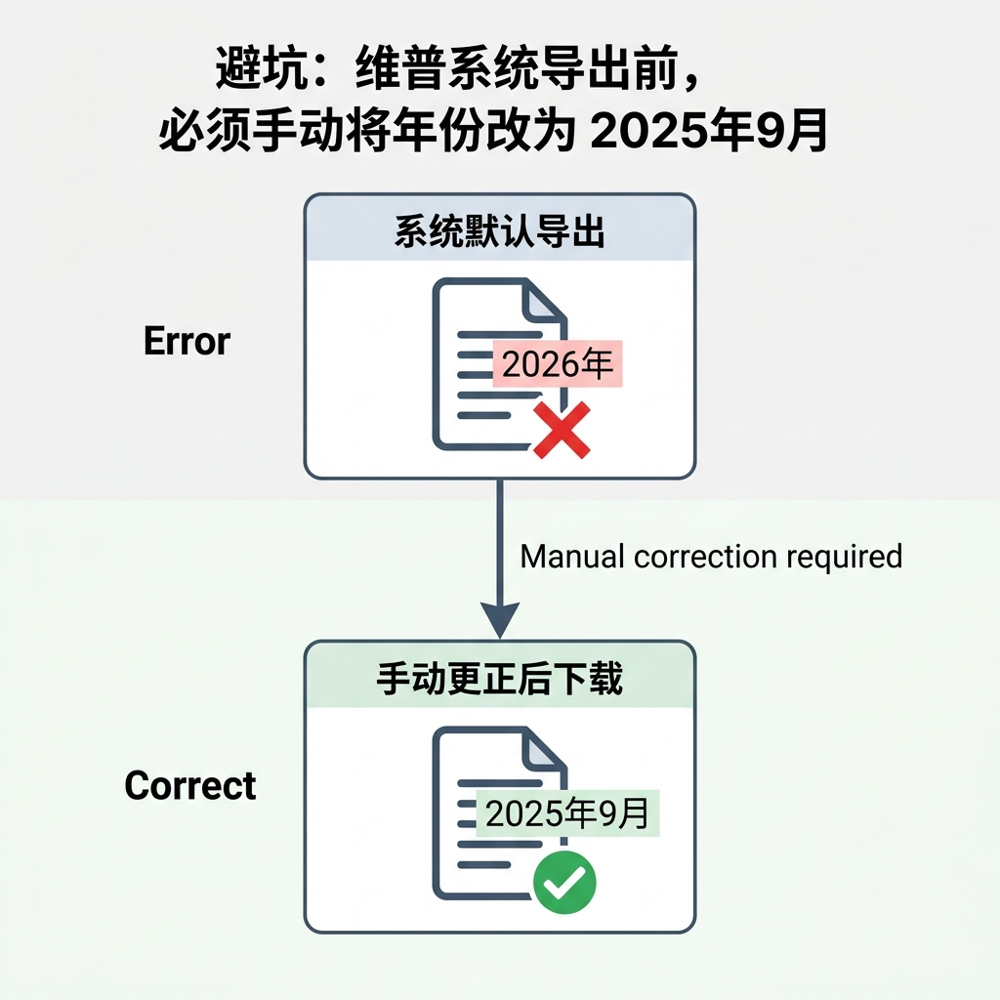
> *   **Source**: Conceptual Design
> *   **RenderMode**: `pedagogical`

> [ACTIVITY]
> *   **Type**: `QA`
> *   **Duration**: `1min`
> *   **Desc**: 时间线抽查
> *   **Q**: 如果你的开题报告导师签字日期填了 2025 年 9 月 25 日，会发生什么后果？
> *   **A**: 答：会造成“时间线倒挂穿越”。因为专业负责人和院系负责人的统一签字日期是 21 日和 22 日，导师签字绝不能晚于上级审核。你的整份开题报告将被作废重签。

### 过程记录：至少三次间隔整月

> [VISUAL]
> *   **Slide**: S08_Process_Record
> *   **Layout**: `Center`
> *   **Scene**: 【概念流程图】使用抽象的层级卡片展示《过程检查情况记录表》的时序规范。纵向排列"第 1 次检查"、"第 2 次检查"、"第 3 次检查"三个模块，模块之间用带有✅的箭头连接，标注"间隔≥1个月"。最底部连接到"导师签字"模块，高亮标出落款日期"2026年03月20日"。顶部主标题："过程记录规范：至少3次，间隔整月"。
> *   **Text**: 三次记录 间隔一月
> *   **Asset**: 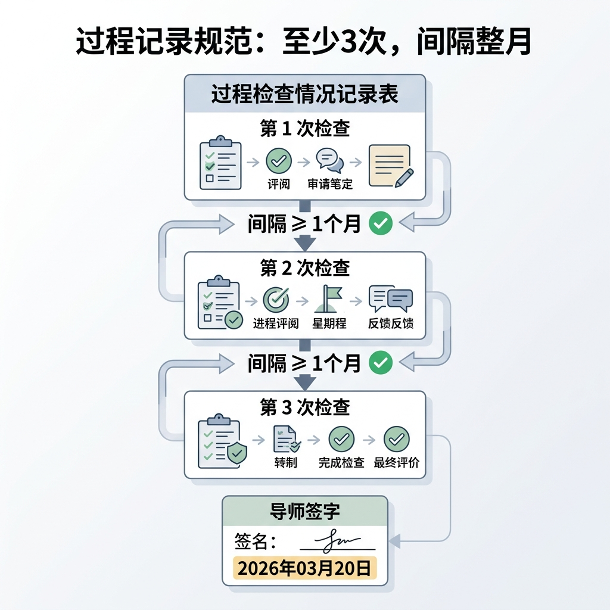
> *   **Source**: Conceptual Design
> *   **List**: 记录三次 / 间隔一月

特别提醒大家看附件7，也就是《**过程检查情况记录表**》。你们在这里记录和导师的讨论过程，必须记录**至少 3 次**，而且每次的间隔必须在 **1 个月及以上**。这张表导师的落款时间统一填**2026年03月20日**。如果你图省事，写成第一天讨论开题，第三天就定稿，这就完全不符合常理，肯定会被退回重写。

别觉得这只是个繁琐的行政手续——想一想，你和导师这一年来每次讨论、每次改稿，都是真实发生过的。这张表，就是那些时间节点的**书面凭证**。填得真实、扎实，才对得起你自己的设计过程，这也是你们这近一年心血的客观记录。

**(Pause: 2s)**

除了过程记录，还有一份记录能够证明你的专业能力，那就是答辩现场的记录。

### 答辩材料：背面双签填满记录

> [VISUAL]
> *   **Slide**: S09_Defense_Docs
> *   **Layout**: `Center`
> *   **Scene**: 【三图纵向拼合实拍】将《答辩记录表》的局部照片拼合成一张纵向长图以重现表单逻辑：① 顶部展示表头与答辩日期信息；② 中部截取密密麻麻的问答记录区，用大括号引出并标注"详实记录：至少记录 3 题"；③ 底部截取背面签名区，红框圈出两位老师的签名，并醒目标注"背页签名：必须两位老师双签，缺一不可"。
> *   **Text**: 详实记录 严防倒挂
> *   **Asset**: 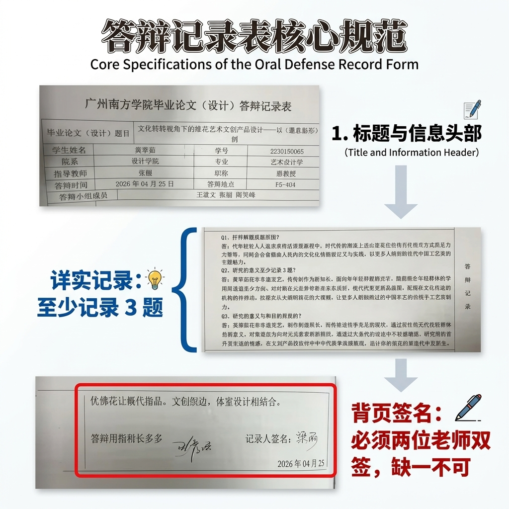
> *   **Source**: Real Photo (Processed)
> *   **List**: 内容翔实 / 背后双签 / 时间逻辑

在《**答辩记录表**》上，你需要记录老师问了什么，你答了什么。请把页面的空白处**尽量填满**，至少记录 3 个题目。记住，纸质表的背面需要**两位答辩老师签字**，而不是一位。

这套系统的流转逻辑非常死：学生必须**先传答辩记录**，答辩组长审核通过后，秘书才能给分。你不按时提交，全组人的流程都要卡着等你。

操作说明：用你的学号登录维普系统，在**「答辩管理」**模块找到你的名字，点进去上传答辩记录表的信息。答辩秘书就是你答辩组里负责记录和统分的那位老师，如果不确定是谁，答辩结束后直接问你的导师。

> [VISUAL]
> *   **Slide**: S09b_Teacher_Eval
> *   **Layout**: `Center`
> *   **Scene**: 【三图纵向拼合实拍】将《指导教师成绩评定表》的局部照片拼合成一张纵向流程图：① 顶部截取表头，红框圈出标题中的"（艺术类）"，旁注"必须选用艺术设计类专用表"；② 中部截取评语区，绿框高亮大段手写评语，标注"评语字数：必须 > 100字 ✅"；③ 底部截取签名区，红框高亮时间"2026年04月24日"，醒目标注"⚠️时间红线：必须早于答辩日(4月25日)"。
> *   **Text**: 导师评定表：评语与时间红线
> *   **Asset**: 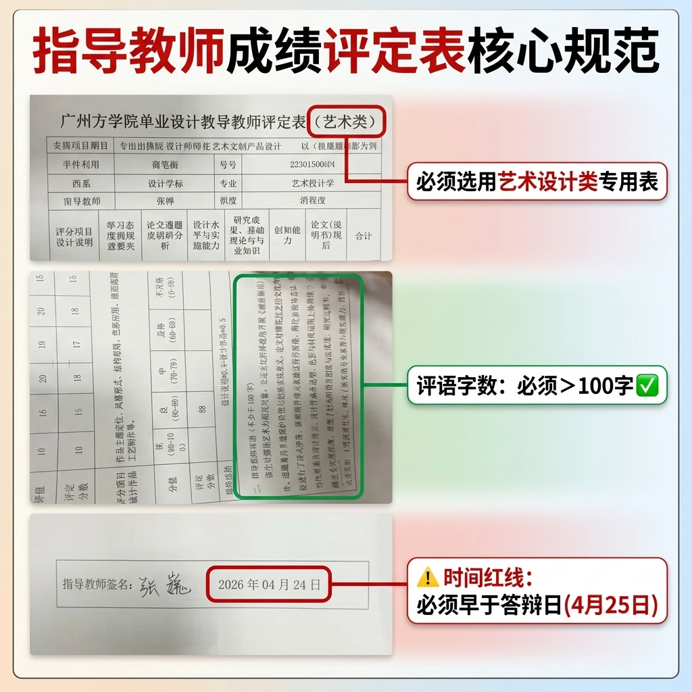
> *   **Source**: Real Photo (Processed)
> *   **RenderMode**: `pedagogical`

还有一份关键材料需要你提醒导师：**《指导教师成绩评定表》**。注意必须选用后缀带"(设计)"的艺术类表格，评语不得少于100字，而且有一条红线——**导师签字时间必须早于答辩日**（比如填**2026年04月24日**），绝不可以填答辩当天或之后的日期，否则整套材料的时间逻辑就崩了。

好，讲了这么多红线和日期，我们来快速检验一下大家对底线的敏感度。

> [ACTIVITY]
> *   **Type**: `Quiz`
> *   **Duration**: `2min`
> *   **Desc**: 归档雷区排雷测试
> *   **Q**: 小明准备提交档案袋了。他的导师姓张，是副教授。小明在档案袋封面的指导老师栏写了“张三 副教授”，并且在没有发生选题变动的情况下，在《过程性材料汇编目录》的“选题变动申请表”一栏留了白。这份材料能过审吗？
> *   **Options**: A. 能过审，信息很详实 | B. 不能过审，因为档案袋封面不能写职称 | C. 不能过审，因为目录表格不能留白 | D. 不能过审，B和C都犯了
> *   **Answer**: `D`
> *   **Explain**: 档案袋封面手写信息时，导师姓名后绝对不写职称。同时，全局兜底原则规定任何表格不得留白，即使没有变动，也必须在对应单元格内手写划“ / ”。

时间到，看来大家对这些红线规则已经心里有数了。

### 最后一里：设计手册双面打印

> [VISUAL]
> *   **Slide**: S10_Design_Manual
> *   **Layout**: `Center`
> *   **Scene**: 【概念示意图】左右对比展示设计手册装袋规范。左侧展示彩色封面，上方标有"彩打版（装入原件袋）"；右侧展示同款黑白封面，标有"黑白版（装入复印件袋）"。封面上均用抽象线框标出三个必填模块："主标题"、"副标题"、"学生与导师信息"，下方绘有装入对应档案袋的动态箭头，全局标题为"设计手册装袋规范"。
> *   **Text**: 最后一公里：设计手册
> *   **Asset**: 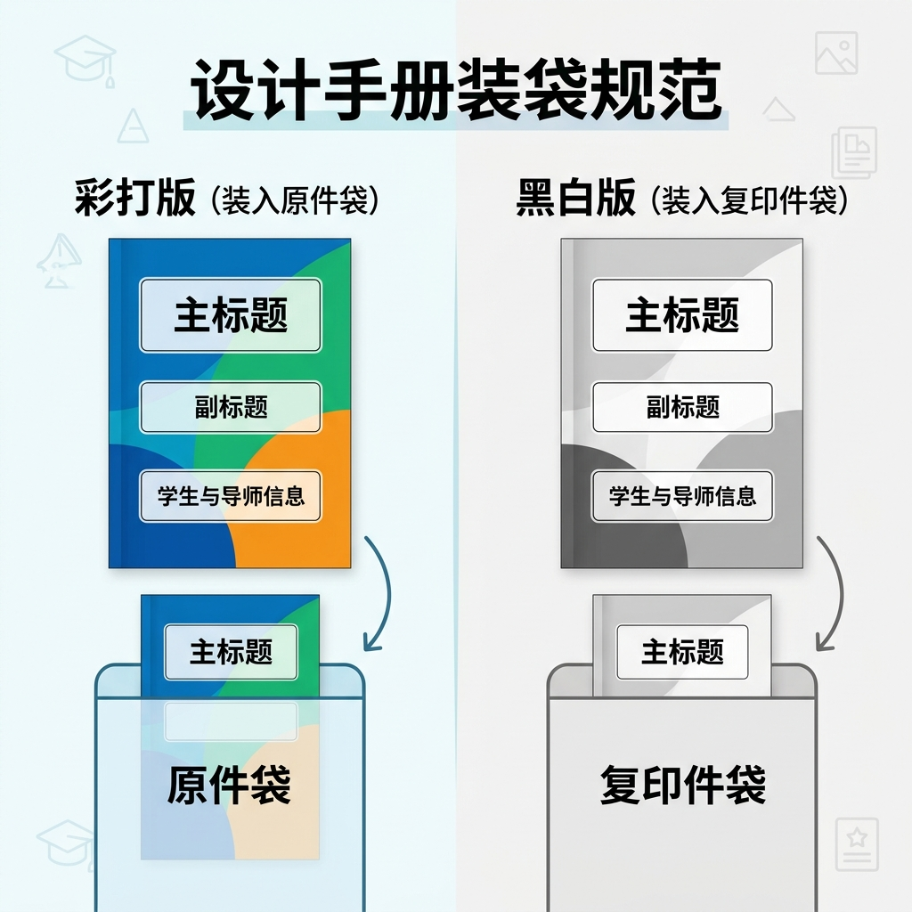
> *   **Source**: Conceptual Design
> *   **List**: 规范封面 / 双面打印 / 检查签名

归档的**最后一公里**，是你们的**设计手册**。这份展现你们专业实力的册子，必须使用规范模板，封面包含你的**完整论文题目**（用书名号括起来，比如《基于沉浸式体验的交互装置设计》），以及固定的副标题"——毕业设计手册"。

一定要**双面打印**。原件袋里放彩色打印版，复印件袋里放黑白版。

所有材料准备就绪后，在装袋前，最后**通篇扫视一遍**：确认所有需要签名的地方——你的、导师的、答辩老师的——**全部签齐了**，**签名不齐全不能装袋提交**。

同学们，归档不是刁难，它是我们为这段大学旅程画下的最后一个严谨的句号。按图索骥，细心检查，祝大家都能**一次过审**，顺利毕业！
