# 造物与创格 - 人物知识图谱

## 关系可视化

```mermaid
graph TD
    %% Node Definitions
    N1["汤显祖"]
    N2["卢见曾"]
    N3["David Chapman"]
    N4["迈克尔·弗雷德 (Michael Fried)"]
    N5["E. J. Marey"]
    N6["丁皋"]
    N7["G.W.F. 黑格尔 (G.W.F. Hegel)"]
    N8["Charles Darwin"]
    N9["Henry Dreyfuss"]
    N10["Noam Chomsky"]
    N11["卡尔·安德烈 (Carl Andre)"]
    N12["梅达尔多·罗索 (Medardo Rosso)"]
    N13["马克·迪·苏维罗 (Mark di Suvero)"]
    N14["Robert Goodman"]
    N15["张旭"]
    N16["Jacques Derrida"]
    N17["安妮·弗里德伯格 (Anne Friedberg)"]
    N18["司空图"]
    N19["阮籍"]
    N20["André Leroi-Gourhan"]
    N21["Robert Bresson (罗伯特·布列松)"]
    N22["Adam Smith"]
    N23["沈春泽"]
    N24["韩愈"]
    N25["Pierre Schaeffer (皮埃尔·舍费尔)"]
    N26["Thomas Wynn"]
    N27["袁宏道"]
    N28["Tim Ingold"]
    N29["前后七子"]
    N30["理查德·塞拉 (Richard Serra)"]
    N31["G.W.F. Hegel"]
    N32["马塞尔·杜尚 (Marcel Duchamp)"]
    N33["John Harvey"]
    N34["Jacques Lafitte"]
    N35["李贽 (李卓吾)"]
    N36["刘行臣"]
    N37["陈鉴如"]
    N38["Michael Polanyi"]
    N39["郑炳林"]
    N40["李瑞豪"]
    N41["菲利克斯·瓜塔里 (Félix Guattari)"]
    N42["巴勃罗·毕加索 (Pablo Picasso)"]
    N43["John W. Tukey"]
    N44["索伦·克尔凯郭尔 (Søren Kierkegaard)"]
    N45["阿瑟·丹托 (Arthur Danto)"]
    N46["尼古拉斯·伯瑞奥德 (Nicolas Bourriaud)"]
    N47["白居易"]
    N48["姜伯勤"]
    N49["雅克·德里达 (Jacques Derrida)"]
    N50["闻人军"]
    N51["王羲之"]
    N52["弗里德里希·荷尔德林 (Friedrich Hölderlin)"]
    N53["杜甫"]
    N54["吴道子"]
    N55["保罗·维里利奥 (Paul Virilio)"]
    N56["塞尔日·达内 (Serge Daney)"]
    N57["罗兰·巴特 (Roland Barthes)"]
    N58["安德烈·布勒东 (André Breton)"]
    N59["沙夫尔"]
    N60["Andrei Tarkovsky (安德烈·塔可夫斯基)"]
    N61["米歇尔·德·塞托 (Michel de Certeau)"]
    N62["Leon Battista Alberti"]
    N63["让-路易·科莫里 (Jean-Louis Comolli)"]
    N64["Buckminster Fuller"]
    N65["Martin Heidegger"]
    N66["Arthur Koestler"]
    N67["Georges Bataille"]
    N68["大卫·波德维尔 (David Bordwell)"]
    N69["安德烈·巴赞 (André Bazin)"]
    N70["伊利亚·卡巴科夫 (Ilya Kabakov)"]
    N71["王国维"]
    N72["Leonardo da Vinci (列奥纳多·达·芬奇)"]
    N73["李泽厚"]
    N74["Claude Lévi-Strauss"]
    N75["René Descartes"]
    N76["梁启超"]
    N77["弗拉基米尔·塔特林 (Vladimir Tatlin)"]
    N78["Michel Chion (米歇尔·希翁)"]
    N79["石涛 (道济)"]
    N80["瓦尔特·本雅明 (Walter Benjamin)"]
    N81["Fritz Schumacher"]
    N82["伊曼纽尔·列维纳斯 (Emmanuel Lévinas)"]
    N83["孟子"]
    N84["徐渭"]
    N85["马丁·海德格尔 (Martin Heidegger)"]
    N86["菲利克斯·冈萨雷斯-托雷斯 (Felix Gonzalez-Torres)"]
    N87["威廉·米切尔 (William Mitchell)"]
    N88["伍绍棠"]
    N89["苏轼"]
    N90["Gilles Deleuze与Félix Guattari"]
    N91["Victor J. Papanek"]
    N92["Erwin Panofsky"]
    N93["Buckminster Fuller (Bucky Fuller)"]
    N94["Maurice Jaubert (莫里斯·若贝尔)"]
    N95["Walter Murch (沃尔特·默奇)"]
    N96["Charles Joseph Minard"]
    N97["汉儒"]
    N98["王维"]
    N99["阿尔贝托·贾科梅蒂 (Alberto Giacometti)"]
    N100["文震亨"]
    N101["Karl Marx"]
    N102["李白"]
    N103["恩斯特·贡布里希 (E.H. Gombrich)"]
    N104["泰勒·考恩"]
    N105["Ad Reinhardt"]
    N106["庄子"]
    N107["吉特·洛文克 (Geert Lovink)"]
    N108["海子"]
    N109["William Paley"]
    N110["Jane Jacobs"]
    N111["J. H. Lambert"]
    N112["André Breton"]
    N113["戴夫·希基 (Dave Hickey)"]
    N114["吉尔·德勒兹 (Gilles Deleuze)"]
    N115["Edward T. Hall"]
    N116["勒内·笛卡尔 (René Descartes)"]
    N117["Gilbert Simondon"]
    N118["卡尔·马克思 (Karl Marx)"]
    N119["马德"]
    N120["Le Corbusier"]
    N121["何长寿"]
    N122["谢尔盖·爱森斯坦 (Sergei Eisenstein)"]
    N123["马克·奥热 (Marc Auge)"]
    N124["安东尼·卡罗 (Anthony Caro)"]
    N125["Alvin Toffler"]
    N126["唐纳德·贾德 (Donald Judd)"]
    N127["William Playfair"]
    N128["居伊·德波 (Guy Debord)"]
    N129["Robert Lindner"]
    N130["翁贝托·波丘尼 (Umberto Boccioni)"]
    N131["弗里德里希·尼采 (Friedrich Nietzsche)"]
    N132["Susan Sontag (苏珊·桑塔格)"]
    N133["Edward R. Tufte"]
    N134["王弼"]
    N135["伊曼努尔·康德 (Immanuel Kant)"]
    N136["John Arnold"]
    N137["荀子"]
    N138["Siegfried Giedeon"]
    N139["何曾"]
    N140["Urban Planners (城市规划者)"]
    N141["文徵明"]
    N142["Iain Davidson与William Noble"]
    N143["David Turnbull"]
    N144["Lars Spuybroek"]
    N145["朱熹"]
    N146["吉加·维尔托夫 (Dziga Vertov)"]
    N147["皇甫轸"]
    N148["柏拉图/苏格拉底 (Plato/Socrates)"]
    N149["Richard Dawkins"]
    N150["Henri Lefebvre"]
    N151["陶潜"]
    N152["布鲁诺·拉图尔 (Bruno Latour)"]
    N153["Ralph Nader"]
    N154["彼得·格林纳威 (Peter Greenaway)"]
    N155["Richard Sennett"]
    N156["吴立行"]
    N157["Thomas Jefferson"]
    N158["Roland Barthes"]
    N159["列夫·马诺维奇 (Lev Manovich)"]
    N160["William J.J. Gordon"]
    N161["Jacques Bertin"]
    N162["李贽"]
    N163["孔子"]
    N164["大卫·史密斯 (David Smith)"]
    N165["Friedrich Nietzsche"]
    N166["迈耶·夏皮罗 (Meyer Schapiro)"]
    N167["克乃夫·贝尔"]
    N168["Gottfried Wilhelm Leibniz"]
    N169["罗伯特·莫里斯 (Robert Morris)"]
    N170["柏拉图 (Plato)"]
    N171["大卫·波德维尔 (David Bordwell) / 珍妮特·斯泰格 (Janet Staiger)"]
    N172["屠隆"]
    N173["Jane Bennett"]
    N174["夏尔·波德莱尔 (Charles Baudelaire)"]
    N175["颜真卿"]
    N176["费尔南·德·索绪尔 (Ferdinand de Saussure)"]
    N177["严羽"]
    N178["Robert Venturi"]
    N179["袁宏道 (三袁 / 公安派)"]
    N180["瑙姆·嘉柏 (Naum Gabo)"]
    N181["奥古斯特·罗丹 (Auguste Rodin)"]
    N182["里克力·提拉瓦尼 (Rirkrit Tiravanija)"]
    N183["Pierre Henry (皮埃尔·亨利)"]
    N184["Alfred Gell"]
    N185["赵孟頫"]
    N186["亚历山大·戈特利布·鲍姆加登 (Alexander Gottlieb Baumgarten)"]
    N187["德罗绘"]
    N188["康斯坦丁·布朗库西 (Constantin Brancusi)"]
    N189["鲁道夫·阿恩海姆"]
    N190["郭沫若"]
    N191["Raymond Loewy"]
    N192["路易·阿尔都塞 (Louis Althusser)"]
    N193["极简主义艺术家 (Minimalists)"]
    %% Relationships
    N181 -- "竞争/同行" --> N12
    N181 -- "启发/先驱" --> N188
    N12 -- "竞争/嫉妒" --> N181
    N130 -- "受启发" --> N42
    N42 -- "启发/师承" --> N77
    N77 -- "反对/领域竞争" --> N180
    N77 -- "受启发" --> N42
    N180 -- "反对" --> N77
    N32 -- "启发" --> N126
    N32 -- "被尊为先驱" --> N46
    N188 -- "受启发" --> N181
    N188 -- "理念共鸣" --> N32
    N58 -- "支持/理论引导" --> N99
    N99 -- "被借鉴" --> N164
    N164 -- "启发" --> N124
    N124 -- "继承与发展" --> N164
    N124 -- "反对" --> N193
    N126 -- "反对/批评" --> N13
    N169 -- "被反对" --> N4
    N11 -- "启发" --> N30
    N30 -- "同盟/共鸣" --> N169
    N4 -- "强烈反对" --> N169
    N4 -- "支持" --> N124
    N78 -- "师承" --> N25
    N78 -- "师承" --> N183
    N78 -- "被支持" --> N95
    N95 -- "支持" --> N78
    N25 -- "导师" --> N78
    N25 -- "合作" --> N183
    N183 -- "导师" --> N78
    N183 -- "合作" --> N25
    N21 -- "被引用" --> N78
    N94 -- "被探讨/反驳" --> N78
    N132 -- "观点共鸣/补充" --> N78
    N60 -- "被引用" --> N78
    N72 -- "被引用" --> N78
    N85 -- "反对/挑战" --> N7
    N85 -- "推崇/思想寄托" --> N52
    N85 -- "批判" --> N116
    N85 -- "部分批判/借用" --> N135
    N85 -- "部分赞同/批判" --> N131
    N85 -- "被批评" --> N166
    N7 -- "被反对" --> N85
    N131 -- "批判" --> N148
    N131 -- "启发/被批判" --> N85
    N52 -- "启发/被推崇" --> N85
    N116 -- "被批判" --> N85
    N135 -- "被批判" --> N85
    N186 -- "被批判" --> N85
    N170 -- "被批判" --> N85
    N166 -- "反对/批评" --> N85
    N166 -- "被批评" --> N49
    N49 -- "解构/批评" --> N85
    N49 -- "解构/批评" --> N166
    N44 -- "启发/被偏离" --> N85
    N45 -- "继承/呼应" --> N7
    N91 -- "合作与思想共鸣" --> N129
    N91 -- "支持与好友" --> N81
    N91 -- "支持与好友" --> N64
    N91 -- "合作探讨" --> N66
    N91 -- "强烈反对" --> N3
    N91 -- "师承" --> N136
    N129 -- "合作" --> N91
    N81 -- "互相支持" --> N91
    N81 -- "观点深化" --> N125
    N125 -- "被对比" --> N81
    N66 -- "合作探讨" --> N91
    N93 -- "好友与精神导师" --> N91
    N3 -- "被强烈批判" --> N91
    N136 -- "导师" --> N91
    N191 -- "对比/反面案例" --> N91
    N9 -- "被引用/部分认可" --> N91
    N157 -- "思想先驱" --> N91
    N160 -- "被引用" --> N91
    N105 -- "被批判" --> N91
    N153 -- "支持与共鸣" --> N91
    N115 -- "被引用" --> N91
    N28 -- "支持" --> N117
    N28 -- "支持/师承" --> N90
    N28 -- "反对" --> N62
    N28 -- "反对" --> N184
    N117 -- "被支持" --> N28
    N90 -- "支持/继承" --> N117
    N62 -- "被反对" --> N28
    N20 -- "阶段性站队" --> N28
    N109 -- "被反对" --> N8
    N109 -- "被反对" --> N28
    N149 -- "反对/修正" --> N109
    N149 -- "被反对" --> N28
    N142 -- "被反对" --> N26
    N142 -- "被支持" --> N28
    N26 -- "反对" --> N142
    N143 -- "反对" --> N33
    N143 -- "被支持" --> N28
    N184 -- "被反对" --> N28
    N173 -- "阶段性站队" --> N28
    N65 -- "被支持" --> N28
    N38 -- "阶段性站队" --> N28
    N144 -- "被支持" --> N28
    N120 -- "被反对" --> N28
    N74 -- "被反对" --> N16
    N74 -- "被反对" --> N28
    N155 -- "被支持" --> N28
    N16 -- "反对" --> N74
    N33 -- "被反对" --> N143
    N46 -- "支持/借鉴" --> N41
    N46 -- "反对" --> N113
    N118 -- "被借鉴" --> N46
    N128 -- "被借鉴与部分超越" --> N46
    N192 -- "被借鉴" --> N46
    N41 -- "被支持/思想导师" --> N46
    N41 -- "合作者" --> N114
    N86 -- "被支持/核心案例" --> N46
    N182 -- "被支持/核心案例" --> N46
    N56 -- "思想共鸣" --> N82
    N113 -- "被反对" --> N46
    N146 -- "同类/比较" --> N154
    N146 -- "演进与承接" --> N174
    N80 -- "比较" --> N55
    N55 -- "比较" --> N80
    N69 -- "被反对" --> N63
    N69 -- "被反对" --> N68
    N63 -- "反对" --> N69
    N63 -- "被修正" --> N68
    N171 -- "反对" --> N69
    N171 -- "支持并修正" --> N63
    N57 -- "共鸣" --> N103
    N57 -- "师承/应用" --> N176
    N103 -- "共鸣" --> N57
    N87 -- "被反对" --> N159
    N174 -- "被继承" --> N17
    N174 -- "被演化" --> N107
    N17 -- "继承" --> N174
    N61 -- "被引用" --> N123
    N61 -- "理论对照" --> N70
    N123 -- "继承/引用" --> N61
    N152 -- "被引用" --> N159
    N122 -- "同领域/时代先驱" --> N146
    N176 -- "被继承" --> N57
    N133 -- "受其启发/致敬" --> N43
    N133 -- "反对" --> N161
    N127 -- "学术继承" --> N111
    N43 -- "启发" --> N133
    N111 -- "先驱" --> N127
    N96 -- "被支持/赞赏" --> N5
    N5 -- "支持/赞赏" --> N96
    N161 -- "被反对" --> N133
    N150 -- "继承与扩展" --> N101
    N150 -- "批判与部分吸收" --> N31
    N150 -- "反对" --> N75
```

## 核心人物与观点词典

### 马丁·海德格尔 (Martin Heidegger)
- **出现文献**: Art Matters_ A Critical Commentary on Heidegger’s
- **核心观点**:
  - 认为艺术是真理自行置入作品的过程；反对将艺术仅仅视为审美对象的传统美学；强调作品中“世界”与“大地”的争执；主张真理是存在的无蔽状态（aletheia），而非单纯的命题符合论。
- **人物关系**:
  - [反对/挑战] -> **G.W.F. 黑格尔 (G.W.F. Hegel)** (挑战黑格尔关于“艺术在最高使命上已经终结”的论断，试图证明艺术仍然是真理发生的重要方式。) _Art Matters_ A Critical Commentary on Heidegger’s_
  - [推崇/思想寄托] -> **弗里德里希·荷尔德林 (Friedrich Hölderlin)** (将其视为贫乏时代的诗人和拯救者，借其关于“大地”、“本源”和“神圣者”的诗意表达来对抗黑格尔的形而上学体系。) _Art Matters_ A Critical Commentary on Heidegger’s_
  - [批判] -> **勒内·笛卡尔 (René Descartes)** (批判笛卡尔的主客二元论及其将自然视为可控制对象的思想，认为他是“世界图像时代”的开启者。) _Art Matters_ A Critical Commentary on Heidegger’s_
  - [部分批判/借用] -> **伊曼努尔·康德 (Immanuel Kant)** (批判其“无利害关系”的美学态度，但也探讨并借用了其关于“天才”、“审美理念”和物之呈现的思想。) _Art Matters_ A Critical Commentary on Heidegger’s_
  - [部分赞同/批判] -> **弗里德里希·尼采 (Friedrich Nietzsche)** (认同尼采关于“上帝之死”和西方文化没落的诊断，但批判其将真理视为权力意志的形而上学底色。) _Art Matters_ A Critical Commentary on Heidegger’s_
  - [被批评] -> **迈耶·夏皮罗 (Meyer Schapiro)** (其对梵高《农鞋》的解读被夏皮罗指责为一种主观的、脱离画作事实的浪漫主义投射。) _Art Matters_ A Critical Commentary on Heidegger’s_

### Victor J. Papanek
- **出现文献**: Design for the real world
- **核心观点**:
  - 工业设计必须成为响应人类真正需求（如穷人、病患、残障人士及第三世界）的创新、跨学科工具，而非为市场利润制造无用的“成人玩具”。强烈呼吁设计师承担社会与道德责任，并主张捐出10%的时间或能力（Kymmenykset理念）用于解决真实的社会问题。
- **人物关系**:
  - [合作与思想共鸣] -> **Robert Lindner** (曾长期通信并合作撰写书籍，Papanek将其“限制三角”理论应用于设计社会价值的评估。) _Design for the real world_
  - [支持与好友] -> **Fritz Schumacher** (Papanek的挚友，Papanek高度认同其关注适当规模技术的理念以及“庞大体系注定失败”的观点。) _Design for the real world_
  - [支持与好友] -> **Buckminster Fuller** (Papanek的挚友，其关于“过度专业化导致灭绝”及综合预期设计的理念深刻启发了Papanek的设计教育观。) _Design for the real world_
  - [合作探讨] -> **Arthur Koestler** (共同探讨并完善了“双重联想（Bisociation）”的创新方法论。) _Design for the real world_
  - [强烈反对] -> **David Chapman** (Papanek严厉批判其迎合消费者放纵欲望、追求商业利润的设计哲学，认为其是充当大商业利益的“皮条客”。) _Design for the real world_
  - [师承] -> **John Arnold** (Papanek曾在MIT师从并协助他，深受其利用极端跨学科情境打破思维障碍的教学方法影响。) _Design for the real world_

### Henri Lefebvre
- **出现文献**: The production of space
- **核心观点**:
  - 提出“空间的生产”理论，认为社会空间是社会的产物，包含空间实践、空间的表象和表征性空间三元辩证关系。反对将空间纯粹精神化、几何化或文本化，强调空间中的社会关系、身体经验与权力运作。
- **人物关系**:
  - [继承与扩展] -> **Karl Marx** (继承了马克思的生产、劳动与异化概念，并将其从物质生产扩展到空间的生产领域。) _The production of space_
  - [批判与部分吸收] -> **G.W.F. Hegel** (吸收了其“具体普遍性”等辩证法思想，但强烈批判其将历史/时间置于空间之上以及将国家视为历史终结的观点。) _The production of space_
  - [反对] -> **René Descartes** (反对笛卡尔将空间视为绝对、无限的“广延”以及造成身心分裂的二元论。) _The production of space_
  - [反对] -> **Noam Chomsky** (批评乔姆斯基预设了语言学精神空间却忽视了其与社会实践空间之间的鸿沟。) _The production of space_
  - [反对] -> **Roland Barthes** (批评巴特等符号学家将空间降维成可阅读的文本和符号系统，忽视了空间中的权力与暴力。) _The production of space_
  - [反对] -> **Erwin Panofsky** (批评潘诺夫斯基关于哥特式建筑与经院哲学同源的观点是极端的还原论和唯心主义。) _The production of space_

### Tim Ingold
- **出现文献**: Making _ Anthropology, Archaeology, Art and Architecture
- **核心观点**:
  - 本书作者。主张“通过造物进行思考”（thinking through making），认为创造是制造者与处于流动中的材料之间持续的“对应”（correspondence）与生长过程。强烈反对将内在形式强加于被动质料的“质形论”（hylomorphism），反对预先设计决定最终产物的观点，并批判了赋予无生命客体“能动性”（agency）的理论。
- **人物关系**:
  - [支持] -> **Gilbert Simondon** (高度赞同其对质形论的批判，并借用其个体化理论来说明形式是材料和力量在生成过程中相互作用的产物。) _Making _ Anthropology, Archaeology, Art and Architecture_
  - [支持/师承] -> **Gilles Deleuze与Félix Guattari** (大量借用其“顺应材料流动”（follow the materials）、“平滑空间”与“抽象线”等概念来反驳质形论。) _Making _ Anthropology, Archaeology, Art and Architecture_
  - [反对] -> **Leon Battista Alberti** (批判其将建筑设计（形式）与工匠建造（质料）截然分离的典型质形论思想。) _Making _ Anthropology, Archaeology, Art and Architecture_
  - [反对] -> **Alfred Gell** (批判其在《艺术与能动性》中将艺术品视为客体并赋予其“能动性”的逆向分析方法。) _Making _ Anthropology, Archaeology, Art and Architecture_

### Michel Chion (米歇尔·希翁)
- **出现文献**: AUDIO-VISION SOUND ON SCREEN SECOND EDITION
- **核心观点**:
  - 提出“视听契约”理论，认为电影的声画不是先天自然和谐，而是相互影响的幻觉。提出“附加值”（声音赋予画面的额外意义）、“同步契合”（声音与画面同步时的心理融合）、“三种聆听模式”（因果、代码、还原）以及“画外音人”（Acousmêtre）等概念。
- **人物关系**:
  - [师承] -> **Pierre Schaeffer (皮埃尔·舍费尔)** (深受其“还原聆听”理论影响，并将其应用和扩展到电影声音领域。) _AUDIO-VISION SOUND ON SCREEN SECOND EDITION_
  - [师承] -> **Pierre Henry (皮埃尔·亨利)** (与舍费尔同为希翁在声音领域的导师。) _AUDIO-VISION SOUND ON SCREEN SECOND EDITION_
  - [被支持] -> **Walter Murch (沃尔特·默奇)** (默奇为其著作撰写前言，高度赞赏并向英语世界推广其视听理论。) _AUDIO-VISION SOUND ON SCREEN SECOND EDITION_

### 孔子
- **出现文献**: 美的历程
- **核心观点**:
  - 提倡实践理性精神，将原始礼乐和宗教引向日常现实生活与亲子血缘的伦常感情，使艺术服务于人而非神。
- **人物关系**:
  - [师承] -> **孟子** (其路线被孟子继承，发展出伟大的个体人格理想。) _美的历程_
  - [师承] -> **荀子** (其路线被荀子继承，发展出无神论和《乐论》。) _美的历程_
  - [被补充与对立] -> **庄子** (其积极进取的儒学与庄子遗世绝俗的道家学说形成相反相成的“儒道互补”。) _美的历程_

### 文震亨
- **出现文献**: 长物志
- **核心观点**:
  - 提倡“雅、古、隐”的文人审美趣味，主张居室园林与日常用具“宁古无时，宁朴无巧，宁俭无俗”，强烈排斥市井俗气与盲目追随时尚，将生活审美化。
- **人物关系**:
  - [朋友/支持] -> **沈春泽** (沈春泽为文震亨的《长物志》作序，两人审美志趣相投，极度认同彼此的风雅追求。) _长物志_
  - [认同/借鉴] -> **屠隆** (文震亨高度认同屠隆代表的文人生活方式，在《长物志》中大量借鉴甚至照搬了屠隆《考槃余事》等书中的内容。) _长物志_
  - [曾孙/家风传承] -> **文徵明** (文徵明是文震亨的曾祖父，文氏家族的艺术成就与家风对文震亨的审美和园林造诣有深刻影响。) _长物志_

### 奥古斯特·罗丹 (Auguste Rodin)
- **出现文献**: 1981_Passages in modern sculpture.txt
- **核心观点**:
  - 反对新古典主义的叙事连贯性和清晰的内部解剖骨架，认为雕塑的意义应当停留在其表面，意义是在经验的过程中同步产生的，而不是先验存在的。
- **人物关系**:
  - [竞争/同行] -> **梅达尔多·罗索 (Medardo Rosso)** (两人同期探索表面肌理与光影，罗索对罗丹的声誉感到嫉妒，认为自己先于罗丹使用了保留制作痕迹的手法。) _1981_Passages in modern sculpture.txt_
  - [启发/先驱] -> **康斯坦丁·布朗库西 (Constantin Brancusi)** (罗丹打破内部骨架和叙事逻辑的做法深刻启发了布朗库西的极简主义形式探索。) _1981_Passages in modern sculpture.txt_

### 弗拉基米尔·塔特林 (Vladimir Tatlin)
- **出现文献**: 1981_Passages in modern sculpture.txt
- **核心观点**:
  - 提出“材料文化”和生产主义，主张雕塑必须依附于真实的物理空间（如角落）并回应真实材料的力学属性，反对脱离现实的理想主义和幻觉空间。
- **人物关系**:
  - [反对/领域竞争] -> **瑙姆·嘉柏 (Naum Gabo)** (反对嘉柏将雕塑理想化、理智化的构成主义，主张雕塑应服务于革命现实与历史进程。) _1981_Passages in modern sculpture.txt_
  - [受启发] -> **巴勃罗·毕加索 (Pablo Picasso)** (赴巴黎拜访毕加索并受到其立体主义构成的深刻影响。) _1981_Passages in modern sculpture.txt_

### 马塞尔·杜尚 (Marcel Duchamp)
- **出现文献**: 1981_Passages in modern sculpture.txt, Relational Aesthetics
- **核心观点**:
  - 提出“是观看者造就了图画”(the beholder makes the picture)；指出艺术是人类不同时代之间的一场游戏。
  - 通过“现成品”打破艺术品与创作者内在心理的必然联系，将艺术创造机械化、去个人化，使雕塑的意义转化为一种充满谜团的公共提问，而非个人情感的透明表达。
- **人物关系**:
  - [启发] -> **唐纳德·贾德 (Donald Judd)** (其“现成品”概念启发了极简主义雕塑家对工业现成材料的抽象化、重复性运用。) _1981_Passages in modern sculpture.txt_
  - [被尊为先驱] -> **尼古拉斯·伯瑞奥德 (Nicolas Bourriaud)** (伯瑞奥德认为其强调“观众参与”和“遭遇”的理念预示了当代关系艺术的发展。) _Relational Aesthetics_

### 康斯坦丁·布朗库西 (Constantin Brancusi)
- **出现文献**: 1981_Passages in modern sculpture.txt
- **核心观点**:
  - 剥离雕塑的内部骨架结构，创造出浑然一体、抗拒形式分析的极简几何形态，强调雕塑的意义取决于它在特定物理环境（如光线、倒影、基座）中的偶然显现。
- **人物关系**:
  - [受启发] -> **奥古斯特·罗丹 (Auguste Rodin)** (受到罗丹表面意义化和局部碎片化手法的深刻影响，尽管表面处理风格迥异。) _1981_Passages in modern sculpture.txt_
  - [理念共鸣] -> **马塞尔·杜尚 (Marcel Duchamp)** (两人在雕塑理念上殊途同归，都致力于瓦解叙事结构和分析性的内部逻辑。) _1981_Passages in modern sculpture.txt_

### 安东尼·卡罗 (Anthony Caro)
- **出现文献**: 1981_Passages in modern sculpture.txt
- **核心观点**:
  - 探索雕塑作为物理结构的实体经验与作为二维图像的绘画性（pictorialism）之间的互不相容性，主张通过高度平面化和装饰性的视觉效果，将艺术品与日常物品严格区分开来。
- **人物关系**:
  - [继承与发展] -> **大卫·史密斯 (David Smith)** (吸收了史密斯作品中正面与侧面的断裂感，但剥离了其图腾和身体隐喻，转向探讨艺术的自律性。) _1981_Passages in modern sculpture.txt_
  - [反对] -> **极简主义艺术家 (Minimalists)** (反对极简主义将艺术品还原为毫无内涵的日常客体（objecthood），坚持雕塑必须保有艺术独特的瞬间启示和意义。) _1981_Passages in modern sculpture.txt_

### 迈克尔·弗雷德 (Michael Fried)
- **出现文献**: 1981_Passages in modern sculpture.txt
- **核心观点**:
  - 坚持现代主义艺术的纯粹性，提出“剧场性”（theatricality）是艺术的死敌。认为雕塑必须通过其自身内在关系的“即时性”（presentness）来击败时间和剧场效应。
- **人物关系**:
  - [强烈反对] -> **罗伯特·莫里斯 (Robert Morris)** (撰写文章猛烈抨击莫里斯、贾德等极简主义艺术家赋予物体的剧场化和客体化特征。) _1981_Passages in modern sculpture.txt_
  - [支持] -> **安东尼·卡罗 (Anthony Caro)** (高度赞赏卡罗的雕塑，认为其成功实现了现代主义所必需的非剧场化的瞬时意义。) _1981_Passages in modern sculpture.txt_

### Pierre Schaeffer (皮埃尔·舍费尔)
- **出现文献**: AUDIO-VISION SOUND ON SCREEN SECOND EDITION
- **核心观点**:
  - 具体音乐（Musique Concrète）先驱。提出“还原聆听”（Reduced listening，专注于声音本身的物理特征，悬置其原因和意义）和“语义/代码聆听”概念。认为脱离视觉的“声听”（acousmatic）情境有助于还原聆听。
- **人物关系**:
  - [导师] -> **Michel Chion (米歇尔·希翁)** (其声音分类和聆听模式理论被希翁继承并作为视听分析的基础。) _AUDIO-VISION SOUND ON SCREEN SECOND EDITION_
  - [合作] -> **Pierre Henry (皮埃尔·亨利)** (共同创作了《具体音乐全景》，开启了电子与录音声音艺术的实验。) _AUDIO-VISION SOUND ON SCREEN SECOND EDITION_

### Pierre Henry (皮埃尔·亨利)
- **出现文献**: AUDIO-VISION SOUND ON SCREEN SECOND EDITION
- **核心观点**:
  - 具体音乐先驱，通过录音和磁带拼接技术，将声音从原始物理声源中解放出来，进行重组和艺术创作。
- **人物关系**:
  - [导师] -> **Michel Chion (米歇尔·希翁)** (作为前辈与导师，深刻影响了希翁对声音本质的理解。) _AUDIO-VISION SOUND ON SCREEN SECOND EDITION_
  - [合作] -> **Pierre Schaeffer (皮埃尔·舍费尔)** (共同创立具体音乐体系。) _AUDIO-VISION SOUND ON SCREEN SECOND EDITION_

### 弗里德里希·尼采 (Friedrich Nietzsche)
- **出现文献**: Art Matters_ A Critical Commentary on Heidegger’s
- **核心观点**:
  - 宣判“上帝之死”，认为西方文化的衰落源于苏格拉底的理性主义，主张通过艺术（尤其是悲剧）来拯救虚无主义，提出权力意志论。
- **人物关系**:
  - [批判] -> **柏拉图/苏格拉底 (Plato/Socrates)** (指责苏格拉底是扼杀古希腊悲剧精神的“理论人”代表。) _Art Matters_ A Critical Commentary on Heidegger’s_
  - [启发/被批判] -> **马丁·海德格尔 (Martin Heidegger)** (启发了海德格尔对现代性危机的诊断，但其形而上学体系最终被海德格尔试图克服。) _Art Matters_ A Critical Commentary on Heidegger’s_

### 迈耶·夏皮罗 (Meyer Schapiro)
- **出现文献**: Art Matters_ A Critical Commentary on Heidegger’s
- **核心观点**:
  - 通过艺术史考证认为梵高画中的鞋子是画家本人的鞋，而非农妇的鞋。
- **人物关系**:
  - [反对/批评] -> **马丁·海德格尔 (Martin Heidegger)** (批评海德格尔对梵高《农鞋》的解读是主观投射了其对泥土和原始性的病态迷恋。) _Art Matters_ A Critical Commentary on Heidegger’s_
  - [被批评] -> **雅克·德里达 (Jacques Derrida)** (其考证的实证确定性遭到了德里达的解构主义质疑。) _Art Matters_ A Critical Commentary on Heidegger’s_

### 雅克·德里达 (Jacques Derrida)
- **出现文献**: Art Matters_ A Critical Commentary on Heidegger’s
- **核心观点**:
  - 通过解构主义视角探讨绘画与真理的关系，质疑对画作内容进行绝对归属设定的可能性。
- **人物关系**:
  - [解构/批评] -> **马丁·海德格尔 (Martin Heidegger)** (质疑海德格尔在《农鞋》解读中的某些理论预设。) _Art Matters_ A Critical Commentary on Heidegger’s_
  - [解构/批评] -> **迈耶·夏皮罗 (Meyer Schapiro)** (解构了夏皮罗声称确定鞋子属于梵高本人的实证主义论调。) _Art Matters_ A Critical Commentary on Heidegger’s_

### Fritz Schumacher
- **出现文献**: Design for the real world
- **核心观点**:
  - 提倡“小即是美”，主张去中心化和小规模的适应性技术，认为没有任何庞大的事物能够真正奏效，必须逆转人类日益机械化的趋势。
- **人物关系**:
  - [互相支持] -> **Victor J. Papanek** (两人的思想高度契合，共同影响了欧洲等地的青年与设计界。) _Design for the real world_
  - [观点深化] -> **Alvin Toffler** (相比于Toffler，Schumacher更清晰地看到了逆转人类机械化的必要性。) _Design for the real world_

### William Paley
- **出现文献**: Making _ Anthropology, Archaeology, Art and Architecture
- **核心观点**:
  - 提出“钟表匠”类比，认为自然界（如生物器官）的复杂结构必然暗示了一个超然的、具备预见性的“智能设计者”（上帝）的存在。
- **人物关系**:
  - [被反对] -> **Charles Darwin** (其智能设计论被达尔文的自然选择进化论所推翻。) _Making _ Anthropology, Archaeology, Art and Architecture_
  - [被反对] -> **Tim Ingold** (被Ingold用来作为反面教材，以批判任何预设“设计先于制造”的观念。) _Making _ Anthropology, Archaeology, Art and Architecture_

### Richard Dawkins
- **出现文献**: Making _ Anthropology, Archaeology, Art and Architecture
- **核心观点**:
  - 提出“盲眼钟表匠”理论，认为自然选择虽无意识和目的，但却在自然界中充当了设计者的角色，生物的形态依然是由隐藏在基因中的“设计”决定的。
- **人物关系**:
  - [反对/修正] -> **William Paley** (反对Paley的上帝设计论，用自然选择取而代之。) _Making _ Anthropology, Archaeology, Art and Architecture_
  - [被反对] -> **Tim Ingold** (Ingold指出Dawkins仅仅是把神换成了自然选择，本质上依然深陷“设计论”的逻辑陷阱。) _Making _ Anthropology, Archaeology, Art and Architecture_

### Iain Davidson与William Noble
- **出现文献**: Making _ Anthropology, Archaeology, Art and Architecture
- **核心观点**:
  - 在阿舍利手斧的起源问题上，提出手斧并非早期人类预先构思的“最终产品”，而可能只是剥片过程中遗留的石核，即“完成品谬误”（finished artefact fallacy）。
- **人物关系**:
  - [被反对] -> **Thomas Wynn** (遭到Wynn的强烈反驳，Wynn坚称手斧具有高度对称性，是人类将文化理念强加于物质的产物。) _Making _ Anthropology, Archaeology, Art and Architecture_
  - [被支持] -> **Tim Ingold** (Ingold借用他们的观点来论证形式是在剥片过程中涌现的，而非将先验模板强加于石头。) _Making _ Anthropology, Archaeology, Art and Architecture_

### David Turnbull
- **出现文献**: Making _ Anthropology, Archaeology, Art and Architecture
- **核心观点**:
  - 以沙特尔大教堂的建造为例，指出中世纪大型建筑并没有预先的总体设计图，而是在无数工匠“混乱、具体的情境实践”中逐渐累积拼凑而成的，类似于现代科学实验室的运作。
- **人物关系**:
  - [反对] -> **John Harvey** (反驳Harvey关于“复杂建筑必须有先期设计和图纸”的论断。) _Making _ Anthropology, Archaeology, Art and Architecture_
  - [被支持] -> **Tim Ingold** (Ingold引用其研究来打破建筑学中“设计与施工分离”的迷思。) _Making _ Anthropology, Archaeology, Art and Architecture_

### Claude Lévi-Strauss
- **出现文献**: Making _ Anthropology, Archaeology, Art and Architecture
- **核心观点**:
  - 在《忧郁的热带》中讲述南比克瓦拉人的“书写课”，认为书写的最初功能是促进奴役和剥削；认为没有书写的人类只能困在缺乏方向的历史中。
- **人物关系**:
  - [被反对] -> **Jacques Derrida** (被德里达严厉批判，指出其基于音素文字对“书写”与“绘画”进行了充满欧洲中心主义的割裂。) _Making _ Anthropology, Archaeology, Art and Architecture_
  - [被反对] -> **Tim Ingold** (Ingold认同德里达的批判，认为只要是用手进行，所有的书写本质上都是画线条。) _Making _ Anthropology, Archaeology, Art and Architecture_

### 尼古拉斯·伯瑞奥德 (Nicolas Bourriaud)
- **出现文献**: Relational Aesthetics
- **核心观点**:
  - 提出“关系美学”(Relational Aesthetics)，认为艺术是一种相遇的状态 (state of encounter)，当代艺术的核心在于创造人际关系的领域 (sphere of inter-human relations) 以及社会交往的微型乌托邦，而非单纯生产独立的艺术物品。
- **人物关系**:
  - [支持/借鉴] -> **菲利克斯·瓜塔里 (Félix Guattari)** (大量借鉴其关于主体性生产、生态哲学 (ecosophy) 以及“美学范式”的理论作为关系美学的哲学基础。) _Relational Aesthetics_
  - [反对] -> **戴夫·希基 (Dave Hickey)** (批评其回归传统“美”的概念，认为其关于视觉愉悦的观点是倒退的和反动的。) _Relational Aesthetics_

### 菲利克斯·瓜塔里 (Félix Guattari)
- **出现文献**: Relational Aesthetics
- **核心观点**:
  - 关注“主体性的生产”(production of subjectivity)，认为主体性是被集体系统构建的；主张“生态哲学”(ecosophy) 和“美学范式”(aesthetic paradigm)，强调艺术在重塑社会和精神领域中打破资本主义同质化的核心作用。
- **人物关系**:
  - [被支持/思想导师] -> **尼古拉斯·伯瑞奥德 (Nicolas Bourriaud)** (其理论被伯瑞奥德大篇幅征用，以剖析当代艺术如何对抗资本主义的同质化并生产新的主体性。) _Relational Aesthetics_
  - [合作者] -> **吉尔·德勒兹 (Gilles Deleuze)** (共同提出诸多哲学概念，在文中经常被作为思想共同体提及。) _Relational Aesthetics_

### 吉加·维尔托夫 (Dziga Vertov)
- **出现文献**: The Language of New Media
- **核心观点**:
  - 电影可以通过蒙太奇克服其纯粹的索引性质，并用“电影眼（kino-eye）”解码世界。其作品《持摄影机的人》展示了电影可以作为一种动态的“数据库”，通过视觉认识论的新操作揭示世界的内在秩序。
- **人物关系**:
  - [同类/比较] -> **彼得·格林纳威 (Peter Greenaway)** (两人都被马诺维奇视为20世纪探索将数据库结构与叙事结合的杰出“数据库电影制作人”。) _The Language of New Media_
  - [演进与承接] -> **夏尔·波德莱尔 (Charles Baudelaire)** (维尔托夫的摄影师身份介于波德莱尔在物理城市中穿梭的漫游者（flâneur）和在赛博空间中穿梭的计算机数据牛仔之间。) _The Language of New Media_

### 安德烈·巴赞 (André Bazin)
- **出现文献**: The Language of New Media
- **核心观点**:
  - 电影技术和风格的发展是一种目的论式的进化，不断朝着“对现实的完全再现（总的电影神话）”以及符合人类自然视觉感知动态的方向发展。
- **人物关系**:
  - [被反对] -> **让-路易·科莫里 (Jean-Louis Comolli)** (巴赞的唯心主义、进化论式电影现实主义被科莫里的唯物主义意识形态分析所批判。) _The Language of New Media_
  - [被反对] -> **大卫·波德维尔 (David Bordwell)** (波德维尔用电影工业体系的经济、效率和质量标准替代了巴赞的乌托邦式神话。) _The Language of New Media_

### 让-路易·科莫里 (Jean-Louis Comolli)
- **出现文献**: The Language of New Media
- **核心观点**:
  - 电影是一台社会机器，电影的现实主义并非线性进化，而是通过技术与风格不断的“添加（additions）”和“替换（substitutions）”来维持观众的现实效应和意识形态功能的建构。
- **人物关系**:
  - [反对] -> **安德烈·巴赞 (André Bazin)** (以非线性的马克思主义视角反对巴赞的现实主义线性进化论。) _The Language of New Media_
  - [被修正] -> **大卫·波德维尔 (David Bordwell)** (波德维尔同意其非线性发展观，但认为驱动这些创新的不是宏大的意识形态，而是电影工业的竞争和实用主义目的。) _The Language of New Media_

### 大卫·波德维尔 (David Bordwell) / 珍妮特·斯泰格 (Janet Staiger)
- **出现文献**: The Language of New Media
- **核心观点**:
  - 电影中的现实主义是由电影产业的机构话语（如专业协会标准）所决定的，是工业竞争、经济效率和产品差异化驱动下的理性工程目标。
- **人物关系**:
  - [反对] -> **安德烈·巴赞 (André Bazin)** (将现实主义还原为工业生产模式的需求，剥离了巴赞的理想主义色彩。) _The Language of New Media_
  - [支持并修正] -> **让-路易·科莫里 (Jean-Louis Comolli)** (赞同科莫里的非线性发展史观，但采用具体的工业机制解释而非抽象的意识形态。) _The Language of New Media_

### 罗兰·巴特 (Roland Barthes)
- **出现文献**: The Language of New Media
- **核心观点**:
  - 提出“作者之死”，认为文本是由不可胜数的文化中心提取的引语编织（拼接）而成的织物，挑战了艺术家凭空创造的浪漫主义神话；并将语言学的“组合段/聚合体”应用至文化分析。
- **人物关系**:
  - [共鸣] -> **恩斯特·贡布里希 (E.H. Gombrich)** (两人共同解构了艺术创作是完全孤立原创的神话，强调了既有文化图式和素材的重新组合。) _The Language of New Media_
  - [师承/应用] -> **费尔南·德·索绪尔 (Ferdinand de Saussure)** (应用并拓展了索绪尔语言学中的聚合体（paradigm）和组合段（syntagm）理论。) _The Language of New Media_

### 夏尔·波德莱尔 (Charles Baudelaire)
- **出现文献**: The Language of New Media
- **核心观点**:
  - 定义了现代都市的典型主体——“漫游者（flâneur）”，在匿名人群与城市的运动中寻找归属感，将城市空间转化为不断变化的感知景观。
- **人物关系**:
  - [被继承] -> **安妮·弗里德伯格 (Anne Friedberg)** (弗里德伯格将波德莱尔的漫游者概念扩展，提出了现代视觉文化中的“流动的虚拟凝视”。) _The Language of New Media_
  - [被演化] -> **吉特·洛文克 (Geert Lovink)** (洛文克将19世纪的漫游者演化为信息时代的“数据花花公子（Data Dandy）”和网民。) _The Language of New Media_

### 米歇尔·德·塞托 (Michel de Certeau)
- **出现文献**: The Language of New Media
- **核心观点**:
  - 空间是“实践的场所（practiced place）”，由移动身体的轨迹交汇所激活；面对系统制定的既定语法和“战略”，用户通过个人的“战术”规划出自己的轨迹。
- **人物关系**:
  - [被引用] -> **马克·奥热 (Marc Auge)** (奥热使用德·塞托对空间和场所的区别来构建其“非场所”人类学理论。) _The Language of New Media_
  - [理论对照] -> **伊利亚·卡巴科夫 (Ilya Kabakov)** (马诺维奇使用德·塞托的战术/战略概念来类比卡巴科夫对空间装置中观众漫游轨迹的控制。) _The Language of New Media_

### Edward R. Tufte
- **出现文献**: The Visual Display of Quantitative Information
- **核心观点**:
  - 数据图形设计的核心是最大化数据墨水占比（Data-ink ratio），消除图表垃圾（Chartjunk），通过清晰、精确、高效的方式展现数据的实质和真相，而非进行无意义的装饰。
- **人物关系**:
  - [受其启发/致敬] -> **John W. Tukey** (Tufte将本书献给Tukey，认为Tukey在20世纪60年代让统计图形重新获得了学术尊重，并受其探索性数据分析思想的深刻影响。) _The Visual Display of Quantitative Information_
  - [反对] -> **Jacques Bertin** (Tufte强烈反对Bertin认为设计师应利用摩尔纹（moiré vibration）等视错觉来增加图形共鸣的观点，认为这会产生图表垃圾和视觉干扰。) _The Visual Display of Quantitative Information_

### Karl Marx
- **出现文献**: The production of space
- **核心观点**:
  - 强调社会劳动、生产方式和生产关系。揭示了商品的拜物教属性和交换价值形式，指出资本主义将社会关系隐藏在物之中。
- **人物关系**:
  - [被继承与扩展] -> **Henri Lefebvre** (其政治经济学批判方法被列斐伏尔用于建立“空间的政治经济学”。) _The production of space_
  - [批判与超越] -> **Adam Smith** (在继承亚当·斯密等人古典政治经济学的基础上，对其进行了彻底的资本主义批判。) _The production of space_

### Georges Bataille
- **出现文献**: The production of space
- **核心观点**:
  - 探寻内在体验空间与物理/社会空间之间的联系，以悲剧性、暴力、牺牲和爆发的方式理解空间的中心与边缘。
- **人物关系**:
  - [继承] -> **Friedrich Nietzsche** (受尼采影响，强调极端体验与异质性逻辑。) _The production of space_
  - [领域竞争/路线对立] -> **André Breton** (与布勒东领导的超现实主义者在处理主体与世界关系的路径上截然对立。) _The production of space_

### 李白
- **出现文献**: 美的历程
- **核心观点**:
  - 盛唐之音的巅峰代表，傲岸不驯，无视传统约束，其艺术作品无法可循，是天才式的、冲口而出的纯粹情感抒发。
- **人物关系**:
  - [领域对比] -> **杜甫** (与杜甫代表了盛唐的两种不同艺术美（李白无法可循，杜甫有法可依）。) _美的历程_
  - [精神契合] -> **张旭** (“诗仙”与“草圣”齐名，同属盛唐不可遏制的天才浪漫抒发。) _美的历程_

### 韩愈
- **出现文献**: 美的历程
- **核心观点**:
  - 提倡儒家道统（“文以载道”），发扬古文运动（“文起八代之衰”），语言通俗顺畅，但作诗却孤冷艰涩。
- **人物关系**:
  - [被批评] -> **苏轼** (被苏轼批评其未能真正乐享圣人之道的实质，只是好其名。) _美的历程_
  - [同道] -> **白居易** (同为中唐要求将文艺与伦理政治紧密结合的代表。) _美的历程_

### 严羽
- **出现文献**: 美的历程
- **核心观点**:
  - 极力反对“以才学为诗、以议论为诗”，强调追求“兴趣”、“气象”和“一味妙悟”，推崇空灵含蓄的美学趣味。
- **人物关系**:
  - [主观推崇] -> **李白** (主观上极力推崇李白、杜甫不可比拟的巅峰地位。) _美的历程_
  - [客观契合] -> **王维** (客观的审美倾向更吻合王维、孟浩然等人的冲淡含蓄风格。) _美的历程_

### 苏轼
- **出现文献**: 美的历程, 考工记_工匠·功能·风格
- **核心观点**:
  - 认为“传神与相一道”，强调观察（阴察）对于人物传神的重要性。
  - 在文艺中表达对整个人生、社会的空漠感和退避心绪，在美学上追求朴实无华、平淡自然的情趣韵味。
- **人物关系**:
  - [顶礼膜拜] -> **陶潜** (将陶渊明极平淡朴质的艺术意境看作是人生真谛和艺术极峰。) _美的历程_
  - [被反对] -> **朱熹** (朱熹、王夫之等人不喜欢他，敏锐察觉到苏轼的出世人生态度对封建秩序的潜在破坏性。) _美的历程_

### 李贽 (李卓吾)
- **出现文献**: 美的历程
- **核心观点**:
  - 明代浪漫思潮的启蒙者，大倡“童心说”（绝假纯真的本心），反对虚伪道学，提倡真实情感，高度肯定市井世俗文艺。
- **人物关系**:
  - [思想启蒙] -> **袁宏道** (深刻影响了袁宏道等人的文学理念与创作。) _美的历程_
  - [思想同道] -> **汤显祖** (受汤显祖倾慕，共同构成了明代反正统的浪漫主义思潮。) _美的历程_

### 袁宏道 (三袁 / 公安派)
- **出现文献**: 美的历程
- **核心观点**:
  - 主张“独抒性灵，不拘格套”，反对盲目拟古，提倡用平易近人的日常语言描写世俗生活和自然风景。
- **人物关系**:
  - [师承] -> **李贽** (直接受李贽思想影响，践行其真实的文学主张。) _美的历程_
  - [反对] -> **前后七子** (坚决对抗前后七子的伪古典主义摹习之风。) _美的历程_

### 吴立行
- **出现文献**: 考工记_工匠·功能·风格
- **核心观点**:
  - 主张从制作者（工匠）视角探讨工匠作品在功能与风格间的关系，呼吁建构系统的认识中国自身艺术语言的教学体系，反对单纯的传统艺术史编年叙事。
- **人物关系**:
  - [反对] -> **泰勒·考恩** (反对其基于密涅瓦模式为全球化带来的文化伤害开脱的观点) _考工记_工匠·功能·风格_
  - [受启发] -> **王国维** (受其“双重论证法”启发，试图将人的因素加入文物考察中) _考工记_工匠·功能·风格_

### 闻人军
- **出现文献**: 考工记_工匠·功能·风格
- **核心观点**:
  - 考据认为《考工记》成书于战国初期。
- **人物关系**:
  - [观点分歧] -> **郭沫若** (在《考工记》成书年代上与郭沫若存在学术分歧) _考工记_工匠·功能·风格_
  - [观点分歧] -> **梁启超** (在《考工记》成书年代上与梁启超存在学术分歧) _考工记_工匠·功能·风格_

### 姜伯勤
- **出现文献**: 考工记_工匠·功能·风格
- **核心观点**:
  - 认为唐中叶后“博士”成为特殊技艺匠人的称呼，取代了“寺户匠”；主张“画师”“塑师”是教授生徒的师傅，工匠内部存在尊卑与等级差异。
- **人物关系**:
  - [观点分歧] -> **马德** (在“博士”是否为高级工匠以及工匠等级制度的界定上存在学术差异) _考工记_工匠·功能·风格_
  - [观点分歧] -> **郑炳林** (在“博士”是否为普遍称谓的观点上存在学术差异) _考工记_工匠·功能·风格_

### 李瑞豪
- **出现文献**: 长物志
- **核心观点**:
  - 作为现代译注者，认为《长物志》印证了古人对生活的努力与探索，指出了晚明文人追求雅致的优越感与局限性，但也肯定了其构建精神后花园的意义。
- **人物关系**:
  - [评价/审视] -> **文震亨** (对文震亨的作品进行现代维度的文化剖析，既赞赏其对生活的热情，又客观指出其成见与矫饰。) _长物志_
  - [引用其观点] -> **海子** (引用海子的观点来反衬和反思晚明文人过于沉溺“趣味”的局限性。) _长物志_

### 梅达尔多·罗索 (Medardo Rosso)
- **出现文献**: 1981_Passages in modern sculpture.txt
- **核心观点**:
  - 关注光影对雕塑表面的侵蚀以及物体与环境的融合，试图通过粗糙的表面和阴影捕捉转瞬即逝的视觉印象，并以此暗示无法看见的内部或背面空间。
- **人物关系**:
  - [竞争/嫉妒] -> **奥古斯特·罗丹 (Auguste Rodin)** (认为自己将草图提升为完成品的理念和对表面的处理手法被罗丹分享甚至抢占了风头。) _1981_Passages in modern sculpture.txt_

### 翁贝托·波丘尼 (Umberto Boccioni)
- **出现文献**: 1981_Passages in modern sculpture.txt
- **核心观点**:
  - 未来主义雕塑应通过融合“绝对运动”（物体的结构本质）与“相对运动”（环境偶然性），在概念上的理想空间中实现对物体全貌的综合性把握，超越单一视角的局限。
- **人物关系**:
  - [受启发] -> **巴勃罗·毕加索 (Pablo Picasso)** (受到毕加索立体主义静物画的启发，试图将其从二维错觉中解放并引入三维的真实空间。) _1981_Passages in modern sculpture.txt_

### 巴勃罗·毕加索 (Pablo Picasso)
- **出现文献**: 1981_Passages in modern sculpture.txt
- **核心观点**:
  - 在立体主义浮雕中，将感知的秩序与真实的物理空间并置，拒绝超越经验的理想中心，证明逻辑内在于物体的表面，而非隐藏在先验的理念核心中。
- **人物关系**:
  - [启发/师承] -> **弗拉基米尔·塔特林 (Vladimir Tatlin)** (其立体主义浮雕直接启发了塔特林创作强调真实材料与真实空间的“反浮雕”作品。) _1981_Passages in modern sculpture.txt_

### 瑙姆·嘉柏 (Naum Gabo)
- **出现文献**: 1981_Passages in modern sculpture.txt
- **核心观点**:
  - 坚持理想主义的构成主义，利用“立体几何”（相交的透明平面）展示物体内部的理性结构核心，将雕塑视为服务于先验知识、模型化人类理性智慧的工具。
- **人物关系**:
  - [反对] -> **弗拉基米尔·塔特林 (Vladimir Tatlin)** (发表《现实主义宣言》公开反对塔特林的生产主义主张。) _1981_Passages in modern sculpture.txt_

### 安德烈·布勒东 (André Breton)
- **出现文献**: 1981_Passages in modern sculpture.txt
- **核心观点**:
  - 超现实主义运动核心，主张“客观偶然性”，认为无意识的力比多能量会根据自身需求重塑外部现实并在现实中找到投射物，强烈反对资产阶级理性主义。
- **人物关系**:
  - [支持/理论引导] -> **阿尔贝托·贾科梅蒂 (Alberto Giacometti)** (高度赞赏贾科梅蒂的雕塑，认为其完美客体化了无意识的力比多能量。) _1981_Passages in modern sculpture.txt_

### 阿尔贝托·贾科梅蒂 (Alberto Giacometti)
- **出现文献**: 1981_Passages in modern sculpture.txt
- **核心观点**:
  - 早期超现实主义雕塑代表，主张作品是无意识欲望的直接“投射”而非精心雕琢的产物，采用真实的运动和棋盘游戏般的剧场化封闭空间，在现实中制造心理断层。
- **人物关系**:
  - [被借鉴] -> **大卫·史密斯 (David Smith)** (其超现实主义的侵占、暴力与献祭意象被史密斯吸收，但史密斯用新的结构法则重构了这些意象。) _1981_Passages in modern sculpture.txt_

### 大卫·史密斯 (David Smith)
- **出现文献**: 1981_Passages in modern sculpture.txt
- **核心观点**:
  - 将超现实主义的图腾与献祭意象同极端的视觉断裂语法相结合，拒绝构成主义那种可预测的、透明的内在逻辑，通过形式的不可占有性来抵御心理和物理上的侵占。
- **人物关系**:
  - [启发] -> **安东尼·卡罗 (Anthony Caro)** (其不连续性的形式策略和拼装语法深刻启发了卡罗从具象青铜转向焊接金属雕塑。) _1981_Passages in modern sculpture.txt_

### 唐纳德·贾德 (Donald Judd)
- **出现文献**: 1981_Passages in modern sculpture.txt
- **核心观点**:
  - 极简主义代表，主张“一个接一个”（one thing after another）的非关系型重复构图，彻底摒弃幻觉主义、先验的理性系统和暗示内心情感的内部核心空间。
- **人物关系**:
  - [反对/批评] -> **马克·迪·苏维罗 (Mark di Suvero)** (批评迪·苏维罗的横梁雕塑在模仿抽象表现主义（如弗朗茨·克莱恩）的绘画姿态和拟人化的幻觉，认为这种内在表达的意义已经不可信。) _1981_Passages in modern sculpture.txt_

### 罗伯特·莫里斯 (Robert Morris)
- **出现文献**: 1981_Passages in modern sculpture.txt
- **核心观点**:
  - 强调雕塑在真实时间与空间中的剧场性（theatricality）。认为雕塑的意义取决于它在外部公共世界中与观者相遇的经验瞬间（如不同放置状态下的L型梁），彻底否定先验的、封闭的内在自我。
- **人物关系**:
  - [被反对] -> **迈克尔·弗雷德 (Michael Fried)** (其引入真实时间与剧场效应的雕塑观念，遭到了弗雷德在《艺术与客体性》中的严厉抨击。) _1981_Passages in modern sculpture.txt_

### 卡尔·安德烈 (Carl Andre)
- **出现文献**: 1981_Passages in modern sculpture.txt
- **核心观点**:
  - 主张依据材料自身的独特法则（如重力）进行组合，将金属板等同质化材料平铺于地面，依靠绝对的物理重量将幻觉空间与内部核心从雕塑中彻底挤压出去。
- **人物关系**:
  - [启发] -> **理查德·塞拉 (Richard Serra)** (其尊重材料物理特性的创作理念直接影响了塞拉的过程艺术实验。) _1981_Passages in modern sculpture.txt_

### 理查德·塞拉 (Richard Serra)
- **出现文献**: 1981_Passages in modern sculpture.txt
- **核心观点**:
  - 通过及物动词式的物理行为（如卷、折、泼洒、堆叠）和重力的制约来决定雕塑的形态，将雕塑视为经验时间中建立和维持平衡的过程，完全解构了理想化的永恒几何结构。
- **人物关系**:
  - [同盟/共鸣] -> **罗伯特·莫里斯 (Robert Morris)** (与莫里斯一同通过过程和行为反抗传统的内部心理隐喻，延续了极简主义和后极简主义的外部经验逻辑。) _1981_Passages in modern sculpture.txt_

### Walter Murch (沃尔特·默奇)
- **出现文献**: AUDIO-VISION SOUND ON SCREEN SECOND EDITION
- **核心观点**:
  - 认为电影声音具有一种“自我隐退”的特性，观众常将优秀的声音体验归功于视觉画面。主张声音与画面之间的“隐喻距离”能创造张力和概念共鸣，从而产生极大的“附加值”。
- **人物关系**:
  - [支持] -> **Michel Chion (米歇尔·希翁)** (深切认同希翁的理论，认为其系统性地填补了电影声音理论的空白。) _AUDIO-VISION SOUND ON SCREEN SECOND EDITION_

### Robert Bresson (罗伯特·布列松)
- **出现文献**: AUDIO-VISION SOUND ON SCREEN SECOND EDITION
- **核心观点**:
  - 认为图像和声音“就像在旅途中结识的陌生人，之后便无法分离”；指出有声电影的出现反而“使沉默（静音）成为可能”。
- **人物关系**:
  - [被引用] -> **Michel Chion (米歇尔·希翁)** (其关于声音、画面结合自由度及沉默的格言，被希翁用来论证视听关系的非必然性及声音的负空间（悬置）效应。) _AUDIO-VISION SOUND ON SCREEN SECOND EDITION_

### Maurice Jaubert (莫里斯·若贝尔)
- **出现文献**: AUDIO-VISION SOUND ON SCREEN SECOND EDITION
- **核心观点**:
  - 批评电影声音中过度追求绝对同步（如《告密者》中硬币掉落的音效配乐），认为这种音画同步仅仅是技术上的完美，缺乏深层艺术性。
- **人物关系**:
  - [被探讨/反驳] -> **Michel Chion (米歇尔·希翁)** (希翁在书中探讨了若贝尔对配乐同步的批评，并指出若贝尔对《告密者》等案例的记忆存在误读，认为这种同步实为歌剧式的象征与情感表达。) _AUDIO-VISION SOUND ON SCREEN SECOND EDITION_

### Susan Sontag (苏珊·桑塔格)
- **出现文献**: AUDIO-VISION SOUND ON SCREEN SECOND EDITION
- **核心观点**:
  - 在《反对阐释》中主张，对待电影中的特定意象（如伯格曼《沉默》中轰鸣的坦克）不应过度进行弗洛伊德式的象征性解读，而应将其视为一种“直接的感官体验”。
- **人物关系**:
  - [观点共鸣/补充] -> **Michel Chion (米歇尔·希翁)** (希翁赞同其拒绝过度阐释的立场，并补充指出该场景的感官震撼同样来自于角色对这一事件的“闭口不谈”（言说与展示间的省略现象）。) _AUDIO-VISION SOUND ON SCREEN SECOND EDITION_

### Andrei Tarkovsky (安德烈·塔可夫斯基)
- **出现文献**: AUDIO-VISION SOUND ON SCREEN SECOND EDITION
- **核心观点**:
  - 将电影定义为“在时间中雕刻的艺术”（the art of sculpting in time）。
- **人物关系**:
  - [被引用] -> **Michel Chion (米歇尔·希翁)** (希翁引用此观点，说明是有声电影稳定了放映速度，才让电影真正成为能够精确控制时间的“计时艺术”。) _AUDIO-VISION SOUND ON SCREEN SECOND EDITION_

### Leonardo da Vinci (列奥纳多·达·芬奇)
- **出现文献**: AUDIO-VISION SOUND ON SCREEN SECOND EDITION
- **核心观点**:
  - 曾观察并惊叹“如果一个人用脚尖跳跃，他的重量不会发出任何声音”。
- **人物关系**:
  - [被引用] -> **Michel Chion (米歇尔·希翁)** (希翁借用其观察，论证电影声音的功能是为了“渲染”（Rendering）包含重量、冲击等复合感官体验，而非单纯重现真实的物理声音。) _AUDIO-VISION SOUND ON SCREEN SECOND EDITION_

### G.W.F. 黑格尔 (G.W.F. Hegel)
- **出现文献**: Art Matters_ A Critical Commentary on Heidegger’s
- **核心观点**:
  - 提出“艺术终结论”，认为在现代世界，艺术作为精神表达的最高形式已经成为过去，思想和反思已经超越了美的艺术。
- **人物关系**:
  - [被反对] -> **马丁·海德格尔 (Martin Heidegger)** (其关于艺术终结的论断是海德格尔在《艺术作品的本源》中试图回应和反驳的核心靶子。) _Art Matters_ A Critical Commentary on Heidegger’s_

### 弗里德里希·荷尔德林 (Friedrich Hölderlin)
- **出现文献**: Art Matters_ A Critical Commentary on Heidegger’s
- **核心观点**:
  - 通过诗歌表达对“本源”的追问，揭示“大地”、“神圣者”和诸神遁去的“贫乏时代”的奥秘。
- **人物关系**:
  - [启发/被推崇] -> **马丁·海德格尔 (Martin Heidegger)** (其诗歌成为海德格尔晚期思想的指路明灯，海德格尔在形而上学的十字路口上选择了荷尔德林而非黑格尔。) _Art Matters_ A Critical Commentary on Heidegger’s_

### 勒内·笛卡尔 (René Descartes)
- **出现文献**: Art Matters_ A Critical Commentary on Heidegger’s
- **核心观点**:
  - 确立了近代哲学的主体性，寻求绝对确定的真理（我思故我在），试图让人通过理性成为自然的主人和占有者。
- **人物关系**:
  - [被批判] -> **马丁·海德格尔 (Martin Heidegger)** (被海德格尔视为现代形而上学和技术统治（将世界客体化、图像化）的理论根源。) _Art Matters_ A Critical Commentary on Heidegger’s_

### 伊曼努尔·康德 (Immanuel Kant)
- **出现文献**: Art Matters_ A Critical Commentary on Heidegger’s
- **核心观点**:
  - 主张审美是“无利害的愉悦”，强调艺术是天才的创造，天才通过自然赋予艺术以规则；区分了现象与物自体。
- **人物关系**:
  - [被批判] -> **马丁·海德格尔 (Martin Heidegger)** (海德格尔反对其将艺术经验主观化、美学化的倾向，认为这种进路遮蔽了艺术揭示真理的功能。) _Art Matters_ A Critical Commentary on Heidegger’s_

### 亚历山大·戈特利布·鲍姆加登 (Alexander Gottlieb Baumgarten)
- **出现文献**: Art Matters_ A Critical Commentary on Heidegger’s
- **核心观点**:
  - 提出“美学”（Aesthetics）一词，将现代美学确立为研究感性认识的学科，认为成功的诗歌应如同莱布尼茨描述的完美世界。
- **人物关系**:
  - [被批判] -> **马丁·海德格尔 (Martin Heidegger)** (被海德格尔视为开启“美学态度”的源头人物，海德格尔认为这种态度正是艺术走向死亡的温床。) _Art Matters_ A Critical Commentary on Heidegger’s_

### 柏拉图 (Plato)
- **出现文献**: Art Matters_ A Critical Commentary on Heidegger’s
- **核心观点**:
  - 将真理视为理念（eidos）和正确性，在其《理想国》中对诗人提出批评并将其驱逐。
- **人物关系**:
  - [被批判] -> **马丁·海德格尔 (Martin Heidegger)** (海德格尔认为柏拉图确立了真理的“符合论”，偏离了早期希腊的“无蔽”，并反驳了柏拉图驱逐诗人的做法。) _Art Matters_ A Critical Commentary on Heidegger’s_

### 索伦·克尔凯郭尔 (Søren Kierkegaard)
- **出现文献**: Art Matters_ A Critical Commentary on Heidegger’s
- **核心观点**:
  - 分析了“畏”（Dread），提出“对伦理的悬置”，通过亚伯拉罕献祭的故事强调信仰中个体与绝对者之间的绝对关系。
- **人物关系**:
  - [启发/被偏离] -> **马丁·海德格尔 (Martin Heidegger)** (其对“畏”的分析深刻影响了海德格尔的本真性概念，但在绝对信仰层面被海德格尔所舍弃。) _Art Matters_ A Critical Commentary on Heidegger’s_

### 阿瑟·丹托 (Arthur Danto)
- **出现文献**: Art Matters_ A Critical Commentary on Heidegger’s
- **核心观点**:
  - 提出当代艺术的“艺术终结”论，认为艺术已转化为哲学，提出艺术的“体制理论”。
- **人物关系**:
  - [继承/呼应] -> **G.W.F. 黑格尔 (G.W.F. Hegel)** (其艺术终结论深受黑格尔美学观点的启发与影响。) _Art Matters_ A Critical Commentary on Heidegger’s_

### Robert Lindner
- **出现文献**: Design for the real world
- **核心观点**:
  - 提出人类受困于由“栖息地、生理设备与死亡”构成的“限制三角（Triad of Limitations）”。生命的终极目的是突破这些限制，进入新的存在秩序。
- **人物关系**:
  - [合作] -> **Victor J. Papanek** (与Papanek探讨创造力与顺从的关系，其理论构成了Papanek衡量设计行为价值的核心过滤器。) _Design for the real world_

### Alvin Toffler
- **出现文献**: Design for the real world
- **核心观点**:
  - 在《未来的冲击》中描述了不断变化的未来，以及人类如何与持续的变化和平相处。
- **人物关系**:
  - [被对比] -> **Fritz Schumacher** (在认识扭转人类机械化趋势的问题上，不如Schumacher深刻。) _Design for the real world_

### Arthur Koestler
- **出现文献**: Design for the real world
- **核心观点**:
  - 创造性行为在于将以前不相关的结构结合起来（双重联想/Bisociation），发现的过程源于不同思想系统的碰撞。
- **人物关系**:
  - [合作探讨] -> **Victor J. Papanek** (其关于创造力的行为理论被Papanek吸收，共同演化为具体的设计思维方法。) _Design for the real world_

### Buckminster Fuller (Bucky Fuller)
- **出现文献**: Design for the real world
- **核心观点**:
  - 认为人类本质上是通才，专业化是走向生物与社会灭绝的道路；提倡对“地球宇宙飞船”进行宏观的综合规划和系统思考。
- **人物关系**:
  - [好友与精神导师] -> **Victor J. Papanek** (其反过度专业化和全球生态视角的理念是Papanek构建跨学科设计团队理论的重要基石。) _Design for the real world_

### David Chapman
- **出现文献**: Design for the real world
- **核心观点**:
  - 认为消费者本质上是“寻求完全放纵的生物”，设计应服务于商业利润、礼品市场和表面装饰（如仅仅因为“可爱”而设计的白侧胎）。
- **人物关系**:
  - [被强烈批判] -> **Victor J. Papanek** (作为美国商业设计体制的代言人，其唯利是图的观点被Papanek作为反面教材严厉抨击。) _Design for the real world_

### John Arnold
- **出现文献**: Design for the real world
- **核心观点**:
  - 通过构建完全超出日常经验的虚构设计情境（如为大角星IV的外星人设计产品），来打破工程和设计专业学生的心理与专业模块限制。
- **人物关系**:
  - [导师] -> **Victor J. Papanek** (在MIT指导并启发了Papanek，其破除常规的教育思想被Papanek应用于为弱势群体设计的教学中。) _Design for the real world_

### Raymond Loewy
- **出现文献**: Design for the real world
- **核心观点**:
  - 通过敲开通用汽车等企业巨头的大门，发起了一场获取商业客户、确立工业设计为企业服务地位的“十字军东征”。
- **人物关系**:
  - [对比/反面案例] -> **Victor J. Papanek** (Papanek承认其对商业的贡献，但以此作为对比，呼吁新一代设计师应该向贫困国家和医疗机构发起一场真正解决社会需求的“新十字军东征”。) _Design for the real world_

### Henry Dreyfuss
- **出现文献**: Design for the real world
- **核心观点**:
  - 工业设计师的职责始于消除多余装饰，深入解剖产品原理，其成功与否取决于能否让人类在使用产品时更安全、舒适和高效。
- **人物关系**:
  - [被引用/部分认可] -> **Victor J. Papanek** (Papanek赞扬其著作是工业设计领域的佳作，并高度肯定其事务所后续在人体工程学（Ergonomics）方面做出的巨大贡献。) _Design for the real world_

### Thomas Jefferson
- **出现文献**: Design for the real world
- **核心观点**:
  - 对专利权许可中固有的哲学持严重怀疑态度，认为实用发明的理念是丰富而廉价的，不应利用他人的需求来赚钱而阻碍技术的普及。
- **人物关系**:
  - [思想先驱] -> **Victor J. Papanek** (Papanek以此作为其反版权/反专利主张的历史依据，鼓励学生免费开放公益设计图纸。) _Design for the real world_

### William J.J. Gordon
- **出现文献**: Design for the real world
- **核心观点**:
  - 创立了“群辨法（Synectics）”，一种强领导者主导、基于多学科常设团队的创新解决系统，擅长处理科技型问题。
- **人物关系**:
  - [被引用] -> **Victor J. Papanek** (Papanek在总结打破思维定势的方法论时，将其作为团队问题解决法的重要分支进行介绍并曾亲自实践。) _Design for the real world_

### Ad Reinhardt
- **出现文献**: Design for the real world
- **核心观点**:
  - 追求极度抽象和形式否定的纯粹艺术（如没有任何结构和上下之分的纯黑画布）。
- **人物关系**:
  - [被批判] -> **Victor J. Papanek** (Papanek认为这类前卫艺术沉溺于私人的“玻璃球游戏”，与真实世界和人类苦难完全脱节。) _Design for the real world_

### Ralph Nader
- **出现文献**: Design for the real world
- **核心观点**:
  - 致力于消费者维权，揭露工业设计在安全性上的严重缺失（如《任何速度都不安全》），主张对抗垄断与不负责任的企业行为。
- **人物关系**:
  - [支持与共鸣] -> **Victor J. Papanek** (Papanek高度赞赏其斗争，并鼓励有社会责任感的设计系学生去担任消费者组织的产品评估员。) _Design for the real world_

### Edward T. Hall
- **出现文献**: Design for the real world
- **核心观点**:
  - 人类与其所处的环境共同参与相互塑造（人类空间学与近距学）。
- **人物关系**:
  - [被引用] -> **Victor J. Papanek** (Papanek引用其研究论证空间设计不当对人际互动产生的负面社会和心理影响。) _Design for the real world_

### Gilbert Simondon
- **出现文献**: Making _ Anthropology, Archaeology, Art and Architecture
- **核心观点**:
  - 批判质形论，认为形式并非外加于被动的物质，物质本身具有“获取形式的能动性”。万物的生成（如制砖）是两个转化半链相遇并达到平衡的发生学过程。
- **人物关系**:
  - [被支持] -> **Tim Ingold** (其关于生成（becoming）优先于存在状态的理论被Ingold作为全书批判质形论的核心理论基石。) _Making _ Anthropology, Archaeology, Art and Architecture_

### Gilles Deleuze与Félix Guattari
- **出现文献**: Making _ Anthropology, Archaeology, Art and Architecture
- **核心观点**:
  - 认为物质始终处于运动和流变之中，工匠的任务是“顺应物质流”；提出“平滑拓扑”与“抽象线”概念，反对点对点的几何预设。
- **人物关系**:
  - [支持/继承] -> **Gilbert Simondon** (继承并推进了Simondon对质形论的批判，将其扩展至冶金等更广泛的物质流变领域。) _Making _ Anthropology, Archaeology, Art and Architecture_

### Leon Battista Alberti
- **出现文献**: Making _ Anthropology, Archaeology, Art and Architecture
- **核心观点**:
  - 文艺复兴建筑理论家。认为建筑师是依靠心智构思完整线条和形式（lineaments）的智者，不同于只负责机械执行的木匠或石匠，设计完全先于建造。
- **人物关系**:
  - [被反对] -> **Tim Ingold** (被Ingold视为建筑界质形论和心物二元论的源头，其理论剥夺了建造过程的创造性。) _Making _ Anthropology, Archaeology, Art and Architecture_

### André Leroi-Gourhan
- **出现文献**: Making _ Anthropology, Archaeology, Art and Architecture
- **核心观点**:
  - 技术操作是身体节奏与物质的对话，节奏创造了形式。但在解释史前人类（如直立人）打制石器时陷入矛盾，既认为技术是身体本能的分泌，又认为形式预存于大脑中。
- **人物关系**:
  - [阶段性站队] -> **Tim Ingold** (Ingold赞同其关于“节奏创造形式”和“技术智慧在于手势动作”的观点，但批判其陷入自然与文化二元对立的矛盾。) _Making _ Anthropology, Archaeology, Art and Architecture_

### Thomas Wynn
- **出现文献**: Making _ Anthropology, Archaeology, Art and Architecture
- **核心观点**:
  - 认为史前手斧是石匠在脑海中预先形成几何意象，然后将其强加于物质世界的最终产品，代表了人类真实的文化类别。
- **人物关系**:
  - [反对] -> **Iain Davidson与William Noble** (明确反驳Davidson和Noble认为手斧只是废弃石核的观点。) _Making _ Anthropology, Archaeology, Art and Architecture_

### Alfred Gell
- **出现文献**: Making _ Anthropology, Archaeology, Art and Architecture
- **核心观点**:
  - 提出“艺术人类学”的理论，关注艺术客体如何被卷入社会关系，并赋予艺术品“能动性”（agency），试图从完成的客体逆推艺术家的初始意图。
- **人物关系**:
  - [被反对] -> **Tim Ingold** (Ingold认为其理论是死胡同，因为它把充满生机的生成过程物化为静态的客体，且误用了“能动性”概念。) _Making _ Anthropology, Archaeology, Art and Architecture_

### Jane Bennett
- **出现文献**: Making _ Anthropology, Archaeology, Art and Architecture
- **核心观点**:
  - 倡导“活力唯物主义”，认为非人类的物质也具有活力和“能动性”（agency）。
- **人物关系**:
  - [阶段性站队] -> **Tim Ingold** (Ingold赞同其赋予物质活力的观点，但批评她依然纠缠于“能动性”这个本质上属于具身化逻辑的错误概念。) _Making _ Anthropology, Archaeology, Art and Architecture_

### Martin Heidegger
- **出现文献**: Making _ Anthropology, Archaeology, Art and Architecture
- **核心观点**:
  - 认为手是人类本质的体现，因为手受语言（道）的支配；区分了封闭孤立的“客体”（object）和处于流变中聚集材料的“物”（thing）；强烈批判打字机剥夺了手写所具有的真情实感。
- **人物关系**:
  - [被支持] -> **Tim Ingold** (Ingold广泛采用其关于“物”（thinging）、栖居以及对键盘剥夺手之书写灵性的批判理论。) _Making _ Anthropology, Archaeology, Art and Architecture_

### Michael Polanyi
- **出现文献**: Making _ Anthropology, Archaeology, Art and Architecture
- **核心观点**:
  - 提出“默会知识”（tacit knowledge）理论，认为人们“知道的比能说出来的多”，实践技艺通常无法被完全明确地表达或编码。
- **人物关系**:
  - [阶段性站队] -> **Tim Ingold** (Ingold认同其个人知识与明言知识的区分，但反对其将“讲述”（telling）等同于“清晰阐释”（articulation），认为手工艺者实际上是能够通过实践和故事进行“讲述”的。) _Making _ Anthropology, Archaeology, Art and Architecture_

### Lars Spuybroek
- **出现文献**: Making _ Anthropology, Archaeology, Art and Architecture
- **核心观点**:
  - 提出“画图就像编织，雕刻就像画图”，认为设计是一种向前探索的合作过程；主张艺术和设计的范本应当是园艺和烹饪，而非钟表或建筑。
- **人物关系**:
  - [被支持] -> **Tim Ingold** (其关于同情、共鸣（correspondence）及网状结构（meshwork）的观点被Ingold用于深化本书主旨。) _Making _ Anthropology, Archaeology, Art and Architecture_

### Le Corbusier
- **出现文献**: Making _ Anthropology, Archaeology, Art and Architecture
- **核心观点**:
  - 现代主义建筑大师。认为现代人是有目标的、走直线的，应当抛弃像驴子一样盲目曲折的路径，主张建立基于直线的现代城市。
- **人物关系**:
  - [被反对] -> **Tim Ingold** (Ingold批评其直线思维代表了忽视过程、只重目的的现代病，认为真正的智慧存在于曲折的“驴子路径”中。) _Making _ Anthropology, Archaeology, Art and Architecture_

### Richard Sennett
- **出现文献**: Making _ Anthropology, Archaeology, Art and Architecture
- **核心观点**:
  - 探讨了工匠精神，强调工匠的“预见性”（anticipation）是领先材料一步；指出手的握力和触觉的“真实性”，认为老茧不仅不会使触觉迟钝，反而能带来更稳健的敏感度。
- **人物关系**:
  - [被支持] -> **Tim Ingold** (Ingold借用其关于触觉和手部技艺的分析来论证“手”在材料对应中的知觉能力。) _Making _ Anthropology, Archaeology, Art and Architecture_

### Jacques Derrida
- **出现文献**: Making _ Anthropology, Archaeology, Art and Architecture
- **核心观点**:
  - 指出书写和画画在落笔的瞬间都是“盲目的”（像在黑夜中摸索）；批评了将书写狭隘定义为拼音文字的观点。
- **人物关系**:
  - [反对] -> **Claude Lévi-Strauss** (在其著作中解构并批判了列维-斯特劳斯的“书写课”所隐含的逻各斯中心主义。) _Making _ Anthropology, Archaeology, Art and Architecture_

### John Harvey
- **出现文献**: Making _ Anthropology, Archaeology, Art and Architecture
- **核心观点**:
  - 认为即使是中世纪的教堂，也绝对不可能在没有预先设计和图纸（类似于复调音乐的乐谱）的情况下被建造出来。
- **人物关系**:
  - [被反对] -> **David Turnbull** (其观点被Turnbull和Francis Andrews基于中世纪建筑实际建造过程的随机性和拼凑性所反驳。) _Making _ Anthropology, Archaeology, Art and Architecture_

### 卡尔·马克思 (Karl Marx)
- **出现文献**: Relational Aesthetics
- **核心观点**:
  - 人的本质是社会关系的总和；商品具有交换价值和抽象劳动属性；资本主义经济体系外存在缝隙 (interstice)。
- **人物关系**:
  - [被借鉴] -> **尼古拉斯·伯瑞奥德 (Nicolas Bourriaud)** (其关于“社会关系”和“缝隙”的概念被伯瑞奥德借用来解释关系艺术在当代资本主义社会中的社会功能。) _Relational Aesthetics_

### 居伊·德波 (Guy Debord)
- **出现文献**: Relational Aesthetics
- **核心观点**:
  - 提出“景观社会”(Society of the Spectacle)，认为现代社会中人与人的关系不再是直接体验的，而是被表象和商品（景观）所中介和异化的。
- **人物关系**:
  - [被借鉴与部分超越] -> **尼古拉斯·伯瑞奥德 (Nicolas Bourriaud)** (伯瑞奥德认同其对景观社会的诊断，但指出关系艺术正试图在景观社会中创造直接的、未被异化的实践和人际交往“缝隙”。) _Relational Aesthetics_

### 路易·阿尔都塞 (Louis Althusser)
- **出现文献**: Relational Aesthetics
- **核心观点**:
  - 晚年提出“相遇的唯物主义”(materialism of encounter) 或偶然唯物主义，认为世界是由元素的偶然相遇形成的。
- **人物关系**:
  - [被借鉴] -> **尼古拉斯·伯瑞奥德 (Nicolas Bourriaud)** (伯瑞奥德将其“相遇的唯物主义”作为关系美学（强调形式是相遇的结果）的哲学基石。) _Relational Aesthetics_

### 菲利克斯·冈萨雷斯-托雷斯 (Felix Gonzalez-Torres)
- **出现文献**: Relational Aesthetics
- **核心观点**:
  - 通过极简主义形式探讨亲密关系、记忆和同性恋群体的生存状态，其作品（如糖果堆、双面钟）强调观众的参与、分享以及“共存的标准”，将私人情感与公共领域的对话结合。
- **人物关系**:
  - [被支持/核心案例] -> **尼古拉斯·伯瑞奥德 (Nicolas Bourriaud)** (被伯瑞奥德视为关系美学和探索“同居/共存”范式最典型的艺术实践代表。) _Relational Aesthetics_

### 里克力·提拉瓦尼 (Rirkrit Tiravanija)
- **出现文献**: Relational Aesthetics
- **核心观点**:
  - 通过在画廊空间烹饪食物（如泰式汤）等行为，将艺术展览转化为微型的社会交往空间和欢聚场所。
- **人物关系**:
  - [被支持/核心案例] -> **尼古拉斯·伯瑞奥德 (Nicolas Bourriaud)** (其营造“关系领域”和“微型乌托邦”的实践被伯瑞奥德高度赞赏并作为典型论据。) _Relational Aesthetics_

### 塞尔日·达内 (Serge Daney)
- **出现文献**: Relational Aesthetics
- **核心观点**:
  - 认为“所有的形式都是一张看着我们的脸”(all form is a face looking at us)，图像的深层意义在于它代替了“他者”，具有深刻的社会和对话意义。
- **人物关系**:
  - [思想共鸣] -> **伊曼纽尔·列维纳斯 (Emmanuel Lévinas)** (达内关于“脸”的美学观点被认为与列维纳斯关于“脸代表伦理禁忌和主体间责任”的哲学不谋而合。) _Relational Aesthetics_

### 戴夫·希基 (Dave Hickey)
- **出现文献**: Relational Aesthetics
- **核心观点**:
  - 主张回归“美”(Beauty) 的概念，将其定义为引起视觉愉悦的机制，并认为当代艺术应以产生视觉快感为核心。
- **人物关系**:
  - [被反对] -> **尼古拉斯·伯瑞奥德 (Nicolas Bourriaud)** (伯瑞奥德批评他的理论是反动的，认为其将艺术局限于视觉快感而忽视了当代艺术更重要的社会效能。) _Relational Aesthetics_

### 瓦尔特·本雅明 (Walter Benjamin)
- **出现文献**: The Language of New Media
- **核心观点**:
  - 机械复制技术（如摄影和电影）通过消除空间距离和将事物拉近，破坏了艺术品和自然客体独一无二的“灵光（aura）”；现代人的感知如同流水线工人一样，受到工业节奏和刺激性“震惊”的训练。
- **人物关系**:
  - [比较] -> **保罗·维里利奥 (Paul Virilio)** (两人都认为自然与空间距离等同，且都指出各自时代的统治性技术（电影与电信）摧毁了这种距离，但维里利奥描绘的阶段更晚。) _The Language of New Media_

### 保罗·维里利奥 (Paul Virilio)
- **出现文献**: The Language of New Media
- **核心观点**:
  - 电子传输等“大光学（Big Optics）”消除了空间维度和距离，导致了基于光速的“实时政治”，取代了基于几何透视的、保留了关键反思时间的“小光学（Small Optics）”。
- **人物关系**:
  - [比较] -> **瓦尔特·本雅明 (Walter Benjamin)** (与本雅明对电影的分析逻辑相似，维里利奥指出电信技术进一步抹杀了物理距离和空间维度。) _The Language of New Media_

### 恩斯特·贡布里希 (E.H. Gombrich)
- **出现文献**: The Language of New Media
- **核心观点**:
  - 现实主义艺术家无法直接从想象中提取图像，只能通过依赖并微妙修改已建立的“再现图式（representational schemes）”来表现自然。
- **人物关系**:
  - [共鸣] -> **罗兰·巴特 (Roland Barthes)** (与巴特的理念一致，共同构成了对“新媒体选择逻辑（从库中挑选而非从零创造）”的理论支撑。) _The Language of New Media_

### 威廉·米切尔 (William Mitchell)
- **出现文献**: The Language of New Media
- **核心观点**:
  - 指出数字图像具备固有的可变性，计算工具对数字艺术家如同画笔之于画家；同时认为数字图像由有限像素组成（固定信息量）且可以无数次完美无损复制。
- **人物关系**:
  - [被反对] -> **列夫·马诺维奇 (Lev Manovich)** (马诺维奇认为米切尔关于数字图像复制“完全无损”的观点在现实中是不成立的，因为当代计算机文化极度依赖有损压缩（如JPEG）。) _The Language of New Media_

### 安妮·弗里德伯格 (Anne Friedberg)
- **出现文献**: The Language of New Media
- **核心观点**:
  - 现代电影、电视和网络文化展现了一种“流动的虚拟凝视（mobilized virtual gaze）”，该模式将通过表征中介的感知与在想象的地点/时间中的虚拟漫游结合起来。
- **人物关系**:
  - [继承] -> **夏尔·波德莱尔 (Charles Baudelaire)** (追溯“流动的虚拟凝视”的起源至波德莱尔笔下的城市漫游者（flâneur）。) _The Language of New Media_

### 马克·奥热 (Marc Auge)
- **出现文献**: The Language of New Media
- **核心观点**:
  - 超现代性（supermodernity）产生了“非场所（non-places）”（如机场候机楼、高速公路），它们不像传统的人类学地点那样能提供稳定的身份和关系，而是创造了孤立的契约性过境体验。
- **人物关系**:
  - [继承/引用] -> **米歇尔·德·塞托 (Michel de Certeau)** (借鉴德·塞托将空间视为移动身体交汇处的主张来界定其理论基石。) _The Language of New Media_

### 布鲁诺·拉图尔 (Bruno Latour)
- **出现文献**: The Language of New Media
- **核心观点**:
  - 某些图像（如透视图像、地图）自古以来就是控制和权力的工具（图像仪器），允许人们跨越时空来调动和操纵现实资源。
- **人物关系**:
  - [被引用] -> **列夫·马诺维奇 (Lev Manovich)** (马诺维奇引用拉图尔的理论，进一步解释计算机时代的“远程行动（teleaction）”不仅表现现实，还能实时操控物理现实。) _The Language of New Media_

### 谢尔盖·爱森斯坦 (Sergei Eisenstein)
- **出现文献**: The Language of New Media
- **核心观点**:
  - 主张电影蒙太奇作为控制和外化思维的工具（如通过视觉对比引导观众进行辩证思考），其蒙太奇理论主要集中在时间维度，但也包括早期的空间叠加实验。
- **人物关系**:
  - [同领域/时代先驱] -> **吉加·维尔托夫 (Dziga Vertov)** (同为20世纪20年代苏联电影蒙太奇的先驱，共同确立了将时间作为电影核心维度的范式。) _The Language of New Media_

### 费尔南·德·索绪尔 (Ferdinand de Saussure)
- **出现文献**: The Language of New Media
- **核心观点**:
  - 语言系统的元素在两个维度上产生关联：组合段（syntagmatic，在场元素的线性序列排列）和聚合体（paradigmatic，缺席的、存在于心智中的相关备选集合）。
- **人物关系**:
  - [被继承] -> **罗兰·巴特 (Roland Barthes)** (其结构主义语言学理论被巴特等人继承，马诺维奇借此论证新媒体时代数据库（聚合体）与叙事（组合段）关系的反转。) _The Language of New Media_

### William Playfair
- **出现文献**: The Visual Display of Quantitative Information
- **核心观点**:
  - 图形比表格更能直观地展示数据的比较形态和趋势。发明了经济时间序列图、条形图和饼图，认为图形能为复杂数据提供简单而完整的概念。
- **人物关系**:
  - [学术继承] -> **J. H. Lambert** (Playfair在利用抽象图形表达量化信息方面，被认为是继承并发展了Lambert更早期的理论基础。) _The Visual Display of Quantitative Information_

### John W. Tukey
- **出现文献**: The Visual Display of Quantitative Information
- **核心观点**:
  - 统计图形不仅是用来装饰数字的，而是用于量化信息推理的有效工具。发明了箱线图（box plot）和茎叶图（stem-and-leaf plot），强调图表的每一个标记都应具有实质意义。
- **人物关系**:
  - [启发] -> **Edward R. Tufte** (其关于探索性数据分析的理念深刻启发了Tufte的图形理论体系。) _The Visual Display of Quantitative Information_

### J. H. Lambert
- **出现文献**: The Visual Display of Quantitative Information
- **核心观点**:
  - 主张将观测数据通过数学坐标轴抽象为图形，使其不受地理或物理类比的限制，是现代抽象关系图形设计的先驱。
- **人物关系**:
  - [先驱] -> **William Playfair** (在Playfair发明诸多现代图表之前，Lambert已经提出了使用非类比关系图形的理论声明。) _The Visual Display of Quantitative Information_

### Charles Joseph Minard
- **出现文献**: The Visual Display of Quantitative Information
- **核心观点**:
  - 擅长将多维复杂数据融入时间和空间的叙事图形中（如拿破仑东征俄国图），主张通过连贯的图形展现丰富的数据故事。
- **人物关系**:
  - [被支持/赞赏] -> **E. J. Marey** (Minard的图形作品被Marey高度赞扬，称其具有残酷的雄辩，似乎超越了历史学家的笔触。) _The Visual Display of Quantitative Information_

### E. J. Marey
- **出现文献**: The Visual Display of Quantitative Information
- **核心观点**:
  - 开创了人类和动物生理学的图形记录方法，强调利用时间序列和多维图表（如火车时刻表）来展示运动和历史的发展。
- **人物关系**:
  - [支持/赞赏] -> **Charles Joseph Minard** (极度推崇Minard的拿破仑行军图表，并将其作为优秀图形表现力的典范。) _The Visual Display of Quantitative Information_

### Jacques Bertin
- **出现文献**: The Visual Display of Quantitative Information
- **核心观点**:
  - 认为设计师有责任充分利用视觉变异（如摩尔纹振动）来获得图形的共鸣感，主张统计图形可以与模糊性调情。
- **人物关系**:
  - [被反对] -> **Edward R. Tufte** (其支持光学错觉图形的观点被Tufte作为典型的反面教材进行严厉批判。) _The Visual Display of Quantitative Information_

### René Descartes
- **出现文献**: The production of space
- **核心观点**:
  - 将空间视为绝对、无限的“广延之物”（res extensa），并提出了思维主体（cogito）与客体的二元对立模式。
- **人物关系**:
  - [被反对] -> **Gottfried Wilhelm Leibniz** (莱布尼茨反对其将空间视为绝对空容器的观点。) _The production of space_

### Gottfried Wilhelm Leibniz
- **出现文献**: The production of space
- **核心观点**:
  - 认为空间本身既不是“无”也不是“有”，而是“不可辨识之物”（indiscernible），空间必须被占据并引入坐标轴和方向才有意义。
- **人物关系**:
  - [反对] -> **René Descartes** (批判笛卡尔和斯宾诺莎的绝对空间论。) _The production of space_

### G.W.F. Hegel
- **出现文献**: The production of space
- **核心观点**:
  - 绝对理念产生世界，强调历史时间的优先性，认为现代国家是社会的稳定中心和历史的终结，从而消解了矛盾。
- **人物关系**:
  - [被批判与超越] -> **Karl Marx** (马克思继承了其辩证法，但将其唯心主义历史观倒转为历史唯物主义。) _The production of space_

### Friedrich Nietzsche
- **出现文献**: The production of space
- **核心观点**:
  - 提出悲剧视角、权力的意志以及日神与酒神的二元对立，强调无尽的违越与“大渴望”（克服工作与产品、需求与欲望的分裂）。
- **人物关系**:
  - [师承] -> **Georges Bataille** (巴塔耶继承了尼采爆发性、破坏性和悲剧性的思想路径。) _The production of space_

### Noam Chomsky
- **出现文献**: The production of space
- **核心观点**:
  - 恢复了笛卡尔的“我思”（cogito）和抽象主体，预设了一个具有特定属性的语言学精神空间。
- **人物关系**:
  - [继承] -> **René Descartes** (在语言学领域复兴了笛卡尔的理性主义主体观。) _The production of space_

### Roland Barthes
- **出现文献**: The production of space
- **核心观点**:
  - 主张通过五种代码（知识、功能、象征、主观、经验等）来阅读/解码文本和空间，将空间视为一种符号系统。
- **人物关系**:
  - [被反对] -> **Henri Lefebvre** (列斐伏尔认为其方法导致了空间的“拜物教化”，掩盖了空间背后的社会生产与权力策略。) _The production of space_

### André Breton
- **出现文献**: The production of space
- **核心观点**:
  - 作为超现实主义代表，试图通过诗歌和对客体的情感过度承载来实现主体与客体的融合，宣称在其诗歌中实现黑格尔式的历史终结。
- **人物关系**:
  - [师承] -> **G.W.F. Hegel** (其超现实主义计划是对黑格尔综合概念的诗意化/主观化借用。) _The production of space_

### Jacques Lafitte
- **出现文献**: The production of space
- **核心观点**:
  - 提出“机械学”（mechanology），试图在被动机器和主动机器的基础上建立关于自然、知识和社会空间的统一理论（技术官僚乌托邦）。
- **人物关系**:
  - [师承] -> **Karl Marx** (其理论起点追随了马克思关于技术的某些论述。) _The production of space_

### Siegfried Giedeon
- **出现文献**: The production of space
- **核心观点**:
  - 在空间历史研究中，将“空间”本身（而非创造性天才或技术进步）置于历史分析的中心。
- **人物关系**:
  - [被部分支持] -> **Henri Lefebvre** (列斐伏尔肯定其为空间历史研究开辟了道路，但指出其方法仍未触及空间的生产本质。) _The production of space_

### Erwin Panofsky
- **出现文献**: The production of space
- **核心观点**:
  - 提出经院哲学与哥特式建筑之间存在结构上的“同源性”（homology），认为一种占主导地位的“视觉逻辑”塑造了当时的思维与建筑空间。
- **人物关系**:
  - [被反对] -> **Henri Lefebvre** (列斐伏尔批评该观点是滥用“生产”概念的极端唯心主义，忽略了社会实践。) _The production of space_

### Jane Jacobs
- **出现文献**: The production of space
- **核心观点**:
  - 研究了美国城市规划和重建政策的失败，指出这些政策摧毁了街道和社区，破坏了城市生活固有的安全、社交和多样性特征。
- **人物关系**:
  - [反对] -> **Urban Planners (城市规划者)** (强烈批判官方和专家的现代主义城市规划对有机城市空间的破坏。) _The production of space_

### Robert Goodman
- **出现文献**: The production of space
- **核心观点**:
  - 揭露了“倡导性规划”（advocacy planning）的失败，并批判资本主义利益集团通过“沥青的魔法圈”等逻辑控制和消耗空间。
- **人物关系**:
  - [反对] -> **Robert Venturi** (尖锐批评文丘里的建筑理论，认为其将温和的形式对比混淆为真正的空间矛盾。) _The production of space_

### Robert Venturi
- **出现文献**: The production of space
- **核心观点**:
  - 主张建筑空间应当是辩证的、充满张力和扭曲的力场，呼吁恢复建筑的复杂性与矛盾性以超越功能主义。
- **人物关系**:
  - [被反对] -> **Robert Goodman** (其关于复杂性与矛盾性的“伪辩证法”遭到古德曼的批判。) _The production of space_

### 克乃夫·贝尔
- **出现文献**: 美的历程
- **核心观点**:
  - 提出美是“有意味的形式”，强调纯形式的审美性质。
- **人物关系**:
  - [被修正] -> **李泽厚** (其观点被本书作者以“审美积淀论”加以改造，以摆脱循环论证。) _美的历程_

### 孟子
- **出现文献**: 美的历程
- **核心观点**:
  - 提出“人皆有不忍人之心”，强调伟大人格理想，说理文章具有不可阻挡的情感气势。
- **人物关系**:
  - [师承] -> **孔子** (继承并完成了孔子的实践理性路线。) _美的历程_

### 荀子
- **出现文献**: 美的历程
- **核心观点**:
  - 提出乐观进取的无神论（“制天命而用之”），其《乐论》强调艺术对情感的陶冶作用及其与现实政治的联系。
- **人物关系**:
  - [师承] -> **孔子** (继承并完成了孔子的实践理性路线。) _美的历程_

### 庄子
- **出现文献**: 美的历程
- **核心观点**:
  - 主张泛神论和遗世绝俗的独立人格（“逍遥乎无为之业”），强调自然独立的审美价值（“天地有大美而不言”）及超功利的审美关系。
- **人物关系**:
  - [反对与补充] -> **孔子** (作为孔子儒学的对立面，相反相成地塑造了中国人的文化心理结构。) _美的历程_

### 王弼
- **出现文献**: 美的历程
- **核心观点**:
  - 魏晋玄学代表，主张本体论哲学（“以无为本”、“崇本息末”），认为内在精神本体才是事物的无限根源。
- **人物关系**:
  - [反对与超越] -> **汉儒** (超越了烦琐与迷信的两汉经学，建立真正的理论思辨。) _美的历程_

### 阮籍
- **出现文献**: 美的历程
- **核心观点**:
  - 通过隐晦深沉的诗歌抒发对人生无常和残酷政治的忧惧、哀伤与矛盾，表现了退避现实的魏晋风度。
- **人物关系**:
  - [被反对] -> **何曾** (因其不拘礼法，曾被维护“名教”的何曾指责为“败俗”并欲加杀害。) _美的历程_

### 陶潜
- **出现文献**: 美的历程
- **核心观点**:
  - 基于怀疑论和无神论的政治退避者，归耕田园，在平淡自然中寻找人生的快乐和心灵的慰安。
- **人物关系**:
  - [被推崇] -> **苏轼** (被苏轼顶礼膜拜，被其视为人生真谛与艺术极峰的代表。) _美的历程_

### 张旭
- **出现文献**: 美的历程
- **核心观点**:
  - 盛唐狂草代表，将一切自然世事变动化为动荡情感，把悲欢情感淋漓尽致地倾注于笔墨之间。
- **人物关系**:
  - [精神契合] -> **李白** (其书法的音乐性美与李白诗歌的浪漫抒发在美学本质上完全一致。) _美的历程_

### 杜甫
- **出现文献**: 美的历程
- **核心观点**:
  - 盛唐的另一代表，将雄豪气势纳入严格的格律规范中（沉郁顿挫），以儒家教义为基础，为后世树立了人工美的艺术楷模。
- **人物关系**:
  - [领域对比] -> **李白** (诗法严密、有规矩可学，与李白的“非学可至”截然不同。) _美的历程_

### 颜真卿
- **出现文献**: 美的历程
- **核心观点**:
  - 创造了浑厚刚健、方正齐整的楷书规范，展现了卓越的忠义人格与通俗可学的书法标准。
- **人物关系**:
  - [审美替代] -> **王羲之** (颜书风行后，取代了王羲之书法中“姿媚”的旧标准。) _美的历程_

### 白居易
- **出现文献**: 美的历程
- **核心观点**:
  - 强调文艺是伦理政治的实用工具（“文章合为时而发”），同时自身具备关心政治与退避闲适的深刻矛盾双重性。
- **人物关系**:
  - [同道与对比] -> **韩愈** (与韩愈同倡复古与功利，但与韩愈对立的元白更倾向于诗歌的通俗讽喻。) _美的历程_

### 司空图
- **出现文献**: 美的历程
- **核心观点**:
  - 追求艺术的风格与韵味，提倡“韵外之致”、“味在酸咸之外”，要求文艺捕捉难以形容却动人心魂的情感。
- **人物关系**:
  - [思想先驱] -> **严羽** (其美学观与严羽的《沧浪诗话》一脉相传，共同体现了后期封建社会对韵味的追求。) _美的历程_

### 汤显祖
- **出现文献**: 美的历程
- **核心观点**:
  - 提出“情”为根本（“理之所必无，安知非情之所必有”），通过戏曲（如《牡丹亭》）呼唤个性解放的新时代。
- **人物关系**:
  - [敬仰] -> **李贽** (敬佩李贽并受其思想鼓舞。) _美的历程_

### 石涛 (道济)
- **出现文献**: 美的历程
- **核心观点**:
  - 强调“夫画者，从于心者也”，主张客观服从主观，物我同一于情感，以简练笔墨表现寂寞与愤慨。
- **人物关系**:
  - [继承] -> **徐渭** (在绘画风格上继承并发展了明代徐渭的浪漫传统。) _美的历程_

### 泰勒·考恩
- **出现文献**: 考工记_工匠·功能·风格
- **核心观点**:
  - 基于密涅瓦模式，认为全球化虽对文化小区伤害较大，但小规模社会会融入广阔潮流并丰富较大文化实体。
- **人物关系**:
  - [被反对] -> **吴立行** (其开脱全球化文化伤害的观点被吴立行反对) _考工记_工匠·功能·风格_

### 鲁道夫·阿恩海姆
- **出现文献**: 考工记_工匠·功能·风格
- **核心观点**:
  - 认为现代鉴赏家误判埃及画不自然是因为参照了错误的标准，实际上埃及人采用了更优的垂直投影法以展现生命力。
- **人物关系**:
  - [支持/引用] -> **沙夫尔** (引用沙夫尔的观点论证埃及艺术的表现方式) _考工记_工匠·功能·风格_

### 沙夫尔
- **出现文献**: 考工记_工匠·功能·风格
- **核心观点**:
  - 认为埃及人等古代民族未采用透视缩短法并非不知使用，而是偏好能更真实再现视觉概念的垂直投影法。
- **人物关系**:
  - [被支持] -> **鲁道夫·阿恩海姆** (其观点被鲁道夫·阿恩海姆引用并支持) _考工记_工匠·功能·风格_

### 王国维
- **出现文献**: 考工记_工匠·功能·风格
- **核心观点**:
  - 提出“双重论证法”的历史研究方法。
- **人物关系**:
  - [启发] -> **吴立行** (其研究方法启发了吴立行对古代工匠文物的考察) _考工记_工匠·功能·风格_

### 郭沫若
- **出现文献**: 考工记_工匠·功能·风格
- **核心观点**:
  - 认为《考工记》成书于春秋末年。
- **人物关系**:
  - [观点分歧] -> **闻人军** (在成书年代上与闻人军观点不同) _考工记_工匠·功能·风格_

### 梁启超
- **出现文献**: 考工记_工匠·功能·风格
- **核心观点**:
  - 认为《考工记》成书于战国后期。
- **人物关系**:
  - [观点分歧] -> **闻人军** (在成书年代上与闻人军观点不同) _考工记_工匠·功能·风格_

### 马德
- **出现文献**: 考工记_工匠·功能·风格
- **核心观点**:
  - 将敦煌工匠分为服务类与文化艺术类；认为“博士”是区别于一般工匠的高级工匠；认为画行受手工业制度严格管理，作品艺术水平差距不大。
- **人物关系**:
  - [观点分歧] -> **姜伯勤** (在工匠等级与博士称谓内涵上存在分歧) _考工记_工匠·功能·风格_

### 郑炳林
- **出现文献**: 考工记_工匠·功能·风格
- **核心观点**:
  - 认为唐五代把“工匠”称作“博士”是普遍现象；认为工匠在从事手工业的同时也耕种土地（未脱离农业）；认为“都料”是建筑师。
- **人物关系**:
  - [观点分歧] -> **姜伯勤** (在“博士”称谓是否代表特殊等级的看法上存在分歧) _考工记_工匠·功能·风格_

### 德罗绘
- **出现文献**: 考工记_工匠·功能·风格
- **核心观点**:
  - 认为佛教肖像画更突出人物名分，不经心捕捉外貌与精神特征；指出画师丁皋从实际技法出发而非单纯依靠相面术。
- **人物关系**:
  - [评价] -> **丁皋** (评价丁皋的肖像画技法注重实际操作) _考工记_工匠·功能·风格_

### 丁皋
- **出现文献**: 考工记_工匠·功能·风格
- **核心观点**:
  - 提出画像需“起稿先圈”，强调作画前必先与对象“眉宇凝结”（意会），反对用固定的画谱规矩套用在千变万化的人脸上，并在传授技法时规避了相学中的形而上论述。
- **人物关系**:
  - [反对] -> **卢见曾** (婉拒了卢见曾希望其确立绝对规矩准绳的要求) _考工记_工匠·功能·风格_

### 卢见曾
- **出现文献**: 考工记_工匠·功能·风格
- **核心观点**:
  - 认为“传真”技法能让仁人孝子生发尊祖之心，关乎传统孝道，并希望丁皋能为画像业制定法守（规矩准绳）。
- **人物关系**:
  - [支持/期望] -> **丁皋** (为丁皋《传真心领》作序并提出期望) _考工记_工匠·功能·风格_

### 吴道子
- **出现文献**: 考工记_工匠·功能·风格
- **核心观点**:
  - 唐代画家，采用勾线后由工人填色的分工方式作画。
- **人物关系**:
  - [领域竞争/敌对] -> **皇甫轸** (因皇甫轸画艺逼近自己，雇人将其杀害) _考工记_工匠·功能·风格_

### 皇甫轸
- **出现文献**: 考工记_工匠·功能·风格
- **核心观点**:
  - 唐代画家，画艺高超。
- **人物关系**:
  - [领域竞争] -> **吴道子** (在绘画领域对吴道子构成威胁并被其雇凶杀害) _考工记_工匠·功能·风格_

### 何长寿
- **出现文献**: 考工记_工匠·功能·风格
- **核心观点**:
  - 唐代画家，善画山水但在画神像上被认为不如刘行臣。
- **人物关系**:
  - [领域竞争] -> **刘行臣** (在神像绘制上与刘行臣存在竞争关系，各自代表不同派别势力的利益) _考工记_工匠·功能·风格_

### 刘行臣
- **出现文献**: 考工记_工匠·功能·风格
- **核心观点**:
  - 唐代画家，画神像技艺高超。
- **人物关系**:
  - [领域竞争] -> **何长寿** (在神像绘制上与何长寿竞争并胜出) _考工记_工匠·功能·风格_

### 赵孟頫
- **出现文献**: 考工记_工匠·功能·风格
- **核心观点**:
  - 认为画像不能单靠写实比例，主张依《易经》阴阳及“泰卦”的理论修改人中等面部结构以附庸文人品味和形而上之理。
- **人物关系**:
  - [指导/雇佣] -> **陈鉴如** (作为被画对象和雇主，援笔修改陈鉴如的画作并以理论教导) _考工记_工匠·功能·风格_

### 陈鉴如
- **出现文献**: 考工记_工匠·功能·风格
- **核心观点**:
  - 元代职业画家，精于写神，依受雇性质满足雇主需求。
- **人物关系**:
  - [被指导/服务] -> **赵孟頫** (为赵孟頫画像并接受其基于八卦理论的修改指示) _考工记_工匠·功能·风格_

### 沈春泽
- **出现文献**: 长物志
- **核心观点**:
  - 认为真正的风雅需要“真韵、真才、真情”，极力赞赏文震亨删繁去奢的品味，认为《长物志》代表了文人同道（“吾党”）的共同追求。
- **人物关系**:
  - [朋友/支持] -> **文震亨** (为《长物志》作序，对文震亨的品味推崇备至，将其奉为圭臬，并借此排斥附庸风雅的俗人。) _长物志_

### 海子
- **出现文献**: 长物志
- **核心观点**:
  - 极其厌弃东方诗人的传统文人气质，认为他们将一切变成苍白孱弱的“趣味”，主张抛弃文人趣味，直接关注生命存在本身。
- **人物关系**:
  - [反对/批判] -> **文震亨** (其文学理念与文震亨等晚明文人沉迷外物、讲究闲情雅致的生活态度形成强烈对立。) _长物志_

### 伍绍棠
- **出现文献**: 长物志
- **核心观点**:
  - 高度评价明代士大夫的儒雅风流和《长物志》的艺术价值，同时痛心于国破家亡之际这些精美文化终遭毁灭的末世悲凉。
- **人物关系**:
  - [赞赏/痛惜] -> **文震亨** (为《长物志》作跋，赞叹文震亨的雅人深致，对其以身殉国的悲剧结局与所处时代的沧桑巨变深表痛惜流泪。) _长物志_

### 屠隆
- **出现文献**: 长物志
- **核心观点**:
  - 以《考槃余事》等作品倡导文人清赏与隐逸生活，谈玄论道、摹拓碑帖、弹琴唱和。
- **人物关系**:
  - [被认同/被借鉴] -> **文震亨** (其代表的文人生活情状被文震亨高度认同，作品内容被文震亨大量借鉴抄袭。) _长物志_

### John Snow
- **出现文献**: The Visual Display of Quantitative Information
- **核心观点**:
  - 通过绘制包含空间数据的点状地图（霍乱死亡病例分布图）来揭示疾病传播的规律，证明图形分析在揭示数据内涵时往往比纯粹的数学计算更高效。

### 屈原
- **出现文献**: 美的历程
- **核心观点**:
  - 代表南方楚文化的浪漫体系，将无羁的神话想象与炽热深沉的真理追求完美融合，开创中国抒情诗的典范。

### 曹丕
- **出现文献**: 美的历程
- **核心观点**:
  - 标志着“文的自觉”，提出“文章经国之大业，不朽之盛事”，提倡追求华丽好看的文辞和为艺术而艺术。

### 倪瓒 (倪云林)
- **出现文献**: 美的历程
- **核心观点**:
  - 元画“有我之境”的代表，主张“逸笔草草，不求形似，聊以自娱”，通过简略自然景物和笔墨表达寂寞、淡泊的纯主观心绪。

### 袁仲一
- **出现文献**: 考工记_工匠·功能·风格
- **核心观点**:
  - 总结秦始皇陵兵马俑整体造型特征为“大”、“多”、“真”；认为秦俑制作者是负责烧制宫廷建筑砖瓦的陶工。

### 雷德侯
- **出现文献**: 考工记_工匠·功能·风格
- **核心观点**:
  - 对秦俑的制作提出“模件”（module）概念，认为秦俑制作者是专门制作宫室下水管道的陶工。

### 巫鸿
- **出现文献**: 考工记_工匠·功能·风格
- **核心观点**:
  - 认为敦煌晚期画家有意避免重复早期图像结构，艺术家为了表现卓越艺术并在相互竞争中建立了独立的风格取向。

### 王绎
- **出现文献**: 考工记_工匠·功能·风格
- **核心观点**:
  - 认为写像需通晓相法，提出“先观八格、次看三庭”以明确大局分寸。

### 郑绩
- **出现文献**: 考工记_工匠·功能·风格
- **核心观点**:
  - 提出“论肖品”，认为画人物不仅写貌，更要肖其平素性情品质（如诸葛亮之韬略，李白之风流）。

### 阎立本
- **出现文献**: 考工记_工匠·功能·风格
- **核心观点**:
  - 身为士大夫，因被皇帝称为“画师”而感到莫大耻辱，告诫子孙勿习此“末伎”。
