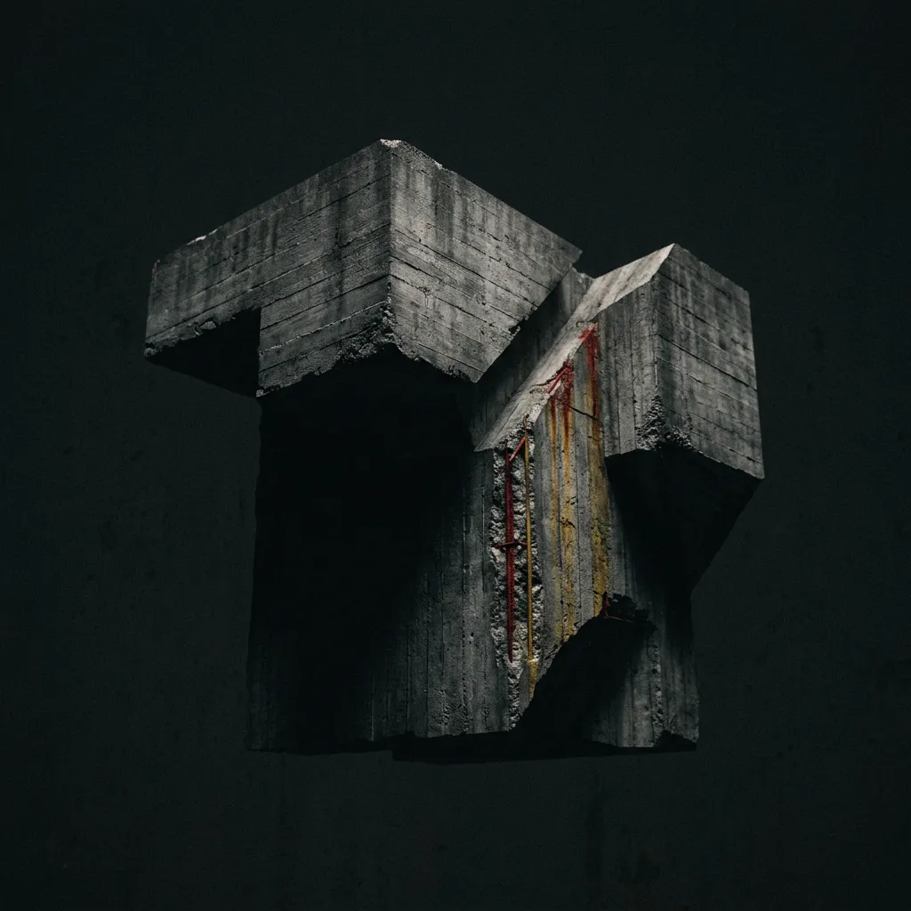
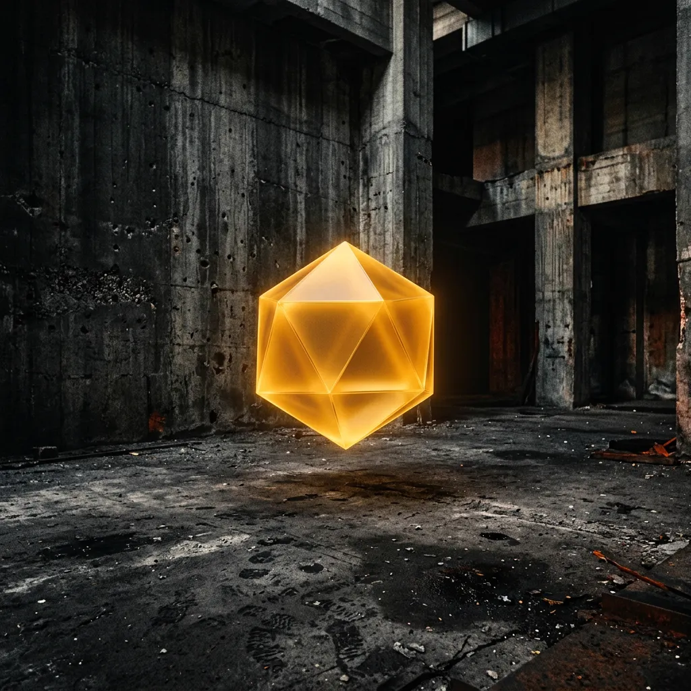
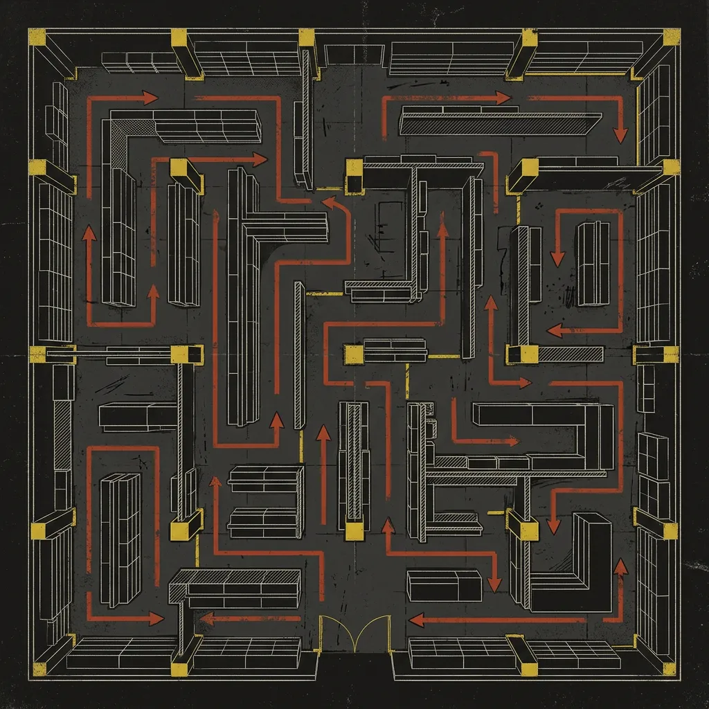
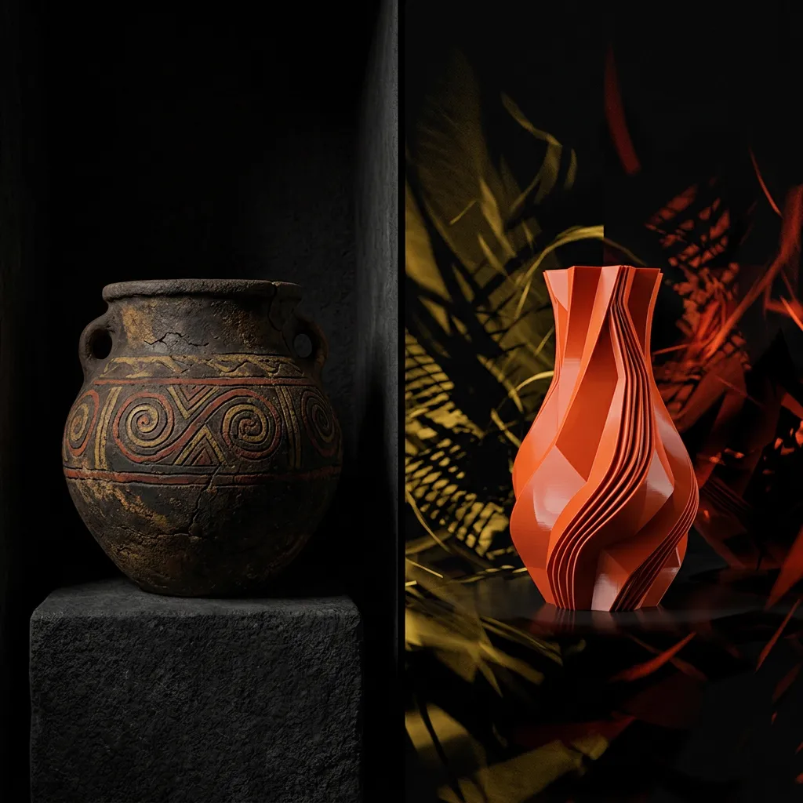
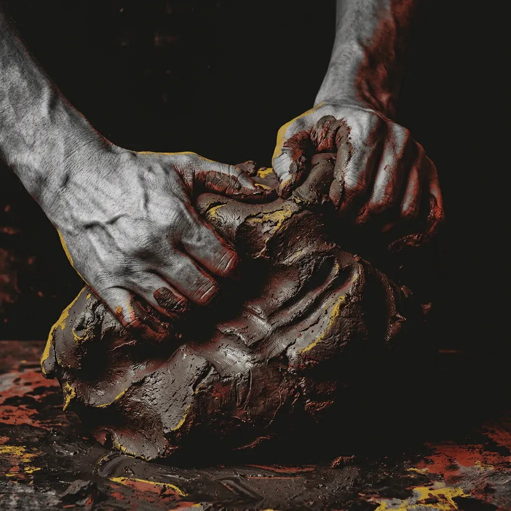
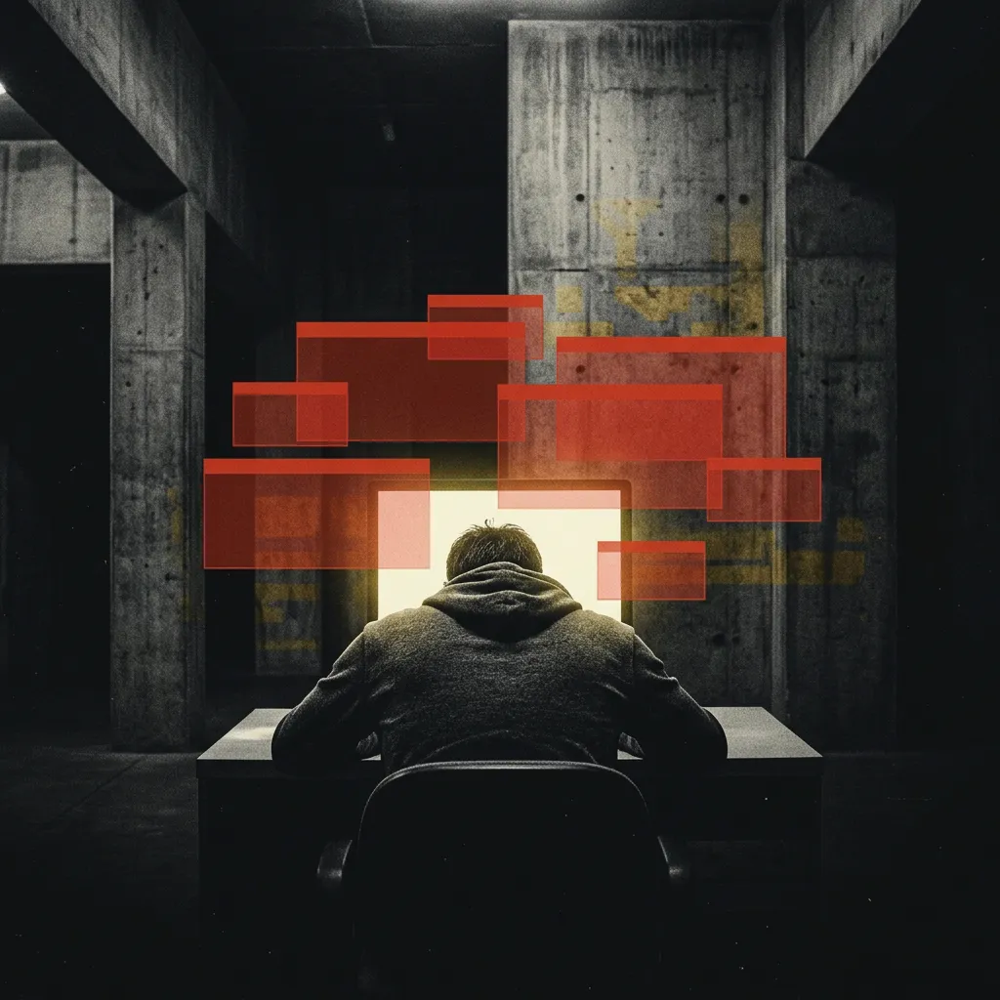
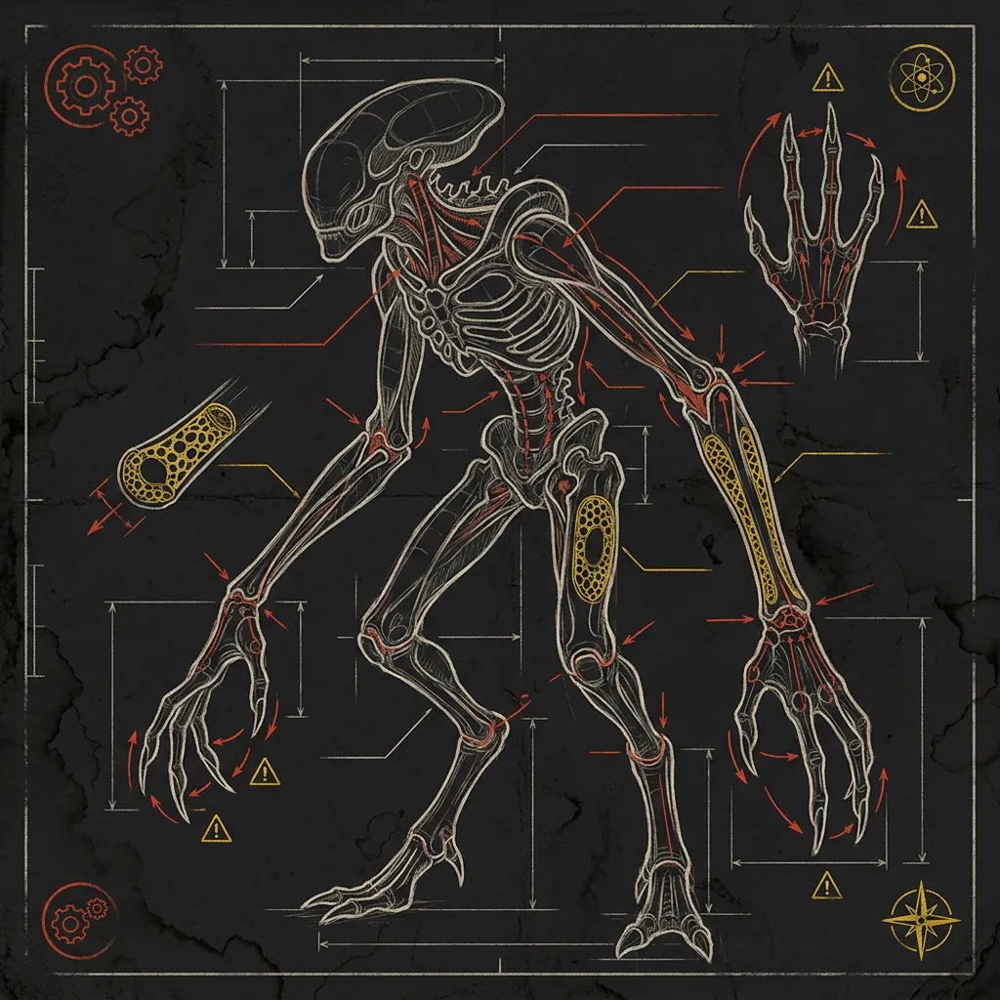
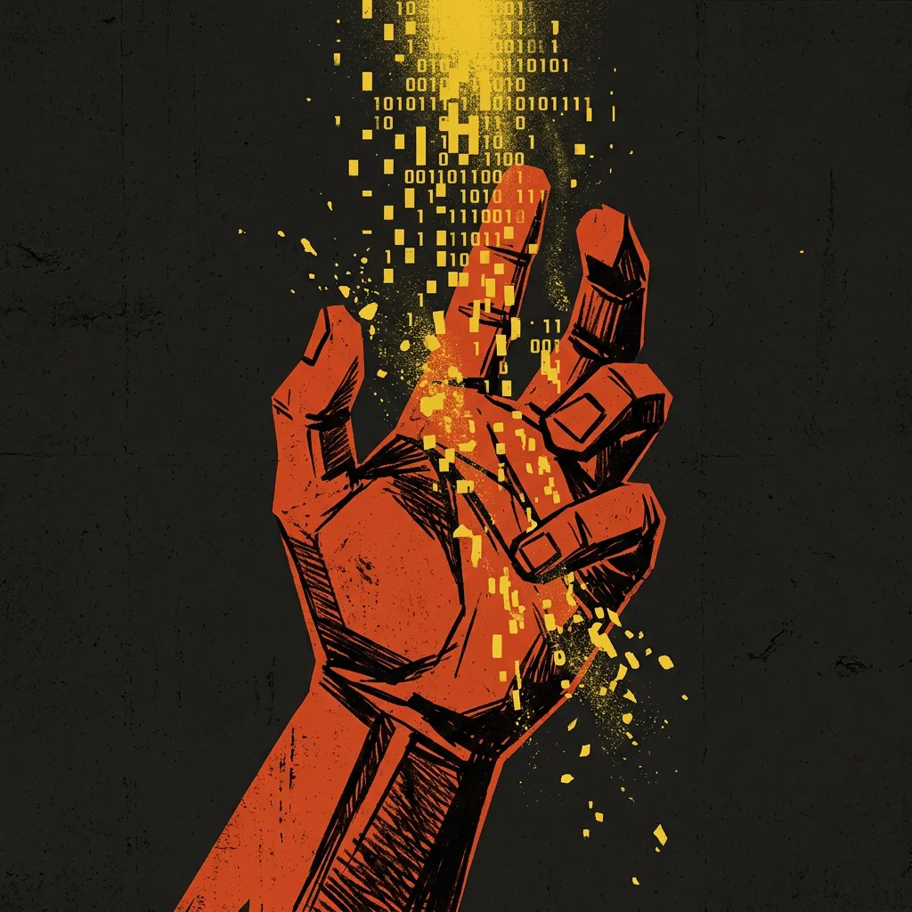

<!-- slide -->

# 3 根手指
<!-- 备注：
（直接走上讲台，不作常规自我介绍，抬起右手向大家展示）

“各位同学，欢迎来到《造物与创格》的第一堂实践课。

在上课之前，我需要全场所有人配合我做一个非常简单的动作。请大家举起你们惯用的那只手，把拇指、食指和中指，紧紧地捏在一起。对，像这样，捏紧，哪怕有些发白也不要松开。

好，保持这个姿势。现在，请你们用剩下的、最不灵活的两根手指，尝试拧开你桌上的水瓶盖，或者拿起笔，在纸上写下你的名字。

大家试一下。是不是感到极度的笨拙？是不是有一种强烈的挫败感，甚至是一种隐隐的痛感？

好，大家可以松开了。

这种‘痛感’，就是我们这节实践课要带大家寻找的东西。这门课的名字叫《造物与创格》，在接下来的八周里，我们的核心追问只有一个，那就是四个字：**艺术何以创造？**
-->

---
<!-- slide -->

# Ctrl+Z 的错觉
<!-- 备注：
为什么我们要提这个看似很古老的问题？因为对于你们这群数字原住民来说，造物变得太容易了。你们每天泡在数字软件里，习惯了建个模不满意，直接按下 `Ctrl+Z` 就撤销。鼠标在屏幕上滑动，没有任何真实的阻力。

大课老师已经给你们讲了深奥的造物史，而我作为你们的实践导师，我的任务是把理论砸回现实。在这门课里，我们将告别 `Ctrl+Z` 的错觉，重新寻找物质的阻力。”
-->

---
<!-- slide -->

# 空间规训
<!-- 备注：
“我们要怎么寻找这种失去的‘痛感’和‘阻力’？我们先从大家最熟悉的生活场景——‘空间’开始。这就进入了我们这节实践课的‘前测（Pre-test）’环节。

我想请大家回忆一下最近一次去宜家购物的体验。

（互动气口：老师停顿，扫视全场，身体前倾）
“有谁能告诉我，当你只想去买一个平底锅时，你在宜家里面是怎么走的？有没有同学愿意分享一下？前排那位穿黑衣服的同学，你当时是怎么找路的？”
（预留 10-15 秒听取学生回答，引导其说出“绕来绕去”、“找不到出口”）

“没错，你只能顺着地上的箭头走，几乎没有回头路。被迫走完长长的迷宫，经过无数个你原本不想买的沙发和杯子，最后才能到达收银台。

我们总以为空间是个中立透明的盒子，是客观存在的物理容器。但事实上，宜家的动线就像是糟糕游戏里的‘强制新手教程’——一条发光的高亮路线，你连去角落探索的权利都没有。

当你试图偏离路线，想抄近道，却撞上一堵无形的‘空气墙’或者一排货架时，那种沮丧感，就是空间在对你的身体施加隐形的暴力！

在数字设计中也是一样。这些透明、平滑的空间和界面，往往掩盖着系统的监控与引导。当你被困在信息流的无限下拉中，就像被困在宜家的迷宫里。这是我们需要在实践课中找回的第一种痛感：**感知并抵抗空间规训的痛感。**”
-->

---
<!-- slide -->
# 形式与时间积淀

<!-- 备注：
“讲完了空间，我们再来看看造物的‘形式’，进入参与式学习（Participatory Learning）的环节。

大家看大屏幕左边。这是仰韶文化的陶器，上面布满了非常抽象的几何折线和螺旋纹。很多人可能会觉得，这不就是原始人画画偷懒吗？觉得画一条栩栩如生的鱼太费劲了，所以敷衍成了几根线条。

但是大家别忘了远古人类真实的生存状态。在那个时代，在陶器上画一条鱼，可不是什么闲情逸致的美术创造。那是关乎整个部落生存、关乎狩猎丰收的一场残酷的巫术！

所以这种从具象到抽象的演变，绝对不可能是敷衍。远古先民对神灵的敬畏、生存的狂热，被一点点压缩、融化在了这些几何线条里。这些看似简单的二维线条，其实是高密度压缩的情感代码。这是一种漫长的‘时间积淀’。
-->

---
<!-- slide -->

# 造物 ≠ 制造
<!-- 备注：
我们再看现在的数字建模，鼠标一拉，线就自动生成了。但古人是如何在手工中完成这种情感转换的？

人类学家 Tim Ingold 在《Making》这本书里提出了一个颠覆性的观点：**造物绝对不是‘制造’**。造物不是你脑子里先有一个完美的 3D 蓝图，然后再把蓝图强加给死气沉沉的物质。

（互动气口：伸出双手，做一个用力揉捏陶土的动作，引导前排学生模仿）
“大家现在跟我一起动作，想象你的手里有一块湿润的陶土。当你的手接触到泥土的湿度，感受到陶轮旋转的离心力时，你在干嘛？你在与材料对话。形式，是在人、工具和材料的不断对抗中自然生成的。

这也就是我们需要找回的第二种痛感：**与材料真实对话的痛感。**我们不能让数字工具剥夺了我们双手的思考能力。”
-->

---
<!-- slide -->

# 工匠的枷锁
<!-- 备注：
“说了这么多，大家可能会有个浪漫的幻想：觉得设计师、艺术家都是坐在工作室里等灵感降临的自由灵魂。

我必须无情地浇灭这个幻想。如果你去读《考工记》，你会发现，无论是做兵马俑的官方工匠，还是画明清祖宗像的画师，他们从来都不是自由的。他们永远面对着严苛的限制：雇主霸道的要求、材料的物理极限、宗教仪轨的强制。

这简直就是现代数字设计行业的完美写照！你们毕业后去公司，每天面对甲方‘五彩斑斓的黑’的需求，就是在极度不自由中寻找出路。

但恰恰是这种令人窒息的约束，在一次次的妥协和死磕中，工匠们完成了审美的创造，甚至推动了时代风格的演变。极端的约束，往往是激荡造物智慧的唯一途径。
-->

---
<!-- slide -->

# 极限约束
<!-- 备注：
所以，为了让你们在期末完成真正的‘创格’，我给你们准备了一个极端的约束。这就进入了这堂课的后测（Post-test）和任务发布环节。

大家还记得开场时，我让你们捏住的三根手指吗？

（互动气口：向台下提问，制造悬念）
“请大家仔细看屏幕上的生物，假设他是你的客户。他只有三根手指，骨骼中空，动作极其迟缓，那里的重力只有地球的三分之一。你们的任务是：为他设计一辆自行车。

有同学能告诉我，面对这样的需求，我们第一步应该思考什么吗？”
（预留 5-8 秒钟的反应时间，接受几个关键词汇反馈）
“是的，不要去想‘轮胎’怎么画，不要去想‘车把手’用什么颜色。因为你学过的所有地球上的人体工程学参数，在这里瞬间作废！

如果只是给地球人设计椅子，你们的脑子里立刻会浮现出被日常经验锁死的刻板形状。但是面对异星生物，你们不能再套用现成的表面风格，必须从零开始，重新推导微重力下杠杆如何发力，三根手指如何去握持。

这，就是在强迫你们的大脑建立全新的神经回路，重塑造物的底层逻辑！
-->

---
<!-- slide -->

# 算法时代的疑问
<!-- 备注：
各位同学，今天的导论课即将结束。

在当下这个 AI 一键生成、数字媒体算法泛滥的时代，造物的材料变成了极其顺滑、毫无阻力的像素和代码。当我们在虚拟世界里只需要输入一串提示词，而不再需要用肉体的双手去感受阻力的时候，人类的双手是否还在思考？

带着这个属于算法时代的锋利疑问，欢迎正式加入《造物与创格》的实践课堂。期待看到你们被逼出极限的期末作品，我们下周见！”
-->
